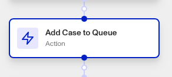

# Workflows: Add Case To Queue step

# What is the Add Case To Queue step?

**Add Case To Queue** is a Workflow Action step that adds a case to a designated case queue.

Cases are Persona products that collect together data on an end user to allow for manual investigation and decisioning on. Your organization may need to investigate this user for a variety of reasons:

-   **Onboarding**: Should this user be allowed to onboard to the platform?
-   **Account takeover investigation**: If a user is claiming that their account has been taken over, is there enough information to validate their claim?
-   **Fraudulent activity**: Are there suspicious signals associated with this user that require further action (e.g. account freezing, sending a follow-up inquiry for verification, etc.)?
-   **Transaction monitoring review**: Are there suspicious transactions associated with this user that require further investigation?

## What are case queues?

Case queues in Persona are used to automatically group cases based on specific filters such as case status, tags, verification check status, and report matches. They are particularly useful for organizations with multiple teams that need to review the same case or handle an escalation flow. For example, cases tagged with "Fraud" or "High risk" can be routed to an escalation queue.

Case queues are determined through Global Assignment Policies. Learn more [here](./4jcpgOReCv6UnPQuPWrARs.md).

# How do you add an Add Case To Queue step?

1.  Navigate to the Dashboard, and click on **Workflows** > **All Workflows**.
2.  Find and click on the workflow you want to edit, or **Create** a new workflow.
3.  Click on **+** when hovering over a circle to add an **Action**.

4.  Use the **Find Action** select box to click on **Case** > **Add Case To Queue**.
5.  Click the **Case** box to choose the case you want to add to a queue.
6.  Choose the **Case queue** to add the selected case to.
7.  (Optional) In ‘Advanced Configuration’, click the **Continue on error** box if you want the workflow to continue running even if this step raises an error.
8.  **Close** the step. You’ll have to **Save** and **Publish** the workflow to begin using it.

# Plans Explained

## Add Case To Queue step by plan

|  | Startup Program | Essential Plan | Growth Plan | Enterprise Plan |
| --- | --- | --- | --- | --- |
| Add Case to Queue step | Not Available | Available | Available | Available |

[Learn more about pricing and plans](./6oZbzp7jb7AWGClF5vpY3K.md).

# Learn more

Learn more about Cases [here](../../docs/v2022-09-01/docs/cases.md).
