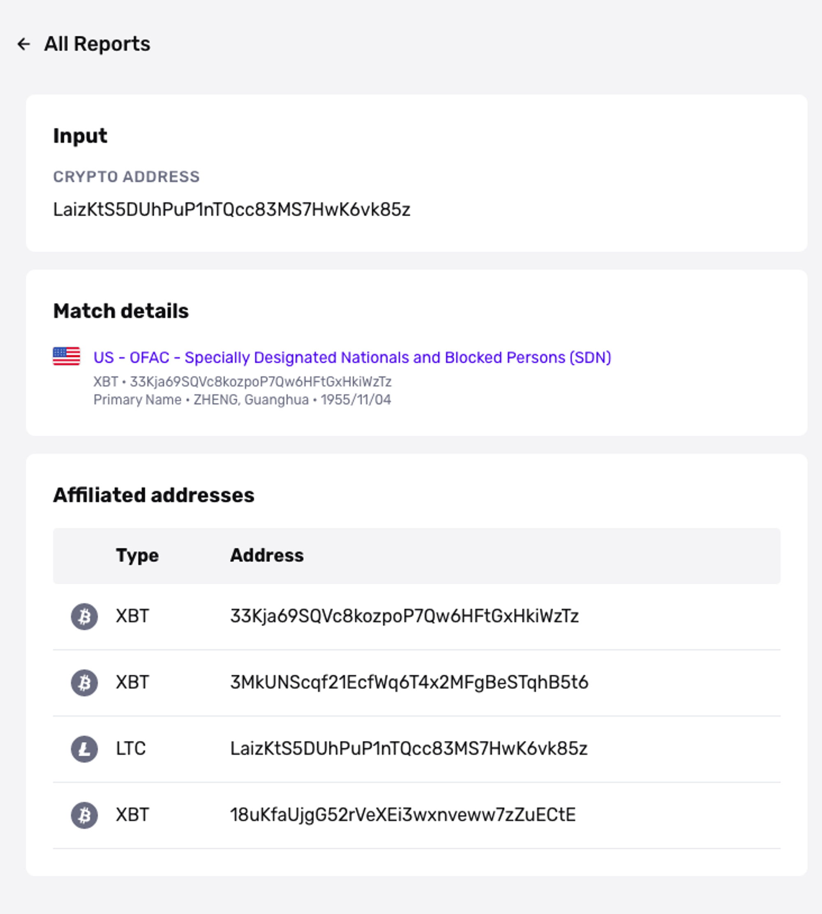

# Crypto Address Watchlist Report

## Overview

The Crypto Address Watchlist report flags any wallet addresses that might be sanctioned. You can use this report type to satisfy AML regulatory requirements specifically for digital currencies.

## Demo

See how you can integrate the Crypto Address Watchlist Report alongside other Persona verifications into a single verification flow:

[Embedded Content](https://withpersona.coastdemo.com/share/691bb47255ca56941c5097c4)

## Report Features

### Search Inputs

-   Crypto wallet address (required)

### Report Outputs

The Report will return results if the address is on an OFAC sanctions list, with some more details on associated wallet addresses.

**`result`**

Result is an array of hits that come back as sanctioned. If it's empty, that means this wallet address was not found to be on any lists. Typically this array will only come back with _one_ hit because OFAC is the only list we currently search.

**`entities`**

Entities is an array inside each hit. It describes the individual associated with the hit. It contains the fields:

-   `name`
-   `alias-type`
-   `birthdates`
-   `crypto-addresses`

**`crypto-addresses`**

This is an array inside one entity. This describes all of the wallet addresses associated with an individual. It contains:

-   `type` The type of digital currency (BTC, ETH, etc)
-   `address` The actual address

### Notifications

The best way to be notified immediately of a match on the Crypto Address Watchlist Report is to set up a webhook listening for the event types: `report/crypto-address-watchlist.matched` fires whenever a match is found; `report/crypto-address-watchlist.ready` fires whenever the report runs, regardless of match status.

## Configuration Options

There is no configuration option available for this report type.

## Continuous Monitoring

Just because a person is not a "bad actor" today does not mean that they cannot be a "bad actor" 2 months down the line. Therefore, it's critical for organizations to monitor individuals continuously and to make sure there is no negative news or unfavorable information on a given person. To learn more, refer to [this guide](./7LRMBbxLshF7sCcLhfhwF4.md).

## Plans Explained

|  | Startup Program | Essential Plan | Growth and Enterprise Plans |
| --- | --- | --- | --- |
| Crypto Address Watchlist Report | Not Available | Available | Available |

[Learn more about pricing and plans](./6oZbzp7jb7AWGClF5vpY3K.md)

## FAQs

**How often are lists updated?**

We check our Crypto Address sanctions sources for updates as frequently as every 10 minutes.

## _Disclaimer_

_Persona is not a consumer reporting agency and the services (and the data provided as part of its services) do not constitute a ‘consumer report’ for the purposes of the Federal Fair Credit Reporting Act (FCRA). The data and reports we provide to you may not be used, in whole or in part, to: make any consumer debt collection decision, establish a consumer’s eligibility for credit, insurance, employment, government benefits, or housing, or for any other purpose authorized under the FCRA. If you use any of any of our services, you agree not to use them, or the data, for any purpose authorized under the FCRA or in relation to taking an adverse action relating to a consumer application._
