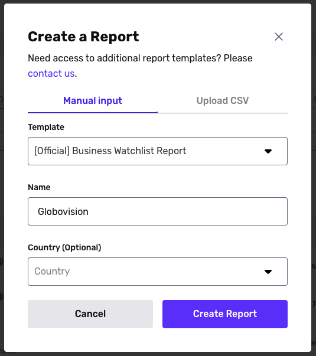

# Test your Report by triggering hits

## Overview

In the [Sandbox environment](./6I2kGhfPvSuUjYq4z6tpmB.md), you can trigger Report hits for testing purposes. This helps you see what a hit looks like for a specific type of Report.

## Steps

To trigger an example Report hit:

1.  In the dashboard, switch to the Sandbox environment.
    -   [How do I switch environments?](./1IKpaNpGCG2E8ksAjZQYLx.md)
2.  Navigate to **Reports** > **All Reports**.
3.  In the upper corner, click **\+ Create report**.
4.  In the Manual input tab, select the Report Template you want to run.
5.  Fill in values according to the _Inputs for testing_ chart below.  
    
6.  Click **Create Report**.

## Inputs for testing

Note, some Report types do not currently have test hits.

| Report type | Input | Result |
| --- | --- | --- |
| Address Lookup | N/A |  |
| Adverse Media | "Jong Kim Un” or "Kim Jong Un" | Report hit |
| Business Adverse Media | “Globovision” | Report hit |
| Business Lookup | “Globovision” | 4100 Salzedo Street Coral Gables, FL 33146 |
| Business Social Media | N/A | Always responds with an entry for "Google" |
| Business Watchlist | “Globovision” | Report hit |
| Crypto Address Watchlist | 1Fz29BQp82pE3vXXcsZoMNQ3KSHfMzfMe3 | Report hit |
| Email Risk Report | [alexanderjsample@example.com](mailto:alexanderjsample@example.com) | Responds with a result with low reputation. All other emails return a result with high reputation |
| Phone Risk Report | +15005550006 (for low risk) or +14155555555 (for high risk) | Low risk or high risk response, depending on input |
| Politically Exposed Person (PEP) Report | "Boris Johnson" | Report hit |
| Profile Report | N/A | Always responds with an entry for "Alexander Sample" |
| Social Media Report | N/A | Always responds with an entry for "Alexander Sample" |
| Watchlist Report | "Jong Kim Un" or "Kim Jong Un" | Report hit |
