# How can I modify an Inquiry template to collect the user’s Selfie even after a GovID failure?

## Overview

Our standard **Government ID and Selfie** inquiry template will fail the user if they fail all Government ID attempts.

The most common variation on this template is to collect the selfie _even if_ the Government ID verification fails. This allows you to collect all of the user’s information upfront, if you have a manual process that would let you overturn the Government ID verification status.

Updating your inquiry template to always collect the selfie requires modifications in just two areas of your inquiry template.

1.  Routing a failed Government ID to the Selfie Verification step instead of the **Fail** step
2.  If the Selfie has passed, check the Government ID verification status and use it to decide if the inquiry should be `Completed` or `Failed`

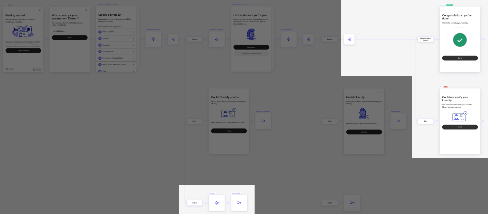

### Step by step

Let’s walk through how to configure this on your inquiry template step by step. Throughout this tutorial, you’ll also learn about:

-   Tagging inquiries
-   Connector steps
-   Branching steps

Go to the “Failed” route of the Branching Step after your Government ID verification. Click the **+** icon to add an **Action Sequence**.

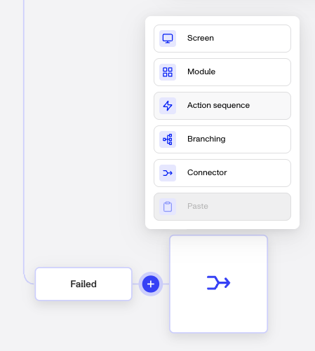

A Placeholder Action will appear. Double-click on the tile or or click the Pencil icon to edit it.

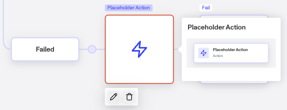

Click on the Placeholder Action tile. This will open up the configuration panel on the right side. Click on the Action dropdown and change it to Tag Object. In the Tag section, you’ll want to create a new tag FAILED GOVID.

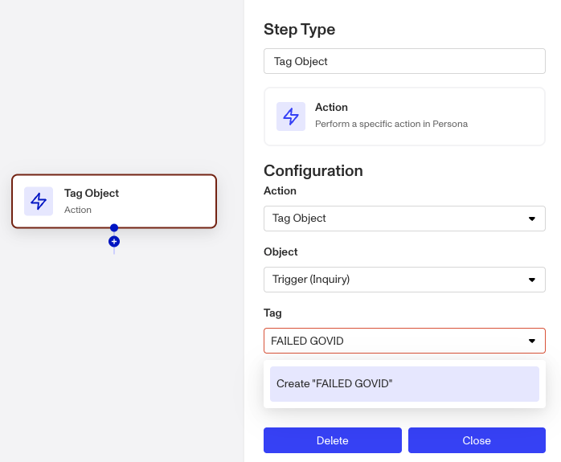

You can use tags to signify anything “of interest” on that inquiry— usually verification failures or report hits, that can be used when filtering inquiries in the dashboard or as “hint” to your manual reviewers on what they should be looking at.

Here, we’re tagging that the inquiry failed its Government ID verification so that we can make sure to route the user appropriately after they’ve passed the Selfie verification— if the Inquiry has a `FAILED GOVID` tag, we’ll know that the user should actually be routed to the **Fail** screen.

For readability, change the step’s name to match the tag: `FAILED GOVID`.

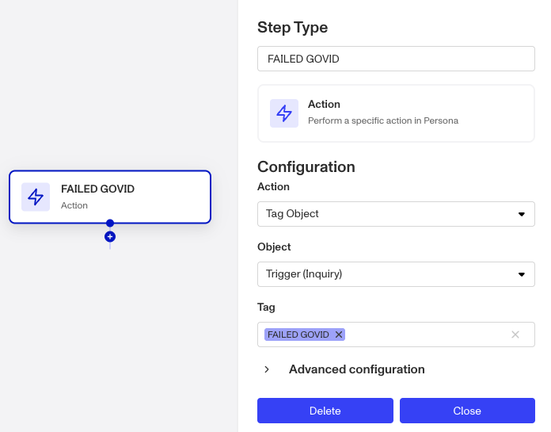

Click the **Flow** link at the top of the screen to get back to the main flow. You’ll see that your action step name now shows up.

Currently, if the user fails all attempts at Government ID verification, they will be connected to the **Fail** screen. Hover over the **Fail** connector step and the Connector window will pop up. Here you are able to select with other step in the flow you want this connector to route to.

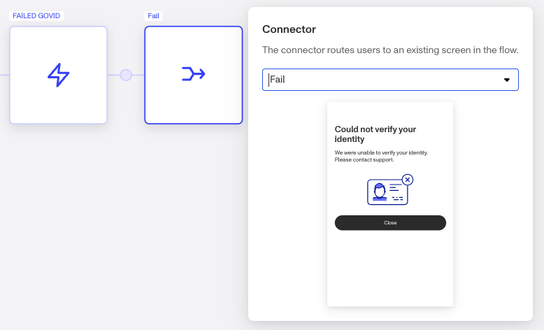

Search for the Selfie verification step and select it. Now, the user will be routed to collect their Selfie even after GovID failure!

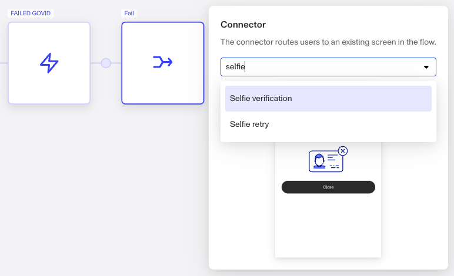

It’s always a good idea to save your work as you go! Make sure to leave a description so your teammates will know what you changed. You’ll want to refresh the page after saving as well— to get the `FAILED GOVID` tag you just created to be available for use in the next step.

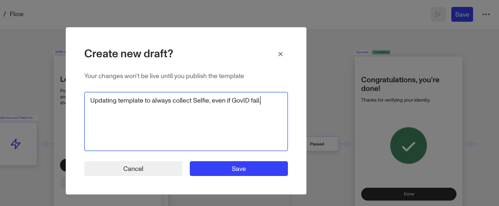

Now head over to the Selfie Verification section in your template. We’ll be focusing only on the Passed branch — since if the user fails their Selfie verification, they’ll already be routed to the Fail screen.

Click on the circle in between the Passed branch and the Success screen to add in a Branching step.

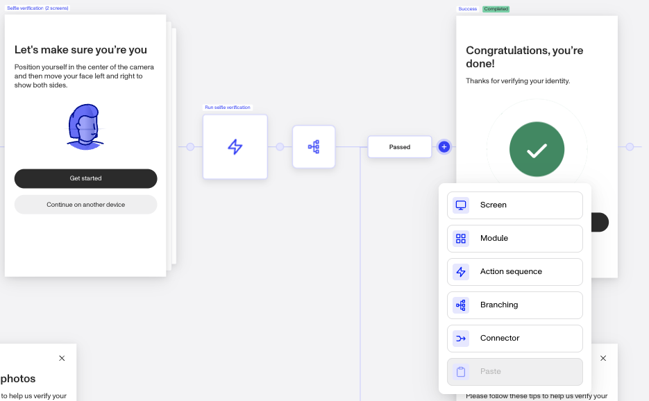

We’re going to specify the condition that would lead the user to the Success screen. Click on the Pencil icon in the right panel to do this. When the Branching Step opens, it defaults to an empty rules which you’ll fill build in a moment.

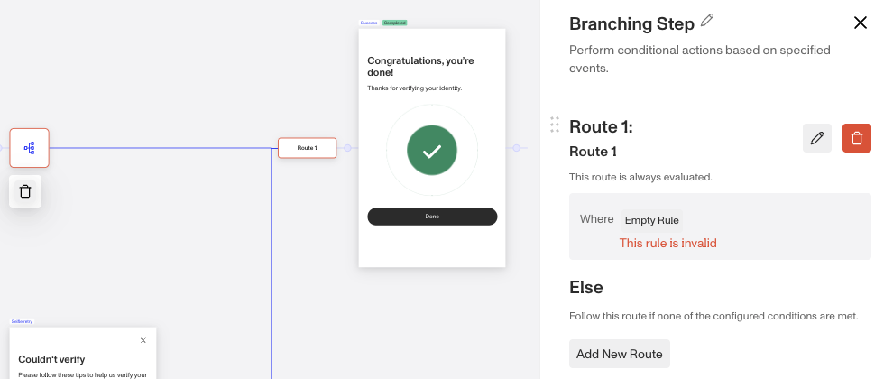

The user should be be shown the Success screen if all verifications passed. That means we’re going to make sure the inquiry is missing the `FAILED GOVID` tag. Configure the condition to reflect this.

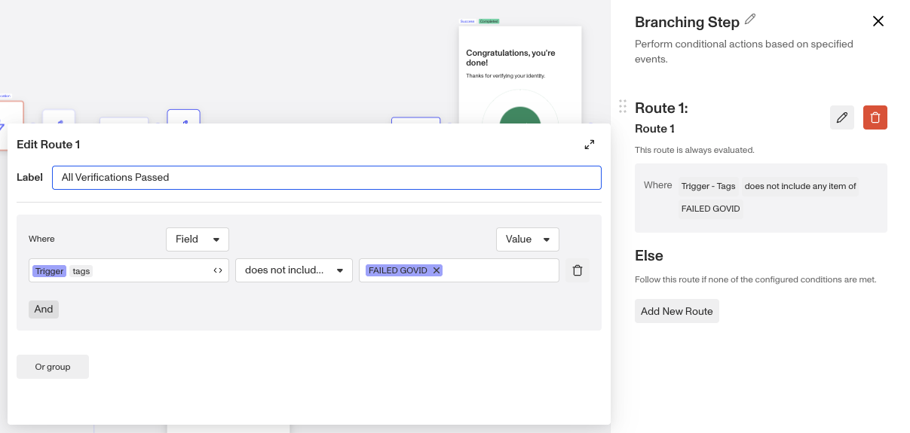

**Note:** If you wanted to reverse the condition to make it `trigger.tags includes any of FAILED GOVID` and route to the Fail screen if true, that’s perfectly fine as well! The recommended path here may be slightly more consistent with the rest of the inquiry template— the “successful path” is always the top path.

Now you’ll need to specify what happens if the condition does not hold true. Head over to the **Else** branch and click to add a **Connector** step.

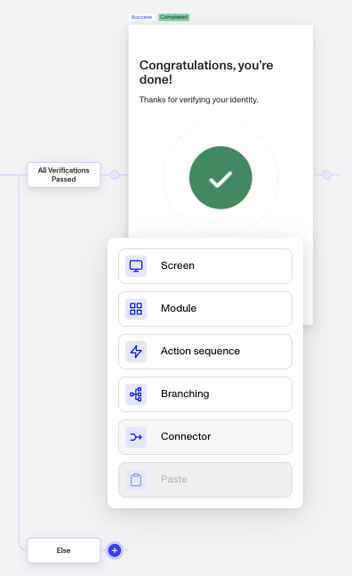

In the **Else** case, where the user did not pass all verifications, you’ll want to **Fail** the inquiry. Connect the step to the Fail screen to do this.

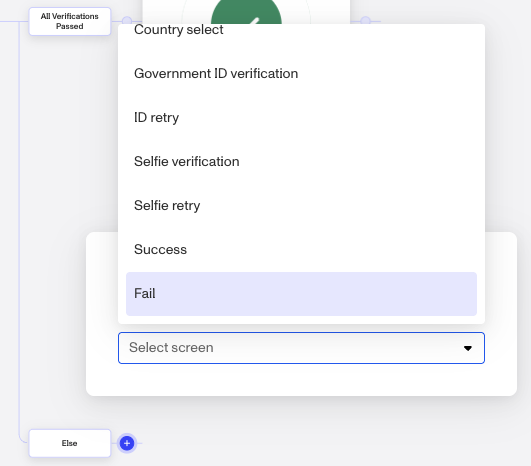

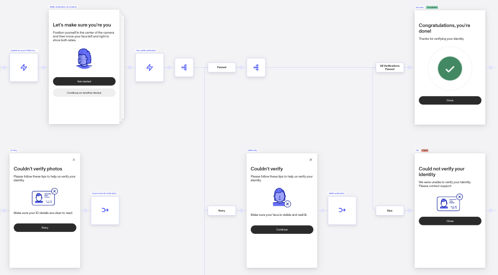

You’re done configuring! Your inquiry template should now look like this.

The next step would be for you to test your changes. See more on why and how to do that [here](./5NB4eGgy0k8oRs5O5sDOR1.md).

And don’t forget to save your changes.

