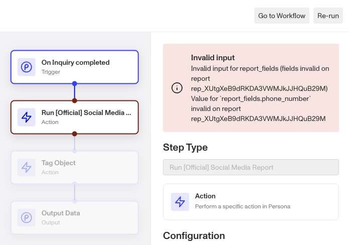
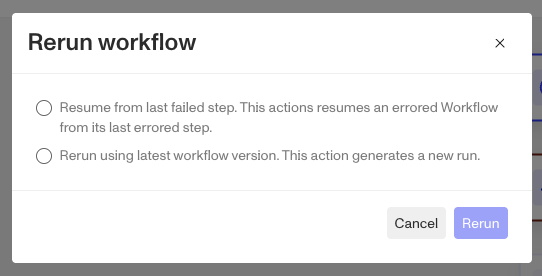
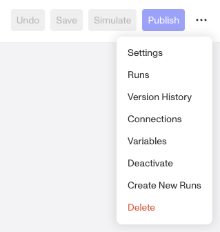
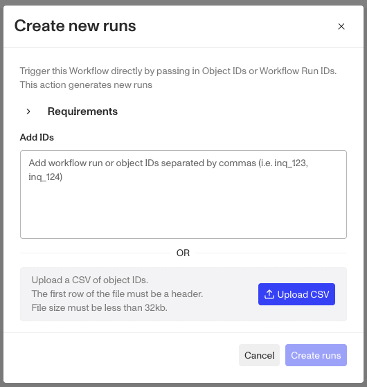

# Rerun, Resume, or Run New Workflows with Manual Triggers

In the case that a Workflow errors out or fails, you may want to resume the Workflow after troubleshooting the error. You can do so by clicking into the Runs page of an specific Workflow. From there, you can choose if you want to resume from the last failed step or to rerun the entire workflow.

Additionally, you may want to manually trigger a new workflow run with an object that has not yet been sent through the workflow, which can be trigged from the workflow itself.

## Getting to a Workflow’s Runs page.

1.  Nav to the Workflows page.
2.  Find the workflow you want to manually trigger.
3.  Click the 3 dot button to the right of the “Edit” button.
4.  From the dropdown click “Runs”.

## Troubleshooting Errored runs

 Once you’ve found the run that errored you can open it and review the run. The step that errored will be highlighted in red and the error message will be presented in the step window to the right when you click on it. You can reach out to [support@withpersona.com](mailto:support@withpersona.com) for help in understanding the error and how to fix it. In the example above, the `report_fields.phone_number` was not configured on the triggering inquiry template.

## Triggering from an errored run.

We recommend for transient errors, you resume an errored workflow from last failed step.

For configuration errors, you should rerun workflows with the most recent published version, which will generate a new run. 

1.  Find and open the errored run.
2.  At the top right, click rerun.
3.  Select between “Resume from last failed step” or “Rerun using later workflow version”.
4.  Click Rerun.
5.  Wait a few seconds, then back in the 3 dot dropdown, click "Runs".
6.  You should see the newly created run(s) listed there.

## Continuing and rerunning failed Workflows from Editor

You can also rerun the Workflow from the Workflow editor directly by passing in Object IDs or Workflow Run IDs. 

## Creating New Runs

From the dropdown above, note the “Create New Runs” option. Clicking it will bring up the following screen. 

1.  In the Create New Runs window paste into the "Add IDs" field the token for the object(s) you want to run through the workflow. You can use this field to batch run multiple valid trigger objects at once. You can also upload larger lists of objects as CSVs.
2.  Click “Create runs”.
3.  Wait a few seconds, then back in the 3 dot dropdown, click "Runs".
4.  You should see the newly created run(s) listed there.

## Related articles

[Workflows FAQs](./1UNQQ1f6RKFlV0pfSplEKp.md)

[Testing and auditing your Workflows](./6hnq0KFsYB3Edjt9ME4E9.md)
