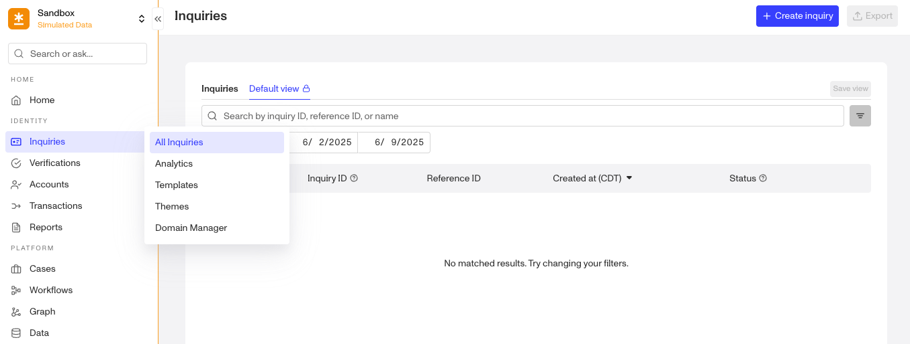
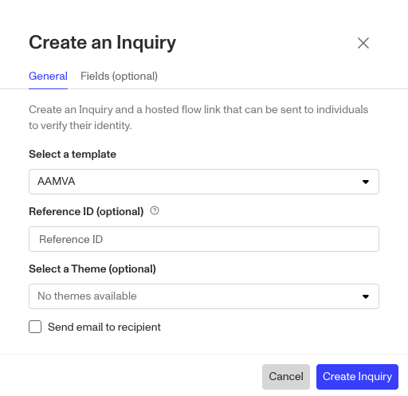

# Creating an Inquiry

# Overview

An [Inquiry](./2BerKqpgNIRG81jX0goCMU.md) is a single instance of a user going through the identity verification process. It is sometimes referred to as Dynamic Flow and is a flexible, customizable process for collecting and verifying personally identifiable information (PII). This article outlines the primary ways you can create an Inquiry using Persona’s platform and APIs.

## Methods for creating an Inquiries

### 1\. Directly creating an Inquiry via API (Recommended)

The [Create an Inquiry](../../docs/reference/create-an-inquiry.md) endpoint generates an Inquiry directly. You’ll need to include additional values in your request. We recommend consulting our API reference documentation to review, test, and explore our OpenAPI specification for more details.

While `inquiry-template-id` is the only `required` parameter needed, you can also create an Inquiry with some other important attributes.

-   `theme-id` (optional): Theme ID for styling. Only available for the deprecated Legacy 2.0 Inquiries (Template IDs beginning with `tmpl_` )
-   `fields`(optional): JSON key-value pairs of field name to field value. [Schema is defined by your Inquiry Template.](./5rT2Llik2kUvJTXKapZb8c.md)

Inquiry Templates can be configured within an the Persona Dashboard. The Inquiry template defines what will be included in the flow and how each object will behave.

For further detail on creating Inquiries via API, review the [appropriate Inquiries integration methods.](../../docs/docs/inquiries.md)

### 2\. Within a Workflow (Recommended)

You can create an Inquiry within a Persona Workflow, as a step in a larger identity orchestration flow.

### Relevant Workflow Steps

-   [Workflows: Create Inquiry Step](./nvCvqDw3f4yRuiovvOHQC.md): Allows you to generate an Inquiry from within a Workflow.

### Specifying Transaction attributes in the Workflow Step

You will need to specify the Inquiry Template for a newly created Inquiry. See the article on [Workflows: Create Inquiry Step](./nvCvqDw3f4yRuiovvOHQC.md) for step-specific configurations.

### 3\. Within the Persona Dashboard

The last way to create a new report is within the Persona Dashboard. Navigate to **Inquiries > All Inquiries** and click the **\+ Create inquiry** button.

After this you will get a popup to select an Inquiry Template.

Select your desired Inquiry Template from the drop down, fill out the fields and click **Create Inquiry**.

## Related articles

[What are Inquiries/Dynamic Flow?](./2BerKqpgNIRG81jX0goCMU.md)

[Workflows: Create Inquiry step](./nvCvqDw3f4yRuiovvOHQC.md)
