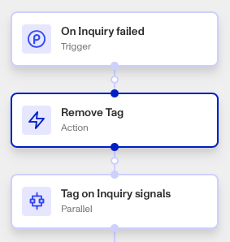

# Workflows: Remove Tag step

# What is the Remove Tag step?

**Remove Tag** is a Workflow Action step that removes a Tag or Tags from a specific Persona object, such as an Account or Inquiry.

Tags are used to organize and classify accounts or inquiries based on specific characteristics or conditions. Tags reflect attributes that are unlikely to change during the verification process, such as “Under 21 years old”, “Non-eligible geo”, or “Watchlist match”. However, Remove Tag is useful for situations when those attributes change.

They help in filtering and managing objects by providing additional context or status that can be useful for decision-making or further processing.

💡 Tags should be used to mark certain conditions or states that are relevant to your organization’s needs.

# How do you add a Remove Tag step?

1.  Navigate to the Dashboard, and click on **Workflows** > **All Workflows**.
2.  Find and click on the workflow you want to edit, or **Create** a new workflow.
3.  Click on **+** when hovering over a circle to add an **Action**.

4.  Use the **Find Action** select box to click on **Other** > **Remove Tag**.
5.  Click the **Object** box to add the object you want to remove tags from.
6.  Click on the **Tag** box to include any tags you want removed to the object.
7.  (Optional) In ‘Advanced Configuration’, click the **Continue on error** box if you want the workflow to continue running even if this step raises an error.
8.  **Close** the step. You’ll have to **Save** and **Publish** the workflow to begin using it.

# Plans Explained

## Remove Tag step by plan

|  | Startup Program | Essential Plan | Growth Plan | Enterprise Plan |
| --- | --- | --- | --- | --- |
| Remove Tag step | Not Available | Available | Available | Available |

[Learn more about pricing and plans](./6oZbzp7jb7AWGClF5vpY3K.md).
