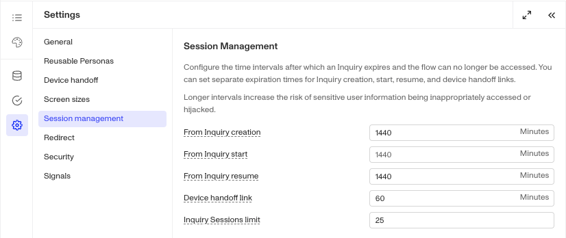
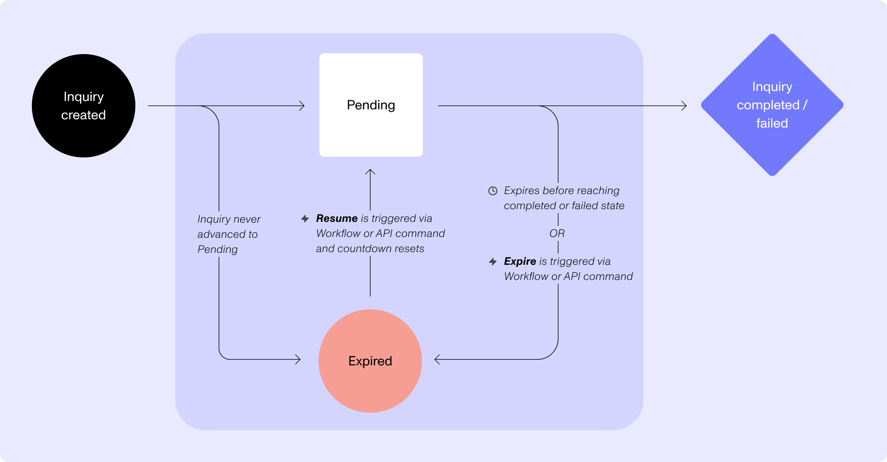

# The Inquiry Lifecycle Model

# Overview

The Lifecycle model articulates the various stages and statuses that an inquiry can move through across it’s creation to conclusion. The model include four phases, some of which include multiple statuses.

## Events change Statuses

Inquiries have formal events, like `inquiry.created` and `inquiry.approved` that drive changes to the statuses. The events are useful to know when building logic on persona as these events can also be used as triggers in post-inquiry processes like workflows. Inquiry events and related statuses can change when:

1.  Your end user proceeds through their inquiry: starting a verification or completing the flow.
2.  Post-inquiry workflows apply business logic to automatically decision the inquiry or mark for manual review.
3.  Your organization’s members manually change the status of an inquiry.
4.  The inquiry expires.

| Phase | Status | Event Name | Status Description |
| --- | --- | --- | --- |
| Created | Created | `inquiry.created` | Set when the inquiry is first created. |
| Pending | Pending | `inquiry.started` | Set when the end user submits a document or begins a verification. |
| Done | Completed | `inquiry.completed` | Set when end user reaches the Completed screen. |
| Done | Failed | `inquiry.failed` | Set when end user reaches the Failed screen. |
| Done | Expired | `inquiry.expired` | Set when inquiry exceeds 24hrs, or configured duration, after inquiry created. |
| Post-Inquiry | Approved | `inquiry.approved` | Set via post-inquiry processes or manual update. |
| Post-Inquiry | Needs Review | `inquiry.needs_review` | Set via post-inquiry processes or manual update. |
| Post-Inquiry | Declined | `inquiry.declined` | Set via post-inquiry processes or manual update. |

## What’s the difference between Done & Post-Inquiry?

While all inquiry runs will end up at some point in the Done phase, via the **Completed**, **Failed**, or **Expired** statuses, it only describes the inquiry from the end user perspective as they are “done” with it. But you have additional optional statuses you can use as part of deciding what to do with the inquiry, allowing to you move it to **Approved**, **Needs Review**, & **Declined**. These statuses can then be used by post-inquiry processes to drive additional logic and outcomes.

## “Opened” vs Pending or Started

Some customers assume that when an end user opens an inquiry that a status or event triggers, but that is not the case. The inquiry will stay in the Created statues even after an end user has opened the inquiry. If the end user submits a document or begins a verification, then it will move to Pending. If they take no action, it will stay in Created until the inquiry expires and is then moved to the Expired status.

What does happen when the end user opens the inquiry link is that their session starts.

**Inquiry Session:** A collection of data, including location and device info, related to a single and sustained network connection between the end user’s device and the Persona platform.

A single inquiry can include multiple sessions as the end user might switch devices or even resume an inquiry after it expires.

## Expired windows

An Inquiry can be configured to expire after a certain duration window based on different starting reference points.

It can expire from the point of Creation, Pending/Started, or after being Resumed. The inquiry can also be set to expire if the end user(s) start too many sessions with the inquiry. This is meant to help mitigate bad actors from passing a captured inquiry link around to different devices.

Additionally, the device handoff link used for device handoffs within an inquiry can also be configured from the default of 1hr. All five expiry windows can be configured at the template level.

| Expire starting point | Default time |
| --- | --- |
| Creation | 24hrs |
| Pending | Same as Creation Expired’s duration |
| Resume | 24hrs |
| Device-Handoff-Link | 1hr |
| Inquiry Session Limit | 25 |

In the off chance you want to change those windows for an individual inquiry that is being created via the API, [you can pass those setting as meta parameters in the API call.](https://www.notion.so/1a0ef6bcb0fd80f1890df86a8ded59e7?pvs=21)

## Resuming an inquiry

End users can become delayed from completing the inquiry for numerous reason. You have the option to allow them to [resume their inquiry](../../docs/docs/inquiries-resuming-inquiries.md), which resets the clock and given them more time to finish.

