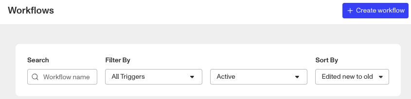

# How to schedule a Workflow based on an ID expiration date

⚠️ This question came from a member of the Persona Community - a customer was seeking to reverify their end users’ just before their end user’s Gov ID was set to expire to see if they had a new valid Gov ID.

# Question

How can I schedule a reverification workflow (including an inquiry) based on the extracted expiration date of a Gov ID submitted in a previous Inquiry?

# Answer

For this use case you’ll need two workflows, the first of which is a scheduled workflow that creates a reverification inquiry for the end user with the expired ID and a second workflow that sets the time schedule of when that first workflow will begin. You should have in mind the original inquiry template that collected the expired ID, and which inquiry template should be used for the reverification. You might reuse the original for the reverification, or use/create a more streamlined inquiry template instead. Let’s start with the Scheduled Reverification workflow first.

### Creating the Scheduled Workflow for Reverification

-   From **Workflows > All Workflows**, click **Create workflow** button at the top right.

-   In the New Workflow widget set:
    -   **Name**: Something specifying that it is a reverification based on Expired ID. You may want to specify which Inquiry or Verification is being reverified.
    -   **Description**: We recommend including notes for you and/or your team as to the purpose of the workflow.
    -   **Trigger type**: Scheduled Workflow
    -   **Trigger object type**: Inquiry (We’ll select the specific Inquiry later in the workflow.)
-   Then click **Continue**.

-   The scheduled workflow will open with the two default steps, On Schedule and Output Data.
-   Click the **Add New Step** button between them.
-   From the Add Step menu on the right, select the Action step.
-   In the Action Step Configuration, set the Action to “Create Inquiry”.
-   For the Template, select the inquiry template you want to use for the reverification.
-   Leave the Account set to “None”.
-   Save and publish the workflow, and remember it’s name for the next step.

### Using the Schedule Workflow action

⚠️ The Schedule Workflow action is what is going to tell, or schedule, the workflow we just created above. This action can be added into an existing workflow or a new workflow, so long as the workflow is triggered On Inquiry completed. For the steps below, we’ll start with a new workflow.

-   From **Workflows > All Workflows**, click **Create workflow** button at the top right.
-   In the New Workflow widget set:
    -   **Name**: Something specifying that the workflow is trigging a new inquiry on expired ID like, “Trigger New Inquiry Flows on ID Expiration”
    -   **Description**: We recommend including notes for you and/or your team as to the purpose of the workflow.
    -   **Trigger type**: Event
    -   **Trigger event**: inquiry.completed
-   Then click **Continue**.

-   The workflow will open with the two default steps, On Inquiry completed & Output Data.
-   Click the **Add New Step** button between them.
-   From the Add Step menu on the right, select the Action step.
-   In the Action Step Configuration, search for Schedule Workflow.
-   For Workflow, select the previously created workflow.
-   For the Object, select “Trigger (Inquiry)”.
-   Unset (click the checkbox) for the Reference date. A blank field will appear below it.
-   Set the Offset when, before or after, the expiration date you want the reverification workflow to be triggered.
-   Click in the blank field and hit backspace once. This will clear a “space” character that populates in the field currently.
    -   Then enter the following into the blank field: `trigger.fields.expiration_date`

⚠️ Note: The field \`trigger.fields.expiration\_date\` is a single string entry, ie a single date. In the rare edge case that an inquiry verified multiple types of Gov IDs, the expiration date of the last ID verified will used. So in the rare case of this workflow being triggered from an inquiry with multiple ID collected, this workflow will still only be trigger once and off the last ID verified.

-   Save and publish the workflow.

📌 This answer was last updated on Jan 16th 2025 by Ryan Cole, a Growth Content Manager at Persona. FAQs, unlike other articles, are written to provide Persona Community members more specific answers to common questions. While we periodically review responses and answers, please note when this FAQ was last updated as information may have changed since then.
