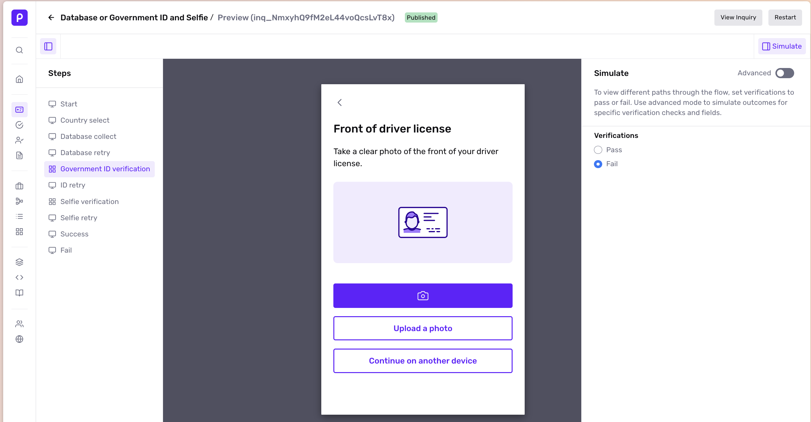
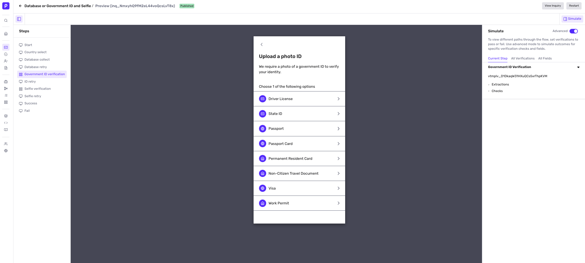
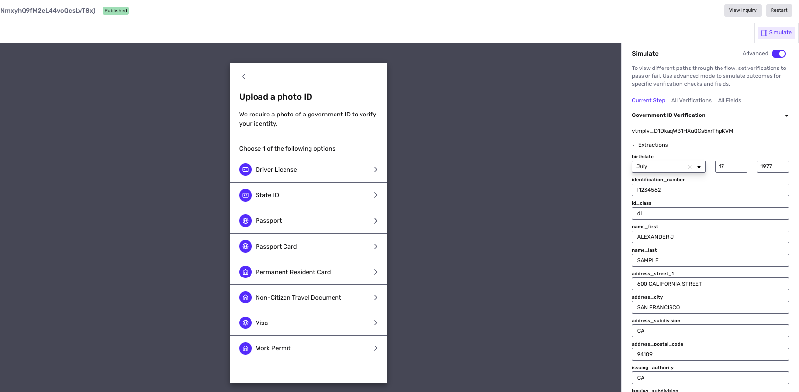
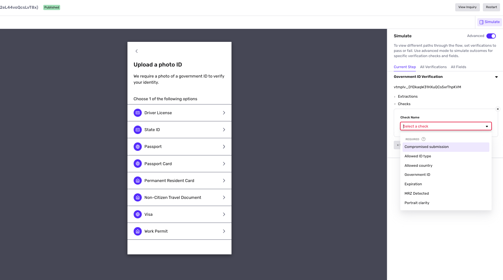
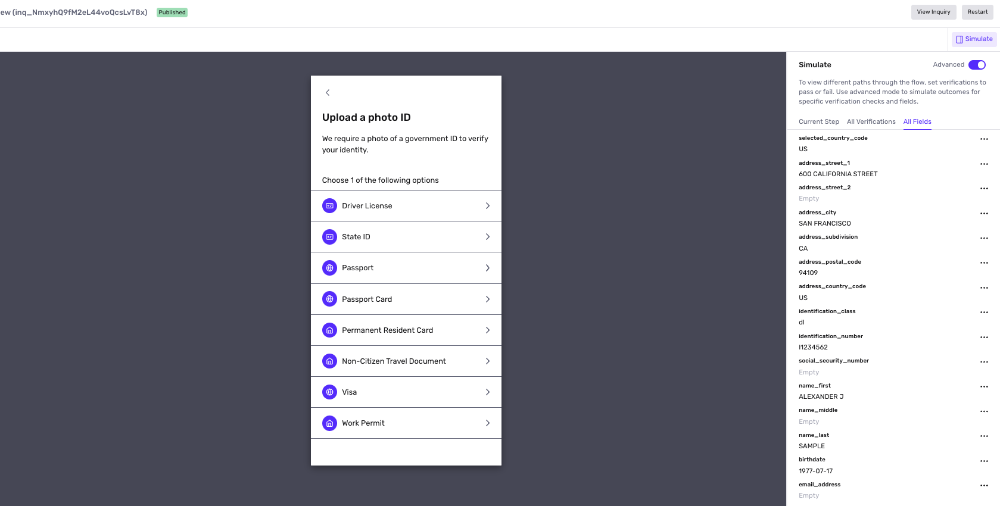

# Simulate in Inquiries

## Overview

Testing is an important part of configuring an inquiry template, especially if you have conditional logic or branching.

What your users experience within the Inquiry flow may depend on the inputs they provide. You can use **Simulate** to mimic different user inputs in a Sandbox inquiry so you can see what different users may experience and test your template.

**Simulate** also enables you test conditions that are difficult to replicate in real life. For instance you would be able to test a template that depends on the extracted age being under 18 without an actual ID or document in hand.

## Using Simulate

After you build out your inquiry template, you can test it within Simulate. To do so, click Preview in the upper right hand corner.

### Simple Mode vs. Advanced Mode

Simulate has two modes, simple and advanced.

-   **Simple mode** allows you to control if verifications should pass or fail on a given screen. This is useful for progressing through simple inquiries with simple branching logic around verification pass/fail like "Gov ID Verification failed"
-   **Advanced mode** gives you more granular control over the outcomes of simulated verifications. This is useful for for progressing through complex inquiries whose branching logic references more granular verification checks results like "Compromised Submission"

### Using Simple Mode

With Simple Mode, you can toggle if the relevant verification(s) will pass or fail on any given screen, no matter what you submit. You can then click through and see how different branches will work. 

To navigate around the template, you can also use the read-only steps panel on the left.

### Using Advanced Mode: Current Step

Start on the Current Step tab in Advanced Mode to simulate the verifications relevant to the current step.

“Relevant” verifications means verifications that about to be performed upon transitioning to next screen, and thus simulated checks and check reasons would be immediately used. You can toggle any relevant verification to pass or fail.

#### Extractions

Some verifications, like Government ID, will pull “extracted” information from what the user submits, which are then copied over to Inquiry Fields and may impact your branching logic.

Within the Extractions toggle, you can simulate certain information being extracted and testing the paths that may follow.  

#### Checks

The result of a verification is directly driven by the results of the checks that it performs. Toggle Checks to simulate certain verification checks passing and failing which will impact the result of a verification.

Verifications generally specify “Required” and non-”Required” checks. If any “Required” check fails, then the verification fails. 

### Using Advanced Mode: All Verifications

This tab shows all the verifications you can simulate in your Inquiry flow, rather than just the ones attached to the current step.

You can use this tab to simulate multiple verifications at a time. 

### Using Advanced Mode: All Fields

This tab shows Inquiry Fields values that may change as you progress through the flow.

Fields can change due to

-   Simulated extractions being copied over to fields
-   Inputting values into Inquiry form components that are connected to fields

