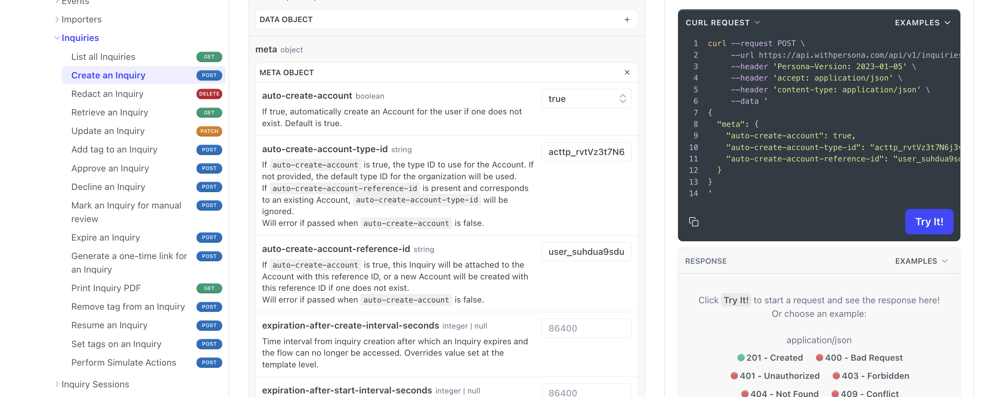

# Creating Accounts

# Overview

An [Account](./2gE7mjjLCIGJPnK6mTyjU9.md) represents a single instance of an [Account Type](./NrM9W6KETzMbzQXgdU3cV.md) and corresponds to a unique user in your system or service. You can create Account records through various methods that align with how businesses typically integrate with Persona. This article outlines different approaches for creating an Account and specifying its Account Type.

# Methods for creating an Account

## 1\. As part of creating another Persona object via API

You can create an Account when you are creating a select set of Persona objects via API by using specific endpoints and specifying the creation of an Account in your API request.

By using the functionality within these endpoints, you’re able to simultaneously create an Account and associate the primary object to the Account as well.

### Relevant objects and API endpoints

**Some of the relevant objects and relevant API endpoints for this behavior include:**

-   [Create an Inquiry](../../docs/reference/create-an-inquiry.md)
-   [Create a Report](../../docs/reference/create-a-report.md)

### Specifying the creation of an Account in the API request

For the relevant API endpoints, you can ensure that an Account is created as part of the request by including the appropriate `meta` object information in the body of your API request. It’s recommended to use the above documentation from our API reference to review, test, and/or navigate toward our OpenAPI spec for further detail.

_Using our API reference documentation, you can also draft your API requests. In the above example, we are attempting to create an Inquiry via API and are specifying the necessary values in the meta object of the request to simultaneously create an Account when the Inquiry is created as well as associated the two newly created objects._

**The necessary values to specify in the `meta` object include:**

`auto-create-account` : Specifying true marks the desire to create an Account alongside the primary object being created by the request.

`auto-create-account-type-id`: The Account Type ID should come from your Persona dashboard and indicates what [Account Type](./NrM9W6KETzMbzQXgdU3cV.md) should be created. For example, if you have two Account Types like User and Business, you will want to find the associated Account Type ID for the the Account Type you would like to make the record of. You can find all Account Type IDs by navigating to Accounts > Types in the dashboard.

`auto-create-account-reference-id`: It is highly recommended to set a [Reference ID](./617EAw0wpwv3J3MGpHUxEb.md) for each newly created Account. Reference IDs should be a unique string from your system or service that represents the unique record of the identity like a user ID.

## 2\. Directly creating an Account via API

You can create an Account directly via API.

### Relevant API endpoint

The relevant API endpoint to execute this request is:

-   [Create an Account](../../docs/reference/create-an-account.md)

### Specifying the creation of an Account in the API request

Unlike the 1st method above, using the Create an Account endpoint directly creates an Account. Nonetheless there are additional values you should include in your request. It’s recommended to use the above documentation from our API reference to review, test, and/or navigate toward our OpenAPI spec for further detail.

**The necessary values to specify in the `data` > `attributes` object include:**

-   `account-type-id`: The Account Type ID should come from your Persona dashboard and indicates what [Account Type](./NrM9W6KETzMbzQXgdU3cV.md) should be created. For example, if you have two Account Types like User and Business, you will want to find the associated Account Type ID for the the Account Type you would like to make the record of. You can find all Account Type IDs by navigating to Accounts > Types in the dashboard.

## 3\. Within a Workflow

You can also create an Account within a Workflow using different steps. Similar to the above methods, you may also need to specify the desired Account Types and/or Reference ID for the newly created Account.

### Relevant Workflow Steps

-   [Find or Create Account](./66GC6EDZ4qysMQLD77WPIQ.md)

### Specifying the creation of an Account in the Workflow Step

Similar to the above methods, you may also need to specify the desired Account Types and/or Reference ID for the newly created Account. More detail on the available Step configurations can be found in the above Step-specific articles.

## 4\. Through Importer

You can create an Account with the information you import through [Importer](./2fpD7Bwb7OrzAS4g7XWoMG.md). In the Destination step of Importer, you can select Accounts to be a destination object onto which the Importer will insert information. You can choose whether to create new records, updating existing records, or allow both.

## Related articles

[Accounts overview](./2gE7mjjLCIGJPnK6mTyjU9.md)

[What is the default Account Type when creating an Account?](./19KBOIPfsnyE2zPyG1AsoC.md)

[Creating custom Account Types and Fields](./NrM9W6KETzMbzQXgdU3cV.md)

[Workflows: Find or Create Account step](./66GC6EDZ4qysMQLD77WPIQ.md)

[Workflows: Create Inquiry step](./nvCvqDw3f4yRuiovvOHQC.md)
