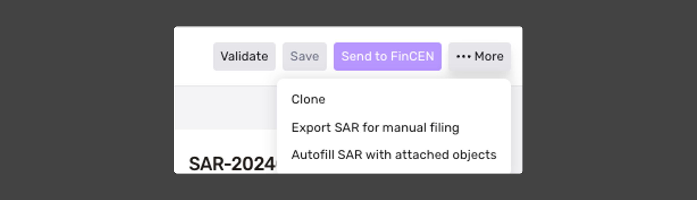
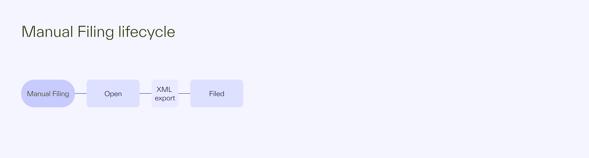
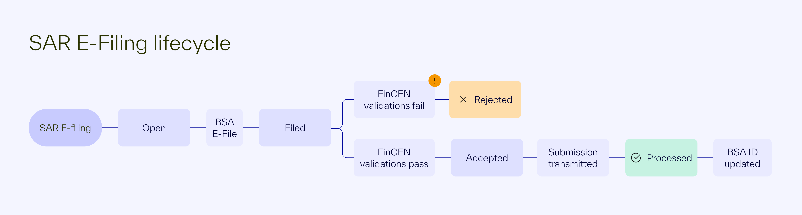
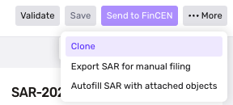
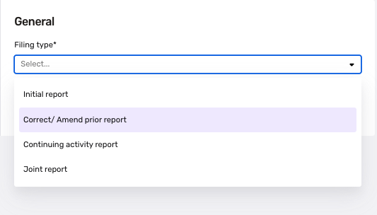

# File a SAR

## Filing a SAR within Persona

SARs (Suspicious Activity Reports) can be filed manually as XML exports or automatically through e-filing.

## Validating your SAR

After compiling your SAR form and narrative, click **Save**, then **Validate**. Upon hitting **Validate**, you'll notice check marks or alert icons next to each section of the SAR form. Resolve any validation issues and then save and validate again to ensure your SAR is prepared for submission.

## Manual Filing

Only users with SAR filing dashboard [permissions](./Ge16TE6VaYZGWVNe2b9cx.md) can initiate SAR exports from the Persona dashboard. Once your SAR form has been validated, your organization can download it as an XML file for upload to the BSA portal. To manually export a SAR, follow these steps:

1.  Click on the SAR record ID within the case to navigate to the SAR record
2.  Locate **More...** in the top right corner, then select **Export SAR for manual filing**
3.  Click **Sign and export** which will finalize the export and move it to a **Filed** status
4.  Upon export, manually submit the XML file to FinCEN using the [BSA SAR filing website](https://bsaefiling.fincen.treas.gov/main.html)

## E-filing from Persona

⚠️**Note:** In order to e-file, you’ll enter valid SAR SDTM e-filing credentials for your organization under **Filing Jurisdiction.** We recommend working with your account team to test in sandbox before you submit your first SAR.

Only users with SAR filing dashboard [permissions](./Ge16TE6VaYZGWVNe2b9cx.md) can initiate e-filing from the Persona dashboard.

To electronically file a SAR, follow these steps:

1.  Click on the SAR record ID within the case to navigate to the SAR record
2.  Locate the **Send to FinCEN** button positioned in the top right corner of the page of the SAR record
3.  Click the button to initiate the filing process. A confirmation modal will appear, asking you to confirm your intention to file the SAR with FinCEN
4.  Press **Sign and submit** to proceed with the submission. A popup message will appear, indicating that the submission is in progress

Upon successful initiation of the SAR transmission, you will notice the status badge at the top of the SAR record update from `Open` to `Filed`, signifying that the SAR has been submitted

## Understanding the SAR e-filing lifecycle

**Manual filing status lifecycle**

-   **Open:** This status denotes the initial stage of the SAR within Persona.
-   **Filed:** Once the SAR has been manually exported, it enters the Filed status. For manual exports, `Filed` is the terminal status. At this stage, the SAR is locked and cannot be edited directly. To make changes to a locked SAR, you will need to **Clone** the SAR record.

**E-filing status lifecycle** 

-   **Open:** This status denotes the initial stage of the SAR within Persona.
-   **Filed:** Once the SAR has been electronically filed to FinCEN, it enters the Filed status. At this stage, the SAR is locked and cannot be edited directly. To make changes to a locked SAR, you will need to `Clone` the SAR record.

After submission, the BSA e-Filing system automatically conducts validations. Within approximately an hour, the filing institution receives notification of acceptance or rejection via email. It's important to note that Persona does not directly receive this email from FinCEN; instead, it is sent directly to the financial institution.

-   **Accepted:** This status denotes that the SAR was accepted for processing
-   **Rejected:** This status denotes that there were validation errors on the SAR form that need to be fixed.
    -   To fix the SAR, click on the **••• More** button to and then click **Clone**. This will duplicate all the fields on the SAR record. Fix any issues before e-fling again.

After the SAR form has been accepted and upon completion of processing by FinCEN, the BSA e-Filing system triggers acknowledgment notifications. At this point the accepted SAR will moved to a processed state.

-   **Processed:** Persona updates the filing status along with the BSA ID within the dashboard upon receiving the processed notification from FinCEN. Additionally, an acknowledgment email is sent from the BSA e-Filing system to the filing institution.

## Fixing a Rejected SAR

If your SAR file has been rejected by FinCEN, follow these steps:

1.  Duplicate the SAR file by clicking on the **… More** button to and then clicking on **Clone.**

2.  Select “Initial Report” under Filing type.

3.  Make sure report is completely filled out and has the corrections.
4.  Submit the new SAR.

## Correcting or amending a SAR

If your SAR file requires amendments from FinCEN, follow these steps:

1.  Duplicate the SAR file by clicking on the **… More** button to and then clicking on **Clone.**

2.  Select “Correct / Amend prior report” under Filing type. You’ll be asked to provided the BSA ID of the original SAR filed. You can find the BSA ID of the SAR previously submitted within the SAR Filing dashboard page.

3.  Make sure report is completely filled out and has the corrections.
4.  Submit the amended report.

## Related articles

[Create Alert and SAR Cases](./2FgJ3WR85sQNVSBWWLffC6.md)
