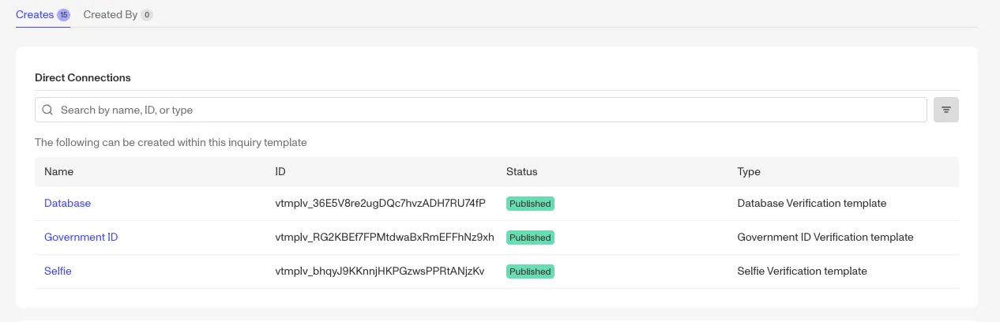
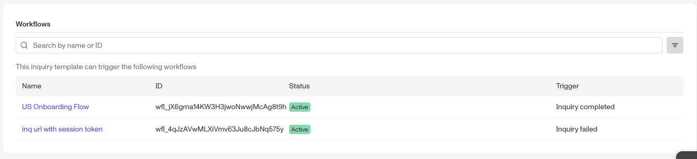
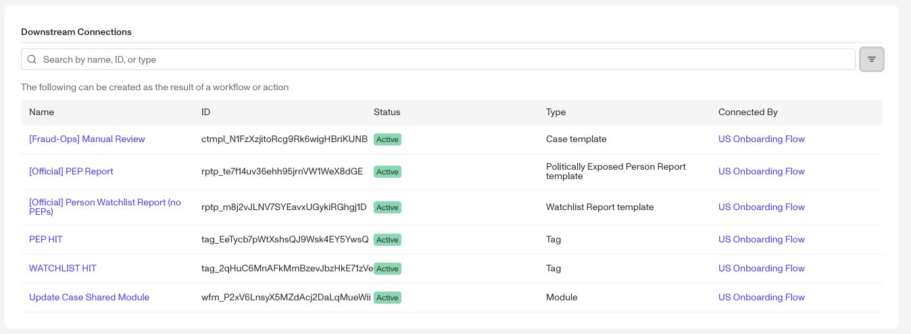

# Platform Connections

# Overview

## What are Platform Connections

Platform Connections allow you to understand how your solution within Persona works. The Platform Connections page provides users with a clear, visual way to understand how different object types, templates, and workflows are interconnected.

As solutions grow to handle more complex use cases, it can become difficult to manage dependencies and understand how changes in one template may impact other solutions. The Connections page makes it easier to visualize these relationships, which improves maintainability and helps builders make changes more confidently.

## Where can you find Platform Connections?

Platform Connections are available for the latest published version of Inquiry Templates, Verification Templates, Case Templates, Report Templates, Graph Query Templates, Account Types, Transaction Types, Tags, Workflows and Lists.

⚠️ A quick primer on templates and objects: Every Persona object (inquiry, transaction, account, etc.) is backed by a template or object type that holds the object’s configuration. For instance, inquiries behave as their template is configured and accounts have the schema defined on the account type. For the purposes of this article, we will use “templates” to refer to both templates and object types.

To view the Platform Connections page, navigate to the type or template or workflow > ... > **Connections**

## How do you use Platform Connections?

There are 2 different types of connections - Creates and Created by. On the **Creates** tab, you can find:

-   **Direct connections** (Workflow and Inquiry Templates only): If a template is listed in this section, it means it can be directly created by the workflow or inquiry.
-   **Workflows**: displays whether the template you’re viewing triggers any workflows.
-   **Downstream connections**: displays whether the template you’re viewing creates any objects via its connected workflows.
-   **Case Actions** (Case Templates only): displays if the Case Template you’re viewing triggers any Case Actions.

On the **Created By** tab, you will only find **Direct Connections** which display the upstream templates/workflows that can create the one you’re viewing.

### Example

To walk through an example, if we view the Creates tab for a Database/Gov ID and Selfie inquiry template, we can see 3 verification templates in the **Direct Connections** section. This means this inquiry template can directly create a Database, Government ID and/or Selfie Verification.

The Workflow section shows 2 workflows that can be triggered by this inquiry template; one via inquiry completed workflow and the other through an inquiry failed workflow.

The Downstream Connections section shows all the templates that can be created by any of the workflows.

Also note that for each of these sections, you can filter by status/state and search by name, ID, or type.

## When might you use Platform Connections?

### I need to update workflow logic for a particular Inquiry Template

Solutions change over time and it’s common to need to change workflow logic for specific Inquiry Templates. However, identifying all of the workflows for a particular Inquiry Template previously required manual searching on the workflows page. Now, the Connections page shows all the Workflows for a particular Inquiry Template in one place, making it easy to implement changes and ensure no workflows are overlooked.

### I want to replicate an existing solution for a new Transaction Type

As customers grow, there can be the need to replicate existing solutions. For instance, a customer launching a new transaction type may want to start by simply replicating the implementation of an existing Transaction Type, then add minor product-specific adjustments. Connections provides builders with a way to recall and rebuild that implementation quickly, without having to click through multiple screens and/or rely on memory. Even if the builder wasn’t involved in the initial implementation, Connections gives a way to easily visualize, understand and replicate solutions.
