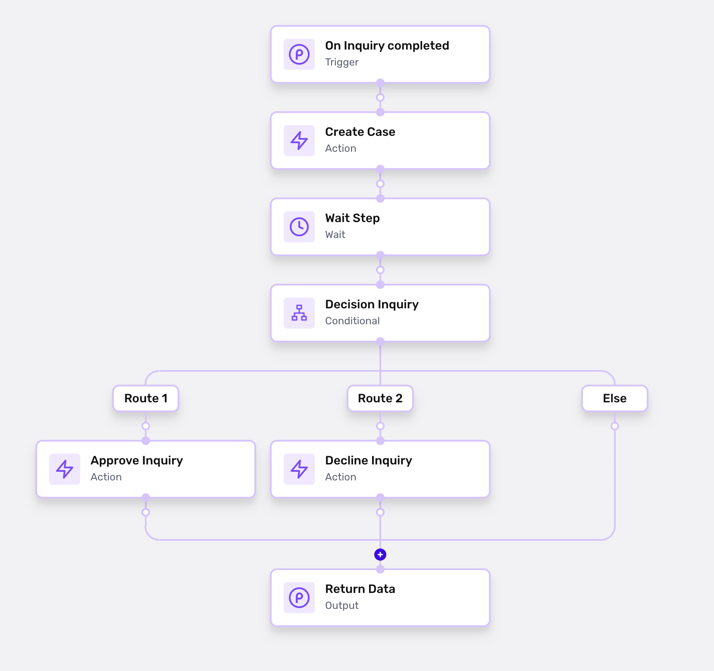

# How do I automatically create a Case for review?

## Prerequisites

Before you begin this tutorial, you should:

-   Know what a Workflow is, and know how to build one. See our articles on [Workflows](../workflows.md) to learn more.
-   Know how to customize a Case template, and have created at least one case template. See the [Case Template](./5WFMyVPjzgXQNljqg2xf4h.md) article for more details.

## Scenario

Let's say you want to:

-   Automatically create a Case when any Inquiry completes
-   (Optional) Automatically assign a Case when it gets created
-   Then, when each Case is resolved, automatically approve the associated Inquiry if the Case is approved, and automatically decline the Inquiry if the Case is declined.

## Building your Workflow

Below, we'll build one Workflow to automate the above scenario. Here's what it'll look like:

**To build it, follow these steps:**

1.  First, create a Workflow. Make this Workflow trigger on `Inquiry completed`.
    
2.  Add an Action step to the Workflow. For Action, select `Create Case`. Choose the Case Template you want to use.
    
3.  (Optional) Add an Action Step called `Assign Case`. Choose the Assignee for the Case.
    
4.  After the Action step, add a Wait step. Select the following settings:
    
    -   Wait for = `Object`
    -   Target Object = `Object from Create Case step`
    -   Events = `Case resolved`
5.  After the Wait step, add a Conditional step.
    
    -   Route 1: 
        -   Label = (Your choice. Suggestion: "Case is approved")
        -   Where = `create_case.state equals Approved`
    -   Route 2: 
        -   Label = (Your choice. Suggestion: "Case is declined")
        -   Where = `create_case.state equals Declined`
    -   Else: (Leave this empty.)
6.  Under Route 1, add an Action step. For Action, select **Approve Inquiry**.
    
7.  Under Route 2, add an Action step. For Action, select **Decline Inquiry**.
    
8.  Once you've completed building this workflow, be sure to save and publish it!
