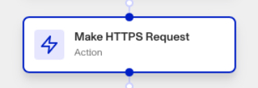
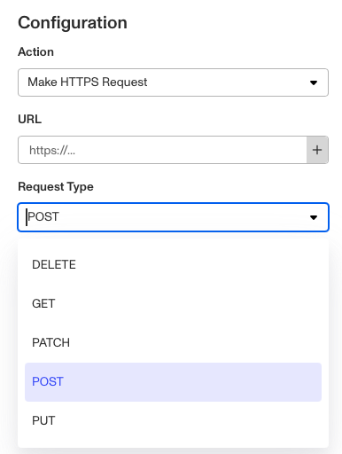

# Workflows: Make HTTPS Request step

# What is the Make HTTPS Request step?

Make **HTTPS Request** is a Workflow Action step that allows you to perform HTTP requests to external APIs or services directly from within your workflow. A common use case for this Action step is to replicate similar behavior to that of a Webhook, allowing you to deliver more precise or specific information back to your systems.

The Make HTTPS Request step enables several types of request:

-   **DELETE**: Deletes a specified resource on the external server, such as deleting a user’s information.
-   **GET**: Retrieves data from the external server, such as retrieving a user’s information.
-   **PATCH:** Modifies a portion of a specified resource on the external server without overwriting the whole resource, such as updating a user’s email on file without changing the rest of the user’s information.
-   **POST:** Sends information via a payload to the server. This is often used for making resources such as creating a new user with a specified name and email address.
-   **PUT:** Overwrites a resource with new data (and creates the resource if it doesn’t exist), such as replacing all of a user’s personal information with updated information.

To add a **Make HTTPS Request** step, you will also need to add:

-   A **Header**, which is the Persona HMAC signature that verifies the HTTPS request’s authenticity. The Header can be generated with a **Key** and **Value**.
-   A **Persona Secret** which is used to further verify outgoing requests. Both the Persona Secret and Header’s Value can be pulled from elsewhere in your workflow.
-   **Retry intervals** in case the HTTPS request does not initially go through, and a **Request Timeout** limit whereupon the step will return an error.

# How do you add a Make HTTPS Request step?

1.  Navigate to the Dashboard, and click on **Workflows** > **All Workflows**.
2.  Find and click on the workflow you want to edit, or **Create** a new workflow.
3.  Click on **+** when hovering over a circle to add an **Action**.

4.  Use the **Find Action** select box to click on **Compute** > **Make HTTPS Request**.
5.  Add the **URL** to send the HTTPS request to. It can be added manually or from elsewhere in your workflow with ‘**+**’.
6.  The **Request Type**, which can be DELETE, GET, PATCH, POST, or PUT. Earlier in this guide explains the purpose of each request type.
    1.  (Optional) If you select PATCH, POST, or PUT, you can optionally add **Body** JSON data to send alongside the request.
7.  The **Request Headers** which identify and authenticate the HTTPS Request. Each Header requires a **Key** and a **Value**.
8.  (Optional) The **Response Schema** that defines how Persona should receive information back from the external server.
9.  In ‘Advanced Configuration’:
    1.  Set the **Persona Secret** that will sign your request.
    2.  (Optional) Set the **Retry Intervals** for the step to re-attempt making an HTTPS request if it doesn’t get a response. You can add several different **Retry** intervals.
    3.  (Optional) Set the **Request Timeout** in seconds that the step will return an error upon reaching without a response from the external server.
    4.  (Optional) Click the **Continue on error** box if you want the workflow to continue running even if this step raises an error.
10.  **Close** the step. You’ll have to **Save** and **Publish** the workflow to begin using it.

# Plans Explained

## Make HTTPS Request step by plan

|  | Startup Program | Essential Plan | Growth Plan | Enterprise Plan |
| --- | --- | --- | --- | --- |
| Make HTTPS Request step | Not Available | Not Available | Available | Available |

[Learn more about pricing and plans](./6oZbzp7jb7AWGClF5vpY3K.md).
