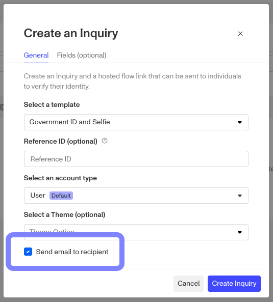
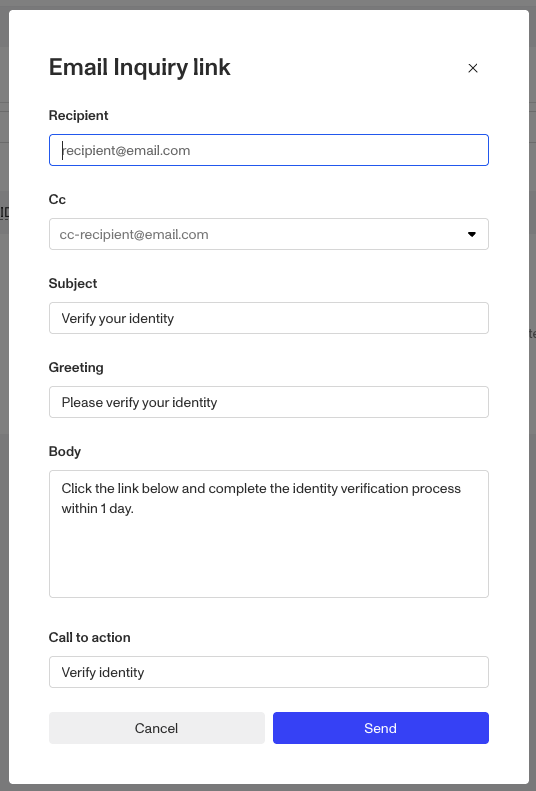

# Sending an Inquiry Link by email at Inquiry Creation

When creating new inquiries via the Dashboard, you can have the Inquiry Link sent to an email address.

By toggling the “Send email to recipient” checkbox, when you click the “Create Inquiry” button you’ll be presented with an additional window.

From here you can set the recipient's email, set any CC’d addresses, the Subject line, Greeting, email body, and finally a Call to Action.

Once you’ve filled out the relevant fields, click Send.
