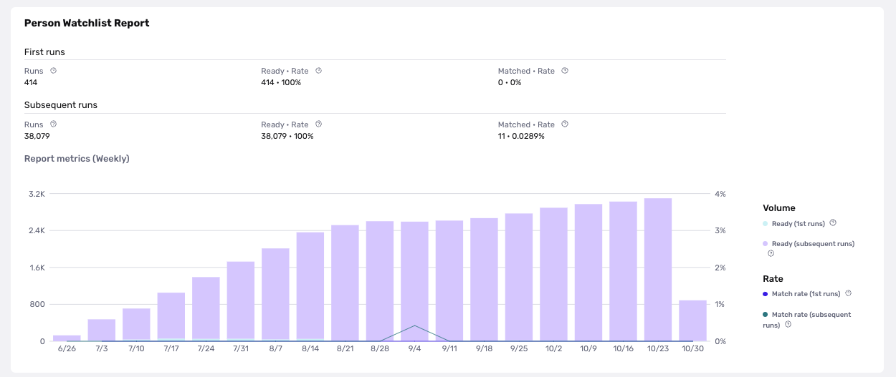

# Reports Analytics in the Dashboard

## Overview

Reports Analytics lets you see ready rates and match rates for each report type. This information can help you decide how to configure your reports.

## How to use Reports Analytics

Navigate to the [Analytics](https://app.withpersona.com/dashboard/reports-analytics?filter=%7B%22createdAtStart%22%3A%222022-11-17T00%3A00%3A00.000Z%22%2C%22createdAtEnd%22%3A%222022-12-01T23%3A59%3A59.999Z%22%2C%22templateIds%22%3A%5B%5D%7D) section within the **Reports** tab on the dashboard.

At the top of the page, you can use the **Dates** and **Template** filters to select the time period and Reports template you want to see data for. After you set your desired filters, click **Run** to update the metrics on the page.

## Available metrics

For each Reports template, available metrics include the number of report runs, number of reports with “Ready” status, and number of reports with at least 1 match.

### Definitions

-   **Ready**: These are reports that have successfully run and have a status = "Ready".
-   **Matched**: These are reports that have at least 1 matched result returned based on what the user had submitted.

## Example use cases

With Reports Analytics, you can:

-   Compare and monitor fluctuations in match rates for all reports.
    -   This is primarily useful for Watchlist, Adverse Media, and PEP reports, because you can use match rate trends to identify opportunities to change your strategy and configure report templates accordingly.
    -   For example, if you observe match rate has increased for a Person Watchlist report and notice these are largely false positives, you can adjust configurations to reduce the number of false positives.
-   View the number of "Ready" reports for billing estimates.

Your analytics is a source of truth for the performance of your specifics solutions, but should not be treated as such for your billing. Your contract will determine how your bill is calculated and your invoice should be treated as the source of truth.

For example, verification analytics will count unique inquiries containing a verification, but not the number of individual verifications in the inquiry, whereas billing counts the total number of verifications. If you have an inquiry with 2 Gov ID verifications, this can cause a disparity in the count between the analytics numbers and billing.
