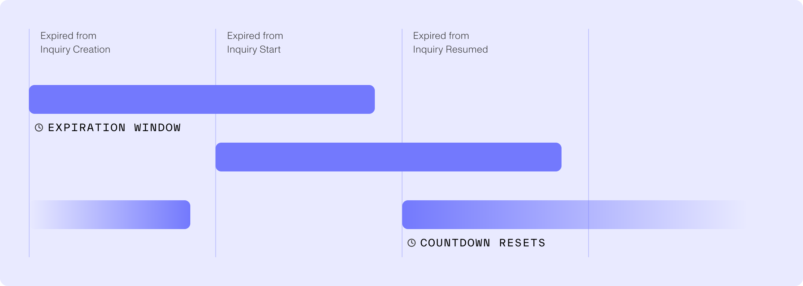
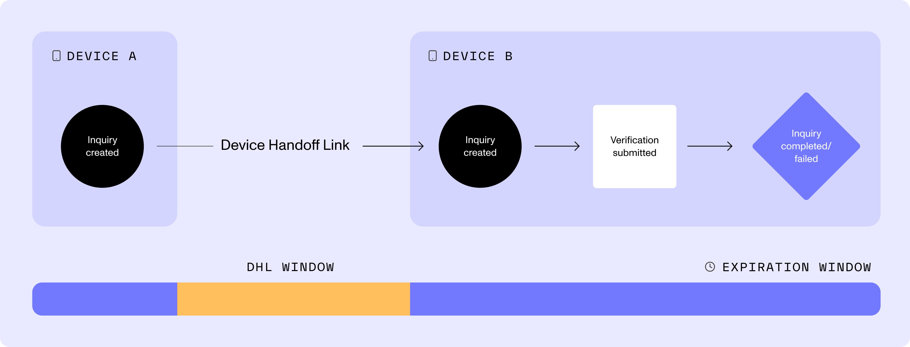
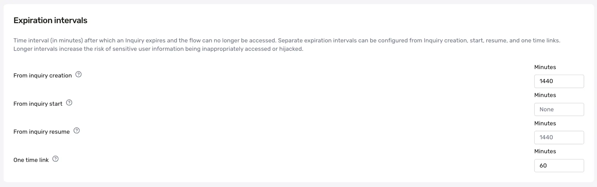

# Controlling when Inquiries expire

## Inquiry Expiration

For security purposes, Inquiries will expire and no longer be accessible by end users after 24 hours.

Expired Inquiries can be [resumed](./7xYuQOCfXXjW4cgS3c7EOg.md). Resumed inquiries will expire again after 24 hours.

Inquiries can also be configured to expire after a given interval after the inquiry has entered the `pending` phase. For example, if set to 1 hour, an Inquiry will expire after 24 hours if not started, but will expire after 1 hour once started. See [Inquiry Model Lifecycle](./5KwYh8Uw7M9z6059vP0aWl.md) for more information on Inquiry statuses.

When an inquiry expires, all of its [Inquiry Sessions](../../docs/inquiry-sessions.md) and [Inquiry One-Time Links (OTL)](../../docs/inquiry-one-time-links.md) will also be expired.

### Inquiry Expiration vs Session Expiration

End users can also lose access to their pending inquiry if their session expires. Sessions are maintained by session tokens on their browser. So if they close a pending inquiry and reopen it in a separate browser window, they will lose their session token and see a ‘Session expired’ error. They will be unable to continue the inquiry without [**creating a new session token**](../../docs/2021-05-14/resuming-inquiries.md#creating-a-new-session-token) or [**generating a one-time link**](../../docs/2023-01-05/api-reference/inquiry-sessions/generate-a-one-time-link-for-an-inquiry-session.md). You can learn more about Inquiry Sessions [here](https://www.notion.so/inquiry-sessions).

## Configuring expiration intervals

Expiration intervals can be configured for each Inquiry Template in the Persona Dashboard, at **Inquiries > Templates > Configure > Expiration Intervals**. Note that longer intervals increase the risk of sensitive user information being inappropriately accessed.

The following intervals can be set: 

-   **From Inquiry creation:** after the inquiry is first created, the status will change to `expired` after this time. Configure this to ensure that inquiries that are never accessed are not available forever. Defaults to 24 hours.
-   **From Inquiry pending:** after the inquiry enters the `pending` phase, the status will change to `expired` after the configured time. If left blank, this defaults to the value for the Inquiry Creation time option. Configure this if you would like to further control how long an Inquiry is available after an end user has accessed it.
-   **From Inquiry resume:** after the inquiry expires and is _resumed_ (via API call or in the Dashboard), this is how long the user has to complete the inquiry before the status changes to `expired` again. Defaults to 24 hours.
-   -   The inquiry can also be set to expire if the end user(s) start too many sessions with the inquiry. This is meant to help mitigate bad actors from passing a captured inquiry link around to different devices. Defaults to 25 sessions.

-   **Device Handoff Link :** This applies to device handoff links generated when a user elects to perform a handoff to another device. Because device handoff links are authenticated links, we recommend setting them to expire as quickly as your use case can tolerate. Defaults to 1 hour.

| Expire starting point | Default time |
| --- | --- |
| Creation | 24hrs |
| Pending | Same as Creation Expired’s duration |
| Resume | 24hrs |
| Device-Handoff-Link | 1hr |
| Inquiry Session Limit | 25 |

All five expiry windows can be configured at the template level. 

## Per-inquiry expiration intervals

Expiration intervals can be set at the inquiry level when [creating inquiries via API](../../docs/2022-09-01/api-reference/apiv-1-inquiriesinquiry-id-2.md) by passing the appropriate `meta` parameters:

-   **From inquiry creation:** `meta.expiration_after_create_interval_seconds`
-   **From inquiry pending:** `meta.expiration_after_start_interval_seconds`
-   **From inquiry resume:** `meta.expiration_after_resume_interval_seconds`
-   **One-Time Link:** `meta.one_time_link_expiration_seconds`

## Related articles

[The Inquiry Lifecycle Model](./5KwYh8Uw7M9z6059vP0aWl.md)

[How do I resume an expired Inquiry?](./7xYuQOCfXXjW4cgS3c7EOg.md)

[When does a link to an Inquiry expire?](./4m6n5LkyT8po1eefaBmBBO.md)
