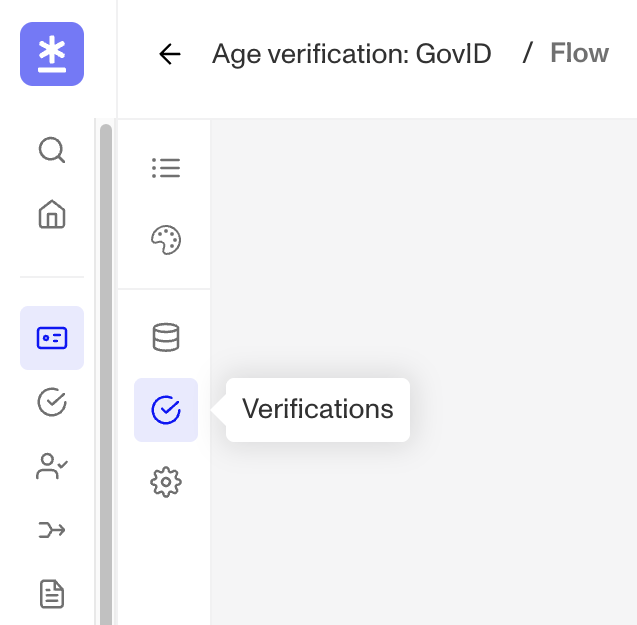
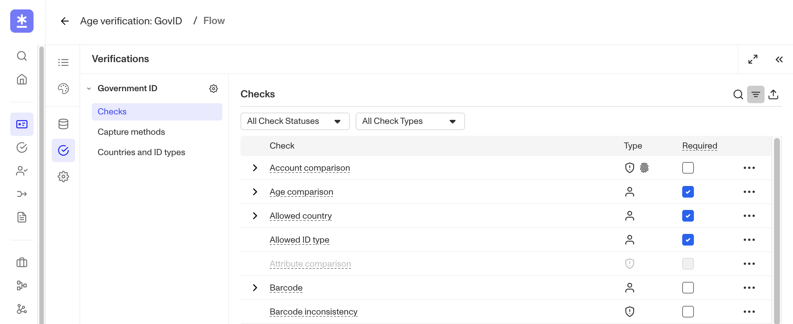

# Verification checks

## Overview

Once you have decided which Verification checks you want to require for a Verification type, you can configure them in the Dashboard. There are [different ways to create a verification](./3wK7xYJEsovSTTaZTAjXuU.md#2-within-a-workflow):

-   As part of an Inquiry (recommended)
-   With an API request
-   Within a Workflow

## Prerequisites

-   Not sure which Verification checks you want? See [this guide](./3WnqX7N26sshPLKPQbuW4O.md) (written for Government ID Verification) as an example of how to think through it, and the full set of steps that may be involved to make a change.
-   The ability to configure required Verification checks is available on paid plans. If you're on the free plan and want to upgrade, please contact us [here](https://app.withpersona.com/dashboard/contact-us).
-   If your Verification check configurations are fully managed by your Persona team, you will not be able to edit them yourself. Please reach out to your customer success manager if you would like to make changes.

## Configure Verification checks inside an Inquiry Template

1.  In the Dashboard, navigate to **Inquiries** > **Templates**.
2.  Select the **Inquiry Template** you want to edit.
3.  In the left sidebar of the Flow Editor, click the **Verification icon** (checkmark in a circle).

 4. Select Checks in the Verifications sidebar for the type you want.  5. Next, you can make changes to enable or disable select Verification checks. To learn more about what it means for a Verification check to be enabled/disabled, [check out this article.](./MBqBUj2HlXY34i5SJIRaz.md) 6. You can also select whether a specific check should be required or non-required under the **Required** checkbox 7. Once you make any changes, click **Save** in the upper right corner of Flow Editor to save your edits.

## Configure Verifications checks alongside a Workflow, Transaction, or API request

1.  In the Dashboard, navigate to **Verifications** > **Templates**.
2.  Select the desired Government ID Verification Template that you'd like to change.
3.  Next, you can make changes to enable or disable select Verification checks. To learn more about what it means for a Verification check to be enabled/disabled, [check out this article.](./MBqBUj2HlXY34i5SJIRaz.md)
4.  You can also select whether a specific check should be required or non-required under the **Required** checkbox.

 5. Once you make any changes, click Save in the header to save your edits.

## Learn more

-   Learn what it means for a check to be enabled or disabled: [Verification check states](./MBqBUj2HlXY34i5SJIRaz.md).
