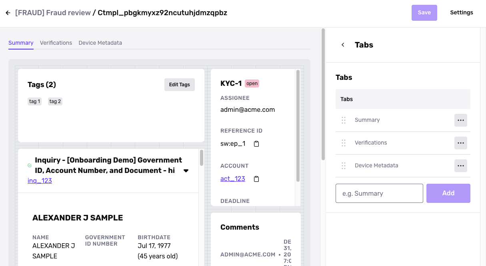
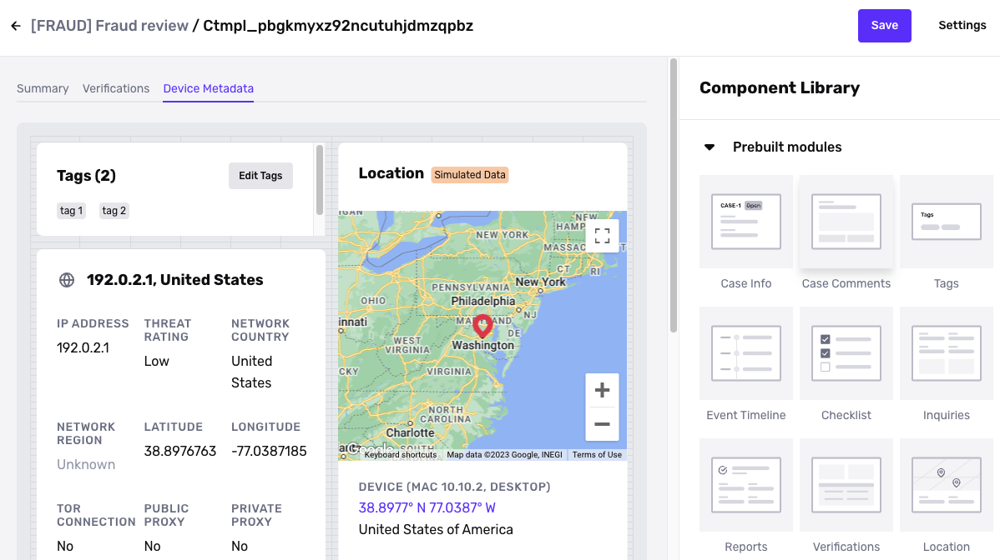

# Cases Template

## Overview 

A Case template lets you configure the Case UI for your team, and many settings that govern how the Case behaves. You can help your team review Cases more efficiently and accurately by creating a Case Template for each common scenario you encounter in manual review. 

For example, if your organization has a KYC team and a fraud team that each review Cases, you can create a Case template customized for each team. 

A Case template lets you configure the Case UI by adding or removing, rearranging, and configuring pre-built Case Modules using a drag-and-drop editor. Among other settings, you can also define custom statuses and actions, and choose the assignment policy for Cases that use the Case Template.

## Create a Case Template

To create a Case Template:

1.  In the Dashboard, navigate to **Case** > **Templates**.
2.  Click **\+ Create template**.
3.  Fill in:
    -   **Name**: This name appears in the Case templates list and other parts of the Persona UI, primarily in configurations. We recommend a name that describes the reason for review.
    -   **Case template key**: This key appears in the Case list that your review team works out of. The template key helps your review team distinguish different types of Cases—i.e. Cases that use different Case templates.
    -   **Visible to roles**: The user roles in your Persona organization that can view Cases created with this Case template.
4.  Click **Create**.

## Edit the Case UI

When you first open a Case Template, you see an editor view called the Case Layout Editor. What you see in the Case Layout Editor reflects what your review team will see.

### Tabs

Notice the tabs at the top of the Editor. Each tab is a screen that your review team can click into. You can customize the name of each tab, and add, delete, and rearrange the order of tabs.

### Modules

Click on a tab in order to view and edit that tab's screen. To customize the screen, you can:

-   **Rearrange modules:** Drag and drop, and resize existing modules on the screen.
-   **Edit a module**: Click on an existing module on the screen to view its settings in the sidebar. You can then edit the settings for the module.
    -   From the settings, you can delete the module.
-   **Add a module**: Drag and drop additional Case modules from the Component Library onto the screen.
    -   See [Available Cases Modules](./71bfAMD6bNyf7zFW7Q1ghk.md) for a list of modules you can choose from.

Make sure to save your changes. Once you save, all Cases created with this template will reflect the new changes.

## Edit Case settings

From within the Case Template view, click **Settings** in the upper corner. You'll be able to edit the following settings.

### Assignment policy

You can create custom assignment policies. For each policy, you configure:

-   Distribution method
-   Assignees: all users, or a select subset of users

You have several options for distribution method:

-   **Inquiry creator:** Cases created from this template will be assigned to the user who created the Inquiry via the Dashboard.
-   **Case creator**: Cases created from this template will be assigned to the user who created the Case.
-   **Round robin:** Cases created from this template will be assigned in a round robin fashion to the possible assignees.
-   **Fewest cases:** Cases created from this template will be assigned to the user in the possible assignees who has the fewest open Cases.

### Notifications

You can choose which users receive an email notification whenever a Case that uses this template is created.

Note that there are other notification settings that allow each team member to choose how they're notified about Cases assigned to them. To learn more, see [Dashboard and email notifications for Cases](./4zjE9FiHMIZMRQkIbb7mbf.md).

### Actions 

See: [Cases Actions](./3QokSTOfV7ZC7hNDPQ5HnT.md)

### Statuses

See: [Cases Statuses](./2P8swNyjlHKiZPDCy5gnAu.md)

## Demo: Editing a Case Template

Karen, product manager on Cases, demonstrates how to create and edit a Case Template. [View the demo on Loom](https://www.loom.com/share/f26fbf75db9740379b0beaf10cea96ff).
