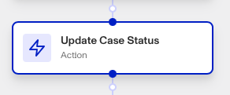

# Workflows: Update Case Status step

# What is the Update Case Status step?

**Update Case Status** is a Workflow Action step that updates a case’s status.

Cases are Persona products that collect together data on an end user to allow for manual investigation and decisioning on. Your organization may need to investigate this user for a variety of reasons:

-   **Onboarding**: Should this user be allowed to onboard to the platform?
-   **Account takeover investigation**: If a user is claiming that their account has been taken over, is there enough information to validate their claim?
-   **Fraudulent activity**: Are there suspicious signals associated with this user that require further action (e.g. account freezing, sending a follow-up inquiry for verification, etc.)?
-   **Transaction monitoring review**: Are there suspicious transactions associated with this user that require further investigation?

## Possible case statuses

Default possible cases statuses are:

-   **Open**: The case is ready for investigation.
-   **Pending**: The case is awaiting further action or information.
-   **Approved**: The case has been reviewed and approved.
-   **Declined**: The case has been reviewed and declined

### Custom statuses

Additionally, your organization can customize these statuses for more complex case management processes. This customization allows for tracking specific states within a process, coordinating reviews between teams, and reflecting the steps in a review process.

# How do you add an Update Case Status step?

1.  Navigate to the Dashboard, and click on **Workflows** > **All Workflows**.
2.  Find and click on the workflow you want to edit, or **Create** a new workflow.
3.  Click on **+** when hovering over a circle to add an **Action**.

4.  Use the **Find Action** select box to click on **Case** > **Update Case Status**.
5.  Click the **Case** box to choose the target case.
6.  Click the **Status** box to set the new status.
7.  (Optional) In ‘Advanced Configuration’, click the **Continue on error** box if you want the workflow to continue running even if this step raises an error.
8.  **Close** the step. You’ll have to **Save** and **Publish** the workflow to begin using it.

# Plans Explained

## Update Case Status step by plan

|  | Startup Program | Essential Plan | Growth Plan | Enterprise Plan |
| --- | --- | --- | --- | --- |
| Update Case Status step | Limited | Available | Available | Available |

[Learn more about pricing and plans.](./6oZbzp7jb7AWGClF5vpY3K.md)

# Learn more

Learn more about Cases [here](../../docs/v2022-09-01/docs/cases.md).
