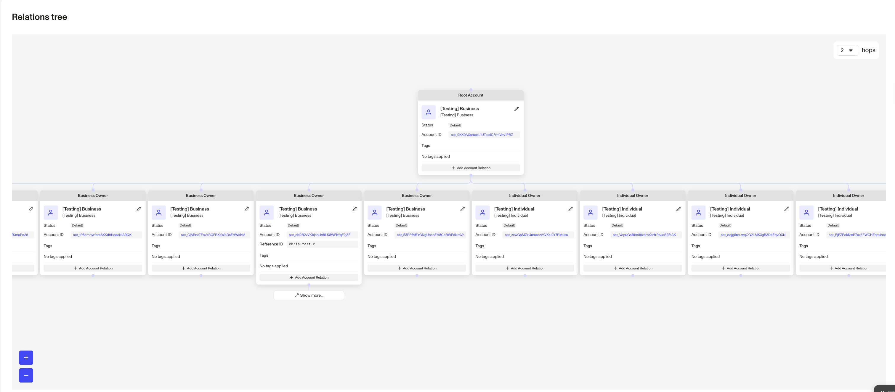

# Visualizing Account Relationships

The Account Relationship Visualization module provides a powerful way to visualize and manage complex account relationships, such as those between businesses and their Ultimate Beneficial Owners (UBOs). With this feature, organizations can model relationships in a nested tree structure to get a comprehensive view of interconnected accounts.

By surfacing ownership and account links in one place, the module helps teams streamline compliance and due diligence while strengthening fraud detection. Suspicious relationships that may otherwise go unnoticed become easier to identify and act on.

## What you can do with the Account Relationship Visualization module

With this feature, organizations can:

-   **Gain transparency into ownership and account structures**  
    Visualize businesses, UBOs, and account relationships in a nested tree, with relevant fields from your account types visible in context.
    
-   **Streamline investigations and compliance reviews**  
    Explore, add, and edit accounts inline—keeping information accurate and up to date without leaving the module.
    
-   **Detect suspicious or unusual relationships faster**  
    Identify potential risks or fraud patterns by seeing how entities are connected across your account network.
    

## Prerequisites

To use the Account Relationship Visualization, you’ll need to be using **[account types](./NrM9W6KETzMbzQXgdU3cV.md) and [relationships](./1aMbe1XEyhiAHgFz1oOjDj.md)** in Persona. If you don’t have these configured, reach out to your Persona account team for support.

## How the Account Relationship Visualization Module works

#### 1\. Access and visualize relationships

Navigate to the **Accounts page** for a given entity or view the **Accounts module** within a Case. Once the module is attached, you can explore account connections in a nested tree format.

Each node displays the fields defined in your account type—no need to expand to view them. Use the **Load more** button to pull in additional relationships as needed.

#### 2\. Add and edit accounts inline

-   To add a related account, click the **Add account relation** button in an account node and follow the prompts.
-   To update account information, click the **pencil icon** in an account node and edit directly in the module.

#### 3\. Custom actions (future release)

Once available, custom actions will allow you to interact with account owners directly from the module.

## Frequently Asked Questions

**What types of relationships can I visualize?**  
You can visualize a wide range of account relationships, including business ownership structures and any relationships you’ve configured in Persona.

**Can I take action on accounts within the module?**  
Yes. You can add and edit accounts today. Support for inline custom actions—such as sending inquiries—is in progress.

**Can I see account fields in the visualization?**  
Yes. Each node displays the fields from the account type you’ve configured, so you can see relevant details directly in context.

**Is there a limit to the number of accounts I can visualize?**  
The visualization is optimized to handle large and complex account networks.

## Related articles

[Accounts overview](./2gE7mjjLCIGJPnK6mTyjU9.md)
