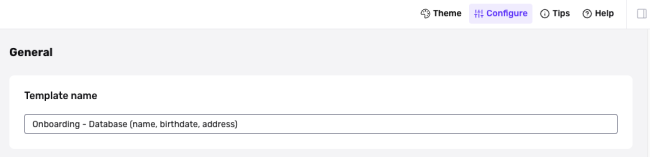

# How do I rename an Inquiry Template?

## Overview

When you create an Inquiry Template, it is assigned a default name. You can change the name.

## Steps

To rename an Inquiry Template:

1.  In the Dashboard, navigate to **Inquiries** > **Templates**.
2.  Select the Inquiry Template you want to rename.
3.  Click **Configure** in the upper corner of the Flow Editor.
4.  Edit the Template name.

5.  Click **Save**.
