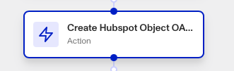

# Workflows: Hubspot steps

# What are the Hubspot Action steps?

Hubspot can be integrated into your workflow, offering several Hubspot Workflow Action steps that allow you to **Create**, **Search**, and **Update** Hubspot records automatically within your workflow.

HubSpot is a CRM platform that connects everything scaling companies need to deliver a best-in-class customer experience into one place. Hubspot is available as a [Marketplace integration](./6YaRAGHHcXb6MQ0c6CGvbJ.md).

Persona’s Hubspot integration can be useful for streamlining and simplifying customer onboarding, improving customer data management, and more.

Once the integration is set up, you can trigger the following Hubspot actions inside your Workflows. _Note: If there are multiple options for these actions, choose the one with "OAuth" in the name._

-   Create Hubspot Object
-   Update Hubspot Object
-   Find Hubspot Object

Objects map to the specific fields that exist within your Hubspot instance.

# How do you add a Hubspot action step?

## Navigating to your Workflow

1.  Navigate to the Dashboard, and click on **Workflows** > **All Workflows**.
2.  Find and click on the workflow you want to edit, or **Create** a new workflow.
3.  Click on **+** when hovering over a circle to add an **Action**.

4.  Use the **Find Action** select box to click on **Marketplace** > **Hubspot**. Choose which Hubspot action step to add: **Create**, **Search**, or **Update**.

## Adding a Create Hubspot Object step

1.  In **Find Action**, click on **Marketplace** > **Hubspot** > **Create Hubspot Object OAuth**.
2.  Choose the **Hubspot Instance** the step should interact with.
3.  Choose the **Object Type** to be created.
4.  Choose the **Object Properties** that object should contain.
5.  (Optional) In ‘Advanced Configuration’, choose the **Associated Object Type** and **Associated Object ID** you want the newly created object to be associated with in your Hubspot instance.
6.  (Optional) In ‘Advanced Configuration’, click the **Continue on error** box if you want the workflow to continue running even if this step raises an error.
7.  **Close** the step. You’ll have to **Save** and **Publish** the workflow to begin using it.

## Adding a Search Hubspot Object step

1.  In **Find Action**, click on **Marketplace** > **Hubspot** > **Search Hubspot Object OAuth**.
2.  Choose the **Hubspot Instance** the step should interact with.
3.  Choose the **Object Type** to be searched for.
4.  Choose the **Object Properties** that object should contain.
5.  (Optional) In ‘Advanced Configuration’, click the **Continue on error** box if you want the workflow to continue running even if this step raises an error.
6.  **Close** the step. You’ll have to **Save** and **Publish** the workflow to begin using it.

## Adding an Update Hubspot Object step

1.  In **Find Action**, click on **Marketplace** > **Hubspot** > **Update Hubspot Object OAuth**.
2.  Choose the **Hubspot Instance** the step should interact with.
3.  Choose the **Object Type** to be updated.
4.  Choose the **Object Properties** that object should contain.
5.  (Optional) In ‘Advanced Configuration’, choose the **Associated Object Type** and **Associated Object ID** you want the updated object to be associated with in your Hubspot instance.
6.  (Optional) In ‘Advanced Configuration’, click the **Do not update Hubspot property with blank value** box if you want to avoid adding empty values to Hubspot.
7.  (Optional) In ‘Advanced Configuration’, click the **Continue on error** box if you want the workflow to continue running even if this step raises an error.
8.  **Close** the step. You’ll have to **Save** and **Publish** the workflow to begin using it.

# Plans Explained

## Hubspot action steps by plan

|  | Startup Program | Essential Plan | Growth Plan | Enterprise Plan |
| --- | --- | --- | --- | --- |
| Hubspot action steps | Not Available | Not Available | Available | Available |

[Learn more about pricing and plans.](./6oZbzp7jb7AWGClF5vpY3K.md)

# Learn more

[Learn more about Hubspot integration here.](./31wcHURGa2MK6FSgP0RBP0.md)
