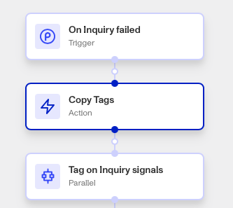

# Workflows: Copy Tags step

# What is the Copy Tags step?

**Copy Tags** is a Workflow Action step that copies all tags from one Persona object to another. You can choose to exclude certain tags from this step.

Tags are used to organize and classify objects (such as Accounts and Inquiries) based on specific characteristics or conditions. Tags reflect attributes that are unlikely to change during the verification process, such as “Under 21 years old”, “Non-eligible geo”, or “Watchlist match”.

Tags can also be used to mark an object for any observations that can aid in the improvement of your solution. If a set of tags exist on one object representing an individual verifying their identity, it may make sense to copy those tags to other objects related to that individual.

Tags help in filtering and managing accounts by providing additional context or status that can be useful for decision-making or further processing.

💡 Tags should be used to mark certain conditions or states that are relevant to your organization’s needs.

# How do you add a Copy Tags step?

1.  Navigate to the Dashboard, and click on **Workflows** > **All Workflows**.
2.  Find and click on the workflow you want to edit, or **Create** a new workflow.
3.  Click on **+** when hovering over a circle to add an **Action**.

4.  Use the **Find Action** select box to click on **Other** > **Copy Tags**.
5.  Add the source object for the copied tags under **From**.
6.  Add the destination object for the copied tags under **To**.
7.  (Optional) **Exclude** any tags you don’t want copied over. You can add multiple tags to be excluded.
8.  (Optional) In ‘Advanced Configuration’, click the **Continue on error** box if you want the workflow to continue running even if this step raises an error.
9.  **Close** the step. You’ll have to **Save** and **Publish** the workflow to begin using it.

# Plans Explained

## Copy Tags step by plan

|  | Startup Program | Essential Plan | Growth Plan | Enterprise Plan |
| --- | --- | --- | --- | --- |
| Copy Tags step | Not Available | Available | Available | Available |

[Learn more about pricing and plans.](./6oZbzp7jb7AWGClF5vpY3K.md)
