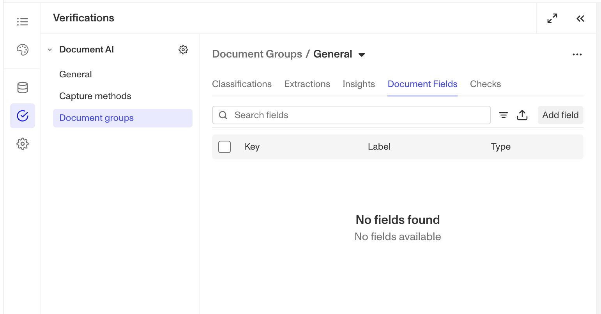

# Document AI: Document Fields Configurations

# Overview

Document Field Configurations on Document Verification Templates define how extracted or Documents AI-generated insights are stored and referenced across Persona products like Workflows, Cases, and API responses.

These configurations ensure data from a Document Verification run are stored as structured data, enabling you to later automatically flag, route, or act on documents based on your specific compliance and business requirements.

## Configuring Document Fields

1.  Navigate to the Dashboard, and click on **Inquiries > Templates** (or **Verifications > Templates**).
2.  Find and select an Inquiry template with Document AI, or **Create** a new template.
3.  In the left panel, click **Verifications**.

4.  In the left navigation, click **Document Groups**, and select the document group you wish to configure. _(Learn more about document groups [in this article](./2tUC2D9VeLsyPtgBo5KYzX.md).)_
5.  In the document group configuration panel, click on Document Fields.

6.  To add a new document field, click the **Add field** button.
7.  In the right side panel, fill out the following fields:
    1.  **Label** (required): A name for this field or attribute that allows you to identify what the value represents. If saving an Insight to this newly created field, it is recommended to provide a label that will help you understand how the value of this field was generated.
    2.  **Key** (required): Auto-generated from the name. Used in API responses and across Persona products.
    3.  **Type** (required): Choose String (default) or Array. Depending on which type is picked there may be additional fields to fill out. See Type Table below.
    4.  **Redaction policy**: Choose Redactable (default) or Not redactable.
    5.  **Write policy**: Choose Writable (default) or Writable once.
8.  Click **Save** on the top right to save all changes to your template.

### Type Table

| **Type** | **Description** | **Additional options** |
| --- | --- | --- |
| **String (default)** | Stores text values such as names, categories, or short responses. | \- Default value (optional): Define a fallback text value. - Max length (char): Maximum 255 characters (default). |
| **Array** | Stores multiple values in a single field. Useful when the extraction or analysis returns a list of items. | None |

### Why Document Field Configurations are important

Document Field Configurations define the data structure or schema that supports your ability to store Document AI-driven [Insights](./2Y9GwZE2JRwND63LUDbQBs.md) and extracted data from a Document Verification run, and the ability to action on that structured data. They’re essential for ensuring that data is consistently stored and can be referenced reliably across your Persona ecosystem.

They’re especially useful when you need to:

-   Standardize data storage for Extractions and Insights across templates, Workflows, and Cases.
-   Use Document AI-generated outputs from Insight Configurations in downstream decisioning or automation.

By defining fields that capture both extracted and Document AI-generated data, Document Field Configurations give you a unified, compliant structure for all document-based intelligence within Persona.

## Access by plan

We're here to chat through your specific needs. Feel free to reach out to your Customer Success Manager or [contact the Persona support team](https://app.withpersona.com/dashboard/contact-us).

|  | **Startup Program** | **Essential Plan** | **Growth Plan** | **Enterprise Plan** |
| --- | --- | --- | --- | --- |
| Document Field Configuration | Not Available | Limited | Available | Available |
