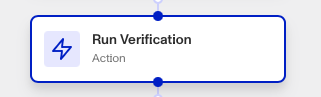
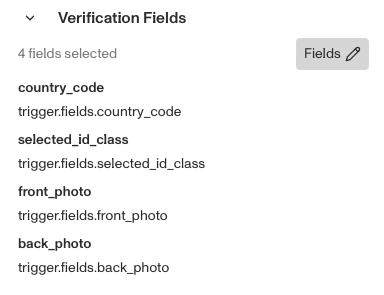

# Workflows: Run Verification step

# What is the Run Verification step?

**Run Verification** is a Workflow Action step that runs a Verification to further understand and check the identity of an individual or entity. Running Verifications can help further authenticate information, such as documents, images, inputted values, and other identity attributes depending on the Verification Type being run.

💡 Since the Run Verification step uses a Verification Template, you need to create a relevant Template beforehand. You can do that in Dashboard > Verifications > Templates.

The Run Verification step is a crucial part of any verification workflow. It can be used to further validate information that has just been collected and/or as a mechanism to conditionally build further confidence for high risk scenarios. Multiple Run Verification steps can be done in sequence to check different pieces of submitted identity information.

# How do you add a Run Verification step?

1.  Navigate to the Dashboard, and click on **Workflows** > **All Workflows**.
2.  Find and click on the workflow you want to edit, or **Create** a new workflow.
3.  Click on **+** when hovering over a circle to add an **Action**.

4.  Use the **Find Action** select box to click on **Verification** > **Run Verification**.
5.  Choose the **Verification Template** you want to use. The template determines what documents and data are being checked.
6.  (Optional) Click the **Complete on tentative?** box if you want the Workflow to continue running even if the Verification hasn’t been fully confirmed yet.
7.  (Optional) When you choose a template, it will show you all the **Verification Fields** required to run the Verification as well as the default values for those field (as a placeholder or default , the Workflow's trigger step are shown as the values being passed into the Run Verification step. . You can edit those values for this step using the **Edit Fields** button. Note that values must be passed into the default Verification fields in order for the Verification to run properly.

8.  (Optional) Click **Override default status** if you want to simulate other verification outcomes for a **Field** in the Sandbox environment.
9.  (Optional) In ‘Advanced Configuration’, click the **Continue on error** box if you want the workflow to continue running even if this step raises an error.
10.  **Close** the step. You’ll have to **Save** and **Publish** the workflow to begin using it.

# Plans Explained

## Run Verification step by plan

|  | Startup Program | Essential Plan | Growth Plan | Enterprise Plan |
| --- | --- | --- | --- | --- |
| Run Verification step | Not Available | Available | Available | Available |

[Learn more about pricing and plans](./6oZbzp7jb7AWGClF5vpY3K.md).

# Learn more

[Learn more about Verifications here.](../verifications.md)
