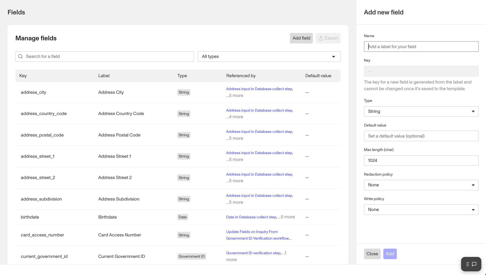

# Inquiries Field Editor

# Overview

To ensure that your organization has all the relevant data you need for Inquiries, add or edit fields via Inquiries Field Editor.

This unlocks a more seamless experience that enables you to:

-   Create, edit, deactivate, or delete fields
-   Set default field values and display them in the table view
-   Search by name and keywords and filter by a field’s data type

## **Where can you find the Inquiries Field Editor?**

1.  In the Dashboard, click **Inquiries** > **Templates** in the navigation bar.
2.  After [adding an Inquiry template or selecting an existing one](./3oD3G7MYVMVOvWZWXRvXtR.md), click Settings then Fields to open the Field Editor.

## **How to add or edit Inquiry fields?**

1.  Navigate to the Inquiries Field Editor.
2.  Click into an existing field or click Add Field
3.  Update Field Details:
    1.  **Field label:** the name of the custom field (displayed within the dashboard)
    2.  **Field key:** a unique identifier for the field (also used when retrieving or updating the object via API)
    3.  **Field type:** describes the type of field value allowed, such as an array, date, integer, string, etc.
4.  Update Field Configurations:
    1.  **Default value:** the default value when no input is specified for the field.
    2.  **Max length (char):** the maximum number of characters allowed for the field.
    3.  **Redaction policy:** defines how and when data within the field can be redacted. If None is selected, no special behavior is applied to the field. If Never is selected, this ensures the field will never be redacted. This is intended for fields that do not contain personally identifiable information (PII), such as timestamps.
    4.  **Write policy:** defines how a field can be modified after it has been set. If None is selected, no special behavior is applied to the field. If Write Once is selected, it cannot be changed after its initial value is set.

# Plans Explained

### Inquiries Field Editor by plan

|  | Startup Program | Essential Plan | Growth Plan | Enterprise Plan |
| --- | --- | --- | --- | --- |
| Inquiries Field Editor | Available | Available | Available | Available |
| Adding fields | Available | Available | Available | Available |

[Learn more about pricing and plans](./6oZbzp7jb7AWGClF5vpY3K.md).
