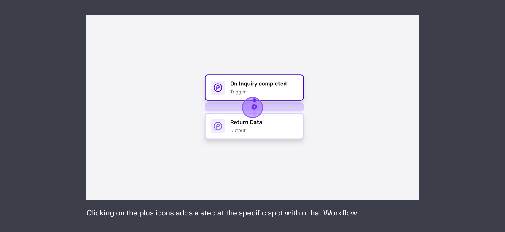
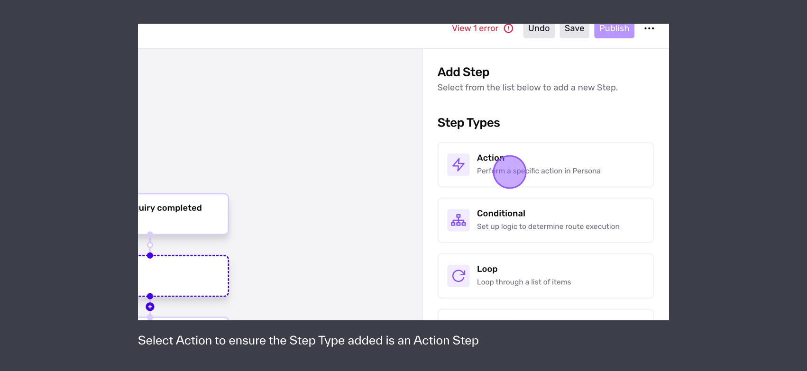
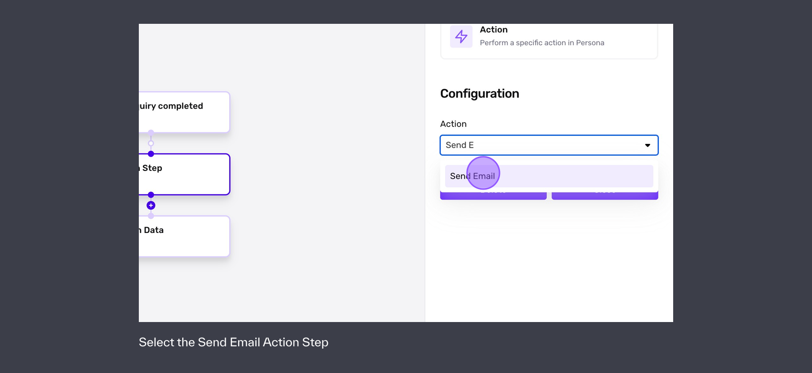
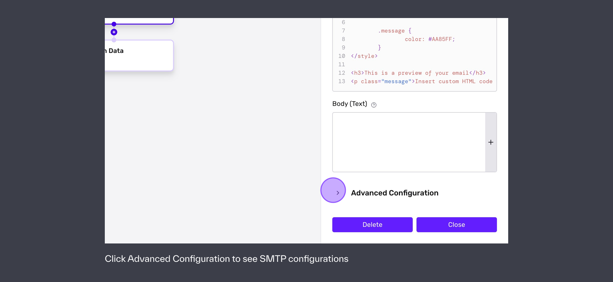

# Using the Send Email Action Step

# Overview[](#overview)

The Send Email action in workflows allows you to to send emails to a desired email address as part of a workflow. This is often used to notify end users of their progress within your experience or other traditional transaction email purposes. You can also adjust the subject, the body of the text, font, color, and more using HTML, but the appearance of your message may vary on different browsers and mail clients.

# Adding a Send Email Action Step to your Workflow[](#adding-a-send-email-action-step-to-your-workflow)

Send Email is an Action Step found when you add a step or edit an existing step within a Workflow. To add a Send Email Action Step:

1.  Navigate to a specific Workflow where you’d like to send an email
2.  Click on the plus icon in the specific spot where an email send is desired



3.  Click on Action



4.  Search for Send Email or select Send Email in the list of available Action Steps



5.  Update the available configurations including email html, email text, and advanced configurations as appropriate



# Advanced Configurations[](#advanced-configurations)

## SMTP configuration[](#smtp-configuration)

SMTP stands for Simple Mail Transfer Protocol, which allows the delivery of emails across the internet. Through SMTP, emails are sent via your own mail server. If no SMTP settings are configured, emails will be sent from [no-reply@frompersona.com](mailto:no-reply@frompersona.com). It is highly recommended that you set up the SMTP settings to ensure that users and customers receive emails from your domain.

Once SMTP is configured, Workflows communicates with your mail server via SMTP to deliver the data, but your mail server ultimately sends these emails. Within the Advanced Configurations toggle of the Send Email Action Step, you will find the following SMTP configurations:

1.  SMTP Server URL: This will be the URL for your SMTP server. For example, Gmail's is `[smtp.gmail.com](http://smtp.gmail.com/)`.
2.  Port: Choose between Port 25 (default), 587, 110, 465, or 2525. Consult your email provider's SMTP instructions if you are not sure which you need.
3.  TLS/SSL: Determines whether you connect to the account using TLS/SSL.
4.  Username: Typically the username and/or email address you use to log in to your email account.
5.  Password: The password you use to log in to your email account.
6.  Domain: The FQDN/IP Address of the sender to verify in the SMTP server. Used for HELO/EHLO checking – RFC 5321

For convenience, we’ve detailed the values of configurations for common email providers but it is recommended that you refer to any specific instructions for providers like Mailgun, SendGrid, Gmail, Postmark, Mailchimp, Amazon SES, or other providers to obtain the exact and respective SMTP server URLs, ports, and other information needed to properly send emails from your email server.

For further assistance, you may need to work with your domain administrator to obtain SMTP configuration values or to configure SPF or DKIM for your domain and specific mail service provider.

### Gmail[](#gmail)

1.  SMTP Server URL: `[smtp-relay.gmail.com](http://smtp.gmail.com/)` OR `smtp.gmail.com` (These options have different quotas. See [https://support.google.com/a/answer/176600](https://support.google.com/a/answer/176600?hl=en) for more details)
2.  Port: 587
3.  TLS/SSL: Enabled
4.  Username: [user@yourdomain.com](mailto:user@yourdomain.com)
5.  Password: The password you use to log in to your email account. It is recommended that you generate an App Password ([https://myaccount.google.com/apppasswords](https://myaccount.google.com/apppasswords)). Passwords generated via a SAML provider may not work.
6.  Domain: yourdomain.com

### Mailchimp (Mandrill)[](#mailchimp-mandrill)

1.  SMTP Server URL: `smtp.mandrillapp.com`
2.  Port: 587
3.  TLS/SSL: Enabled
4.  Username: [primarycontact@yourdomain.com](mailto:primarycontact@yourdomain.com)
5.  Password: Mailchimp API Key
6.  Domain: yourdomain.com

### Mailgun[](#mailgun)

1.  SMTP Server URL: `smtp.mailgun.org`
2.  Port: 587
3.  TLS/SSL: Enabled
4.  Username: [smtpuser@yourdomain.com](mailto:smtpuser@yourdomain.com). Set one up in Sending > Domain settings > SMTP credentials
5.  Password: The password for smtpuser
6.  Domain: yourdomain.com

### Twilio SendGrid[](#twilio-sendgrid)

1.  SMTP Server URL: `smtp.sendgrid.net`
2.  Port: 587
3.  TLS/SSL: Enabled
4.  Username: `apikey`
5.  Password: The generated API Key that you create in Settings > Api Keys ([https://app.sendgrid.com/settings/api\_keys](https://app.sendgrid.com/settings/api_keys)) with `Mail` permissions.
6.  Domain: yourdomain.com

### Amazon Simple Email Service (SES)[](#amazon-simple-email-service-ses)

1.  SMTP Server URL: Find Regional SMTP Endpoints here ([https://docs.aws.amazon.com/general/latest/gr/ses.html#ses\_region](https://docs.aws.amazon.com/general/latest/gr/ses.html#ses_region))
2.  Port: 587
3.  TLS/SSL: Enabled
4.  Username/Password: Follow the Amazon Simple Email Service Developer Guide ([https://docs.aws.amazon.com/ses/latest/dg/smtp-credentials.html#smtp-credentials-console](https://docs.aws.amazon.com/ses/latest/dg/smtp-credentials.html#smtp-credentials-console)) to create SES SMTP credentials that have appropriate permissions.
5.  Domain: yourdomain.com

### Test your configuration by sending an email[](#test-your-configuration-by-sending-an-email)

For the Send Email action using your email provider, there are pieces where the email can break:

1.  Improper configuration within Workflows
2.  Failure to send from your email provider

To troubleshoot and conduct a test email send, publish the workflow in a production environment and trigger the necessary workflow trigger step to ensure that the Send Email action step occurs. At this point, if an email is not received by the test email address, it is advisable to first review the Workflow Run to see if the step successfully ran and to simultaneously review if the email request was properly sent by your email provider.

# Common issues[](#common-issues)

### I am not **receiving emails sent by SMTP via Workflows**[](#i-am-not-receiving-emails-sent-by-smtp-via-workflows)

**When using SMTP sent by an Email action step in Workflows, the emails are actually being sent by your mail server.** The Workflow communicates with the mail server via SMTP to deliver the data from our system, but your mail server is ultimately sending these emails. For more information about delivery status, please review your SMTP logs.

**The SMTP server is receiving the email envelope but emails are not received.** If you are trying to send email via SMTP server and the SMTP server is receiving the email envelope, but you're still not receiving emails then it is possible that your domain’s DKIM or SPF records need to be updated.

You can look at the TXT record specifying the DMARC policy for your domain as a starting place.

\_

```
❯ nslookup -q=txt example.com 
...

Non-authoritative answer:
example.com	text = "v=DMARC1; p=reject; ..."
example.com	text = "v=spf1 -all"

❯ nslookup -q=txt example1.com 
...

Non-authoritative answer:
example.com	text = "v=DMARC1; p=quarantine; ..."
example.com	text = "v=spf1 -all"

❯ nslookup -q=txt example2.com 
...

Non-authoritative answer:
example.com	text = "v=DMARC1; p=none; ..."
example.com	text = "v=spf1 -all"
```

\_

A policy of `p=reject` will tell the receiver to ignore the email if the `spf` TXT record fails.

A policy of `p=quarantine` will tell the receiver to treat it as spam.

A policy of `p=none` will tell the receiver to allow the email through.

-   If your DMARC policy is `quarantine`, then check your spam folder. If it is there, your SPF record needs updating and/or you are missing DKIM records.
-   If your DMARC policy is `reject` and you don’t receive the email, it is pretty likely your SPF record needs updating and/or you are missing DKIM records.

View your mail service provider’s documentation to understand how to setup email domain authentication.

### SMTP authentication with a password managed through SAML is failing[](#smtp-authentication-with-a-password-managed-through-saml-is-failing)

If you have accounts for mail service providers managed by a SAML identity provider, the passwords provided the SAML identity provider may not work. Review your SMTP server provider’s documentation to setup a password that will work with their SMTP server.
