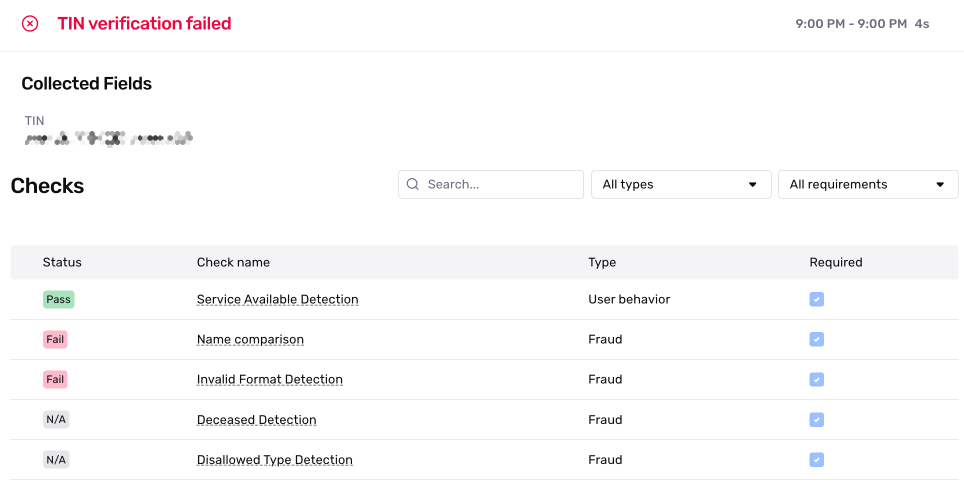
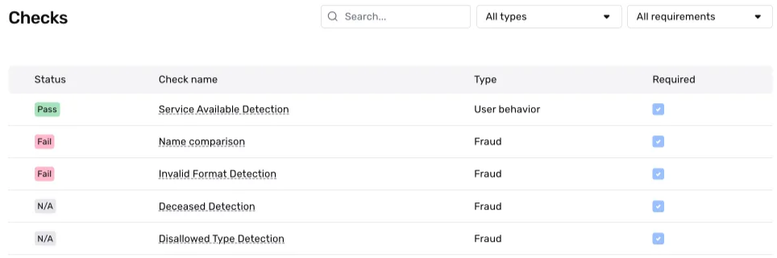

# Understanding TIN Verification results

## Overview

TIN verification is a type of verification check that confirms that the name and TIN (Taxpayer Identification Number) provided in an inquiry match records found within the Internal Revenue Service database. For more details, see the [TIN Verification overview](./2lGG2fqJwUO9ziVAFZNeTG.md).

This page examines an example of a TIN Verification and guides you through the results. You'll learn how to interpret Verification checks and understand why they passed or failed.

ℹ️ Note: A Verification run represents a single attempt to verify specific information. Within an Inquiry, users may get multiple Verification results due to user error, network issues, or other configureable factors in Persona. For this reason, we recommend reviewing, listening, or retrieving the status of the parent Inquiry or Transaction rather than individual Verifications. This approach allows you to use Inquiry Templates or Workflows to better evaluate approval conditions, declines, and cases needing additional review.

## Example TIN Verification result

As an example, we'll look at a TIN Verification. We'll walk through the example Verification below, section by section.

Note: Input fields in these screenshots are intentionally blurred for privacy, but represent the actual data submitted during verification.

## Overall Verification run result

When viewing a TIN Verification run, you’ll first see the overall Verification result. In this example, the TIN Verification **failed**. The reason is that the **Name Comparison** and **Invalid Format Detection Checks** were required, and the submitted information did not pass the check requirements. This check passes only if each "required" field collected in the TIN matches the settings for TIN Verification.

This top-level status is commonly in a “**passed**” or “**failed**” state. The information below the overall result offers further explanation or reasons as to why it “**failed**” and shows the Verification Template configurations that led to that “**failed**” status.

Here’s how to understand Verification results and their status:

### A note on Inquiry status vs. Verification status

A common best practice for solutions within Persona is to rely on statuses. For example, when integrating via Inquiries (Hosted, Embedded, or Mobile SDK), businesses typically listen for the status of an Inquiry to decide whether a user should proceed within a user experience or not—if **passed**, otherwise it may require additional review. That additional review allows you to automatically or manually review the different verification attempts by conditioning on or reviewing the statuses of those verifications. You can also go one level deeper and review the statuses of the verification checks within a Verification to further understand the exact reasons for Verification failures.

These different statuses, let you quickly determine if an identity meets your Verification threshold and which ones don't. It gives you the ability to automate the attempts you feel most confident about, while leaving a pathway open for the longer tail, more complicated situations. For those complicated situations that need review—such as higher-risk, failed, or declined identities—you can drill down into specific details based on what you need to investigate further.

### TIN

“TIN” refers to the Taxpayer Identification Number submitted.

# Verification checks

## What are Verification checks?

Verification checks evaluate specific aspects of the submitted information. Each Verification type has its own set of Verification checks that run instantly during the Verification run. A check can result in one of three statuses: "**passed**,” "**failed,**" or "**not applicable (N/A).”** The following section explains these statuses in detail.

In this example, a Deceased Detection check would be "**N/A”** because a Deceased Detection Verification does not exist within the same Inquiry as the TIN Verification.

## What does each Verification Check mean?

Every Verification Type has it's own Verification Checks, as each type verifies different pieces of information. For a complete look at the definition of Verification Checks per Verification Type, active customers can view a complete list of Verification Checks and associated failure reasons by going to **Documentation > [Verification Checks](https://app.withpersona.com/dashboard/resources/verification-checks)** in your Persona Dashboard.

## What do Verification Check results look like?

Let's zoom in on all the checks.

Here's what each column means at a high level:

-   **Status**: This is a high-level result of the check. Possible values are:
    -   `Passed`: The check passed in the verification attempt.
    -   `Failed`: The check failed in the verification attempt.
    -   `N/A`: Not applicable. The check was not evaluated in the verification attempt. (This may happen because this check depends on a piece of information that was not collected as part of the Inquiry.)
-   **Check Name**: The name of the verification check.
-   **Type**: If a Verification check falls into the `Fraud` or `User behavior` category.
    
    -   `Fraud`: Checks in this category are designed to help catch fraudulent submissions. If a check in this category fails, there may be a higher chance the submission is fraudulent.
    -   `User behavior`: Checks in this category are designed to flag instances when a user submits information that does not meet the quality bar Persona requires. If a check in this category fails, it does not necessarily indicate a higher chance that the submission is fraudulent.
    
    Note: You may see this as `user action required` in the API response.
-   **Required**: The Verification checks required to pass in order for the Phone Carrier Verification to successfully complete.

## How do I know if a Verification check is required?

In this example, we see that five Verification checks were [required](./7IAy61dAMRDQ1Q77ugwpcA.md) (indicated by blue checkmarks in the Required column). One passed, two failed, and two were labeled N/A. While reviewing non-required Verification checks is common practice, consider updating your Verification Template to require any check whose failure would be unacceptable. This ensures future Verification runs will properly evaluate these critical checks.

## What is the Name Comparison Check?

The Name Comparison check evaluates whether the submitted name matches the name registered with the IRS for the given TIN.

A failed Name Comparison check means the name submitted doesn't match IRS records. This could be due to:

-   Data entry errors (typos, autocorrect)
-   Using informal names instead of legal names
-   Business name variations (DBA vs. legal entity name)

**Possible Names suggestions**:

When the Name Comparison check fails for a business, you may see "Possible names" in the check details. This feature suggests alternative names that have previously verified successfully with the same TIN.

For example, a company submits "Joe's Pizza" (their DBA) but their EIN is registered to "Joseph's Restaurant Group LLC" - the suggested name would show the legal entity name.

You may use suggested names to retry verifications with the suggested name format.

## Related articles

[TIN Verification](./2lGG2fqJwUO9ziVAFZNeTG.md)
