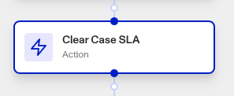

# Workflows: Clear Case SLA step

# What is the Clear Case SLA step?

**Clear Case SLA** is a Workflow Action step that removes the Service Level Agreement (SLA) deadline from a case. This is useful when you no longer want a case to be bound by a specific deadline, perhaps because circumstances have changed or the case requires indefinite time for review.

Cases are Persona products that collect together data on an end user to allow for manual investigation and decisioning on. Your organization may need to investigate this user for a variety of reasons:

-   **Onboarding**: Should this user be allowed to onboard to the platform?
-   **Account takeover investigation**: If a user is claiming that their account has been taken over, is there enough information to validate their claim?
-   **Fraudulent activity**: Are there suspicious signals associated with this user that require further action (e.g. account freezing, sending a follow-up inquiry for verification, etc.)?
-   **Transaction monitoring review**: Are there suspicious transactions associated with this user that require further investigation?

## Why do cases have SLA deadlines?

A Case in Persona has an SLA deadline to help ensure cases are reviewed and resolved within a specific time frame. This is important for meeting compliance requirements and maintaining operational efficiency.

The SLA deadline also allows organizations to prioritize cases based on urgency and ensure that they are addressed in a timely manner. By setting deadlines, teams can avoid backlogs and ensure that cases are handled according to the agreed-upon timelines.

However, the Clear Case SLA step lets you bypass this deadline. It effectively clears any previously set SLA targets, allowing the case to be managed without the constraints of a deadline.

# How do you add a Clear Case SLA step?

1.  Navigate to the Dashboard, and click on **Workflows** > **All Workflows**.
2.  Find and click on the workflow you want to edit, or **Create** a new workflow.
3.  Click on **+** when hovering over a circle to add an **Action**.

4.  Use the **Find Action** select box to click on **Case** > **Clear Case SLA**.
5.  Click the **Case** box to choose the case you want to clear the SLA deadline from.
6.  (Optional) In ‘Advanced Configuration’, click the **Continue on error** box if you want the workflow to continue running even if this step raises an error.
7.  **Close** the step. You’ll have to **Save** and **Publish** the workflow to begin using it.

# Plans Explained

## Clear Case SLA step by plan

|  | Startup Program | Essential Plan | Growth Plan | Enterprise Plan |
| --- | --- | --- | --- | --- |
| Clear Case SLA step | Limited | Available | Available | Available |

[Learn more about pricing and plans.](./6oZbzp7jb7AWGClF5vpY3K.md)

# Learn more

Learn more about Cases [here](../../docs/v2022-09-01/docs/cases.md).
