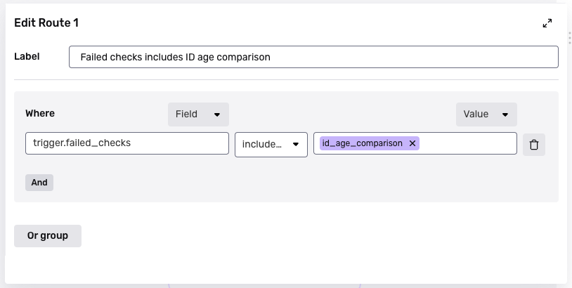

# Tagging Inquiries that fail a specific Verification check, using Workflows

## Overview

This tutorial shows you how to build a Workflow that applies a Tag to any Inquiry that fails a specific Verification check.

This tutorial demonstrates concepts that you can use to create new Workflows.

### Generalize this tutorial to your use case

You can generalize the following aspects of this tutorial:

-   **Action on Inquiry**: This tutorial uses the "tag" action, but you can take another type of action on an Inquiry. For example, you can change the status of the Inquiry.
-   **Verification check**: In your Workflows, you can set up logic based on the result of any Verification checks that were run on your Inquiries. View all available checks in the [Verification checks reference](https://app.withpersona.com/dashboard/resources/verification-checks/).

## Steps

There are a few main steps to build this Workflow:

1.  First, we'll create a Workflow.
2.  Second, we'll add the logic that selects Inquiries that fail a certain Verification check. We'll do this by adding what's called a Conditional step to the Workflow.
3.  Third, we'll apply the Tag to the selected Inquiries. We'll do this by adding what's called an Action step to the Workflow. We'll use a specific Action step called Tag Object.
4.  Finally, we'll save our work.

### Step 1: Create a new Workflow

1.  In the Persona Dashboard, select **Workflows** in the navigation bar.
2.  Click **\+ Create workflow** in the upper corner.
3.  In the New Workflow form:
    1.  Fill in a name and description.
    2.  Select the following options:
        -   Trigger type: `Event`
        -   Trigger event: `inquiry.completed`
4.  Click **Continue**.

### Step 2: Add a Conditional step

A Conditional step lets you express if/else logic in a Workflow.

1.  In the Workflows canvas, click **"+"** below the "On Inquiry completed" step.
2.  Under Step Types, select **Conditional**.
3.  In the Workflows canvas, click **Route 1**.
4.  In the Edit Route 1 form:
    1.  Fill in a descriptive Label.
    2.  Select the following options:
        -   Where: `trigger.failed_checks`
        -   Operator: `includes any of`
        -   Values: _< select one or more Verification checks  >_
            -   example: `id_age_comparison`

### Step 3: Add a Tag Object step

Tag Object is a type of Action step. Action steps let you take actions in a Workflow.

1.  In the Workflows canvas, click the empty box under Route 1. 
2.  Under Step Types, select **Action**.
3.  Under Action, select **Tag Object**.
4.  In the Action Configuration, set the following:
    -   Object: `Trigger (Inquiry)`
    -   Tag: _< select or create a Tag >_

### Step 4: Save and publish

Save your changes. When you are ready to deploy your changes, publish your Workflow.

## Learn more

-   [Trigger Event and Step Types in Workflows](./4q44atlPvZvBNZAbYJzi3f.md): Learn more about step types, like the Conditional and Action step types you used in this tutorial.
-   [Workflows: Manage versions and state](./4cM7g2XVmqM6hicxsy9Js3.md): Learn more about saving and publishing your Workflow.
