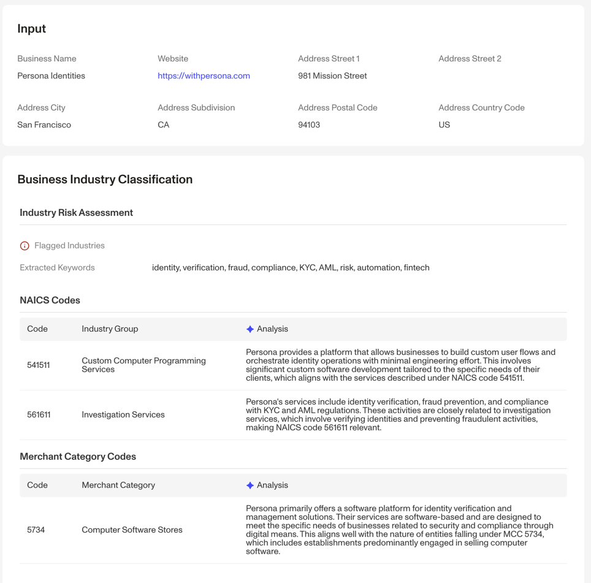

# Business Classification Report

## Overview

The Business Classification Report classifies a given business into their industry (or industries) based on business name and website. Industry classification is based on North American Industry Classification System (NAICS) codes or Merchant Category Codes (MCC).

The report analyzes a business's online presence to determine the most relevant codes. Organizations can use the report to also flag high-risk industries based on factors such as reputational risk, fraud risk, legal risk, etc.

**This Report requires the [Business Website Verification](./6YMwMNVZpOYO4n6bpUhokY.md) in order to run.**

## Why is this report valuable?

Knowing the industry in which a business operates is crucial for various aspects of customer onboarding, underwriting, and monitoring. Often times, customers have compliance requirements for doing business with certain flagged and regulated industries. For some customers, they want to outright decline businesses that fall in any of these categories.

## What information does this report provide?

The Report results includes the following sections:

-   Risk assessment: this section outlines if the business belongs to a flagged industry based on specified keywords. Industries flagged as high-risk include the following, but can be customized further by working with your Persona account team.
    
    -   Adult Entertainment
    -   Cannabis
    -   Cryptocurrencies
    -   Drugs and drug paraphernalia
    -   Firearms
    -   Gambling
    -   Prepaid or gift cards
-   NAICS codes: this section includes NAICS codes the business may belong to. Note that NAICS codes are listed in their order of confidence and up to 2 may be listed.
    
-   MCC Codes: this section include MCC codes the business may belong to. Up to 1 MCC code may be listed.
    
-   Extracted keywords: this section identifies key terms on the business's website to help determine the industry or risk category the business belongs to.
    

## Frequently Asked Questions (FAQ)

**What classifications are available?**

The Business Classification Report provides both NAICS and MCC information about a business.

**What locales and languages do this report support?**

The report isn’t limited to English and generally performs well across other languages. No special locale setup is required.

## Related articles

[Verifying Businesses: How Persona can help verify businesses](./3OGe9IwySJmDvXL2DOfV7N.md)

[Business Online Presence Report](./4PXsPj48k67OR26o2ToN5x.md)

[Business Website Verification](./6YMwMNVZpOYO4n6bpUhokY.md)
