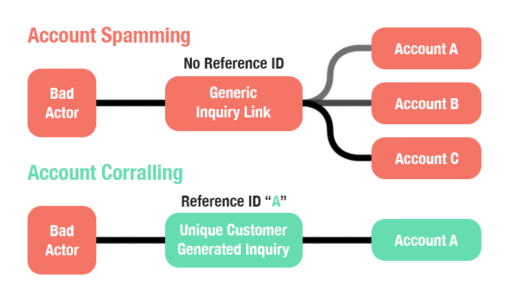

# What is a reference ID?

❓ This question came from a member of the Persona community - a project admin who wanted to understand what makes a good Reference ID.

⚠️ Note: This article covers Reference IDs, but should not be confused with [Transaction](./5mzXj1PHBXtX5UlYbfZyvx.md) Reference IDs nor with [Importer](./2fpD7Bwb7OrzAS4g7XWoMG.md) Reference IDs as they both provide different functionalities from Reference IDs.

A Reference ID is a string unique to every user that is used to identify their Persona account in a way that makes sense to your business. Reference IDs are set by an organization, whereas Account IDs are automatically generated by Persona. Persona recommends using the same user ID that uniquely represents the user in _your_ internal system, and providing a Reference ID whenever possible.

Accounts allow organizations to consolidate all inquiries, cases, etc. for the same user in one place using Reference IDs. Inquiries created with the same Reference ID will then all get automatically associated with the same account. This makes it easier to know the status of all user interactions with Persona, and makes it easier to re-verify the user.

If an inquiry is created without a Reference ID, then Persona has no way of linking that inquiry to an existing Account and will create a new Account instead. This prevents re-verifications against an existing Account and clutters your account list with duplicate accounts of the same person.

## Using Reference IDs mitigates fraud

Two practices make it easier for fraudsters to spam fake accounts, ie trying to bypass verifications by rapidly cycling through fake identities: Not using a Reference ID and posting generic Inquiry links.

Without a Reference ID, the inquiry will not be able to find an existing account to attach the inquiry to and will instead create an new account to attach to. Even legitimate end users will be creating new accounts every time they are put through an inquiry, with you losing the ability to reverify them against an original account.

Sometimes Persona customers using the hosted implementation will post a generic inquiry link with no Reference ID, allowing anyone with that link to start an inquiry flow. But bad actors can then spam that inquiry with as many fraudulent identities as they have at hand. This is one of the many reasons we strongly recommend using Reference IDs linked to an end user with your inquires.

Additionally not including a Reference ID mean you can't leverage one of our fraud checks during a reverification, the Repeat check, which checks the submitted information against existing information on the attached account.

⚠️ The Repeat check is not available on the Starter Package.

# What makes a good reference ID?

An organization can set a reference ID based on how it identifies its users.

A good reference ID references whatever unique identifier an organization already uses for their database, such as customer IDs or customer emails. This convention ensures continuity across an organization.

⚠️ Persona recommends using customer IDs instead of potentially sensitive information such as email addresses. Persona does not treat Reference IDs as personal identification information (PII).

A bad reference ID would be one created ad-hoc for each Account, or one that doesn’t match an organization’s customer identification convention.

⚠️ You cannot add a reference ID to an Account that is already in use elsewhere. You also cannot create a new Account based on an already-in-use reference ID.
