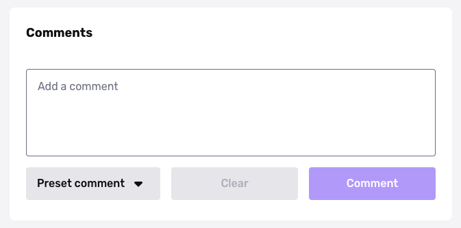
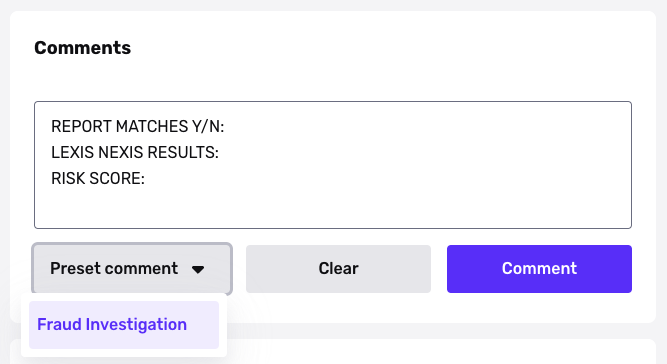
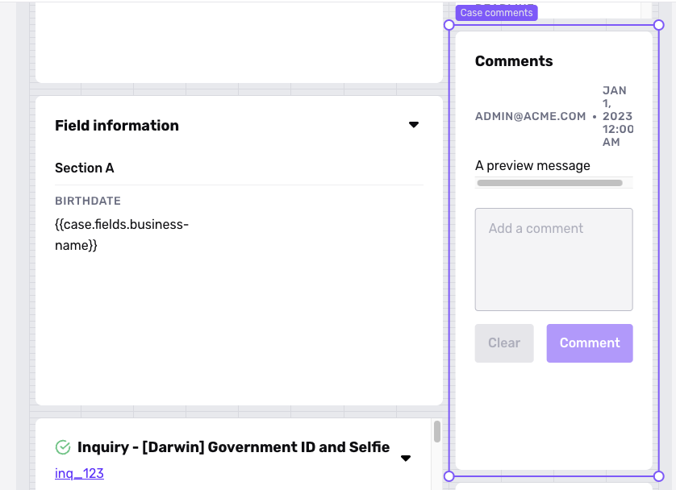
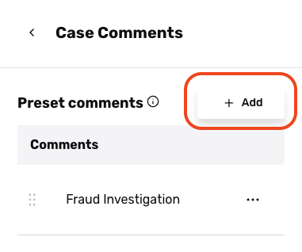
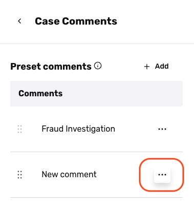
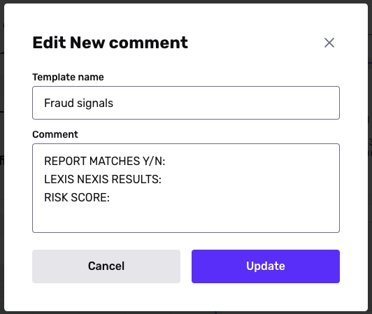

# Preset comments for Cases

## About preset comments

The Case Comments [module](./71bfAMD6bNyf7zFW7Q1ghk.md) lets you add comments to a Case. If you want to standardize or speed up how your team writes comments, you can create a preset comment.

## Using a preset comment

A preset comment is like a comment template. When someone writes a comment on a Case, they can pick from a list of preset comments, and the comment box will be prefilled with text.

You must first configure preset comments on the associated Case Template.

 

## Configure preset comments

### Find preset comment settings

Each Case Template has its own preset comments. To find the preset comments settings:

1.  In the Dashboard, navigate to **Cases** > **Templates**.
2.  Select the Case Template you want to edit.
3.  In the canvas of the Case Template Editor, find and select the existing Case Comments module.  
    
    -   Note: If this Case Template doesn't have a Case Comments module, drag and drop the module from the Component Library to the canvas

### Add a preset comment

In the Preset comment settings:

1.  Click **\+ Add**.  
    
2.  Find the new comment and select **"..." > Edit**.  
    
3.  Fill in the template name and comment text.  
    
4.  Click **Update**.
5.  Click **Save**.
