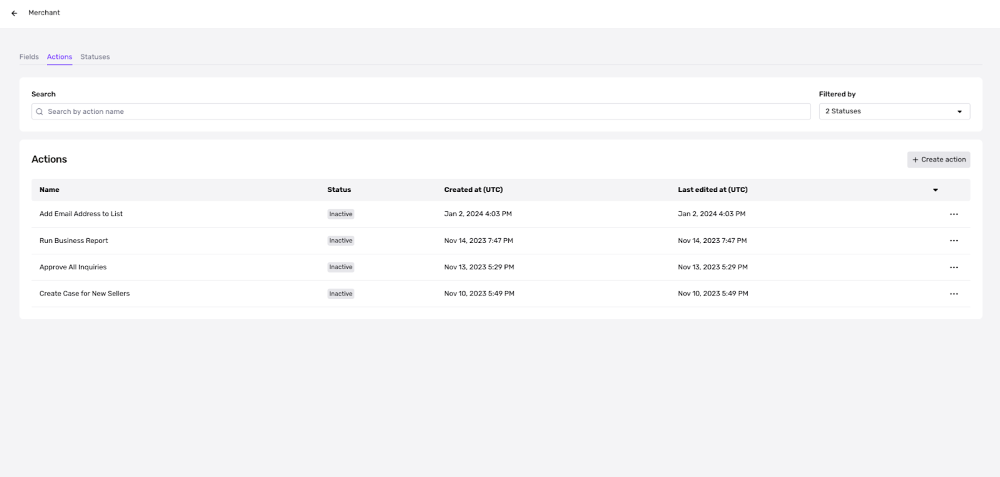
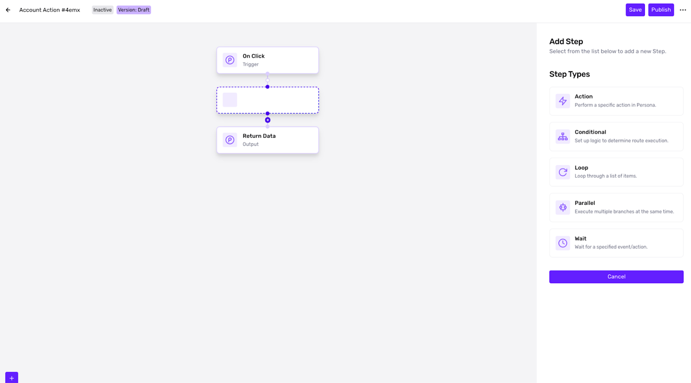

# Triggering custom Account Actions for each Account type

# What is an Account Action?

Account Actions are one-click “macros.” A macro is a series of pre-set actions that you can set for Persona to run automatically on a given account, supercharging what customers can do within an account. Since account actions are built using workflows, any series of workflow steps, including custom code, can be made into an account action and used within an account.

## Example Actions

With Account Actions, you can run the following actions at the account level:

| Action name | Description |
| :-- | :-- |
| Run report | Run an individual or business report at the account type level |
| Update account information | Manually update fields on an account |
| Add to list | Add items such as email address, phone number, and faces to a list so you can easily keep track of bad actors |

🚨 Account actions are configured for each Account type to ensure that all required fields for the Account Action to run are available when the Account Action is triggered. Trigger parameters are used to set these fields.

# Should I use Account Actions or Workflows?

Account Actions should be used whenever an action is not 100% automated and is dependent on the outcome of an investigation or assessment. If you want to reserve some sort of flexibility, use Account Actions instead of [Workflows](./6i3aAp6lBK3FCf08HJgPjh.md).

### **Configure Account Actions**

Within your selected Account Type, navigate to the Actions tab.

1.  Select **\+ Create Action**
2.  Create an Action using the editor powered by workflows. For example, actions such as Run Business Report, Create Case, Update Account Object, or Add to List. 
3.  Save and Publish your Account Action.

📍 Within each account of this Account Type, you will now be able to see the newly created Action within the Actions dropdown.
