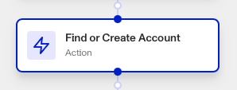
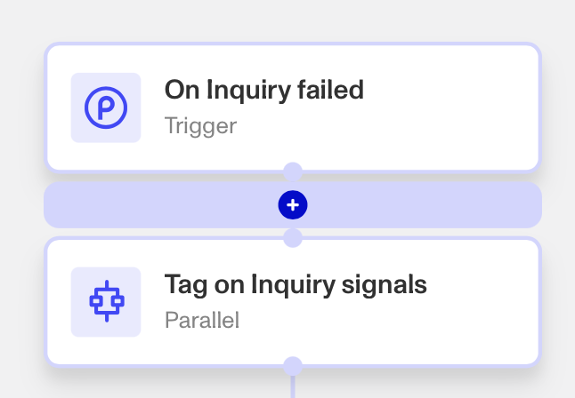

# Workflows: Find or Create Account step

# What is the Find or Create Account step?

**Find or Create Account** is a Workflow Action step that fetches the Account corresponding to a specific Identifier (such as a Reference ID) into your workflow, if the Account exists. If it doesn’t exist, the step instead creates a new Account with that Identifier.

Accounts allow organizations to consolidate all inquiries, cases, etc. for the same user in one place. In essence, Accounts is a system of record for your users and the history of verifications, inquiries, reports, and other Persona objects related to that user. It is a best practice for each Account to be assigned a unique Identifier (called a Reference Id), to avoid duplicate accounts of the same person.

Inquiries created with the same Reference ID will then all get automatically associated with the same account. This makes it easier to know the status of all user interactions with Persona, and makes it easier to re-verify the user.

Persona recommends using the same identifier for Reference ID that uniquely represents the user in _your_ internal system.

[Learn more about what makes a good reference ID here.](./617EAw0wpwv3J3MGpHUxEb.md)

# How do you add a Find or Create Account step?

1.  Navigate to the Dashboard, and click on **Workflows** > **All Workflows**.
2.  Find and click on the workflow you want to edit, or **Create** a new workflow.
3.  Click on **+** when hovering over a circle to add an **Action**.

4.  Use the **Find Action** select box to click on **Accounts** > **Find or Create Account**.
5.  Choose the **Account type**, such as ‘User’.
6.  Choose the type of **Identifier**, such as ‘Reference ID’.
7.  Add the **Identifier value**, either manually and/or from elsewhere in your workflow by clicking ‘**+**’. You can optionally assemble an Identifier value by including multiple manual or workflow values in the same Identifier value box.
8.  (Optional) In ‘Advanced Configuration’, click the **Continue on error** box if you want the workflow to continue running even if this step raises an error.
9.  **Close** the step. You’ll have to **Save** and **Publish** the workflow to begin using it.

# Plans Explained

## Find or Create Account step by plan

|  | Startup Program | Essential Plan | Growth Plan | Enterprise Plan |
| --- | --- | --- | --- | --- |
| Find or Create Account step | Not Available | Available | Available | Available |

[Learn more about pricing and plans](./6oZbzp7jb7AWGClF5vpY3K.md).

# Learn more

[Learn more about Accounts here.](../accounts.md)
