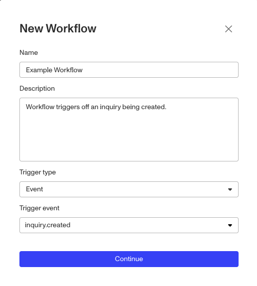
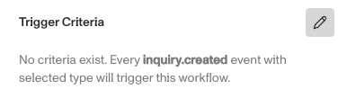
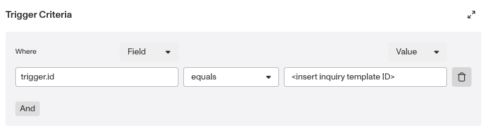

# How to trigger Workflow Runs with Inquiry Created?

⚠️ This question came from a member of the Persona Community - a customer that did not have enhanced features was trying to selectively trigger a workflow that wasn’t linked to existing inquiries.

## Workflow Triggers

Workflows have three types of Triggers:

-   Event - A basic feature, tied to the status of an Inquiry, Report, or Case.
-   API call - An **Enhanced** feature, with relevant information included in the API call.
-   Scheduled - An **Enhanced** feature, that allows a set date and time for a workflow to run, usually a reverification.

But if you are a customer that doesn’t have Enhanced features like API or Scheduled, how can you selectively trigger and run a workflow, either manually or in an automated way? With the Inquiry Created event, which is not an Enhanced feature.

## The Inquiry Workaround

The normal expectation for using an Inquiry is that an end user will engage with the Inquiry to submit PII and have that PII scrutinized via verifications. But you can create an Inquiry template with the goal of only using it to trigger a workflow. You may even create a Inquiry with no verification that’s just for this workaround. No end user has to touch it. If the Workflow is set to trigger off that Inquiry when the `inquiry.created` event happens, then you just need to create a run of that Inquiry Template and the Workflow will run. You can even set the Workflow to set the inquiry to Completed, or any other Inquiry statuses to keep your listing of Inquiries orderly.

### How to set the workflow to trigger on Inquiry Created

This assumes you're starting from a new workflow template.

1.  Create a new workflow, and set the Trigger Type to `Event` and the Trigger Event to `inquiry.created`.

2.  In the workflow template, select the On Inquiry created step.
3.  Click the edit icon to the right of `Trigger Criteria`.

⚠️ If you don’t set a Trigger Criteria for the Workflow, then every inquiry created in that production environment will trigger the workflow instead of just inquiries from your selected inquiry template.

4\. In the widget, enter trigger.id into the where field, eqauls for the operator, and then paste the template ID for the inquiry you want to use as the trigger in the Value field.

## How can I then create a run of that Inquiry?

-   Via the [Dashboard](./1snRc3bFMYhykFN6vhLith.md)
-   Via an [API Call](../../docs/reference/create-an-inquiry.md)

But what if you need to pass fields into the Workflow for it to work? Use the Inquiry Prefill feature.

## The Prefill feature

The [Inquiry Prefill feature](./79Y8gi2c0QnOzDax63LfDF.md) allows you to populate the fields of an individual inquiry when you create that inquiry. So without an end user being involved, you would have an inquiry populated with the fields you need for your Workflow.

If you set the workflow trigger to be Inquiry Created and pre-fill the inquiry at creation, then the Workflow would trigger off the prefilled inquiry and the Workflow can then pull the fields from the Inquiry. Since the inquiry already has the fields you need via prefill, then you don’t need an end user to complete any of the verifications.

Prefill is part of the normal Inquiry creation process and can be accessed via the Dashboard or API.

📌 This answer was last updated on Mar 13th 2025 by Ryan Cole, a Growth Content Manager at Persona. FAQs, unlike other articles, are written to provide Persona Community members more specific answers to common questions. While we periodically review responses and answers, please note when this FAQ was last updated as information may have changed since then.

## Related articles

[Testing your Inquiry Template](./1az3sGqpcW5Zrne9I7lm49.md)

[Using Inquiry Prefill](./79Y8gi2c0QnOzDax63LfDF.md)
