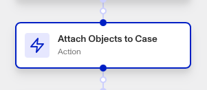

# Workflows: Attach Objects To Case step

# What is the Attach Objects To Case step?

**Attach Objects To Case** is a Workflow Action step that attaches Persona Objects, such as Inquiries or Accounts, to a Case.

Cases are Persona products that collect together data on an end user to allow for manual investigation and decisioning on. Your organization may need to investigate this user for a variety of reasons:

-   **Onboarding**: Should this user be allowed to onboard to the platform?
-   **Account takeover investigation**: If a user is claiming that their account has been taken over, is there enough information to validate their claim?
-   **Fraudulent activity**: Are there suspicious signals associated with this user that require further action (e.g. account freezing, sending a follow-up inquiry for verification, etc.)?
-   **Transaction monitoring review**: Are there suspicious transactions associated with this user that require further investigation?

The Attach Objects To Case step makes case investigation easier, since relevant objects such as Inquiries or Accounts can be attached to a case for fast and easy reference. Any attached Persona Objects will subsequently be shown when reviewing that Case if the Case template has those modules as part of the view. Note that any Verifications associated to an Inquiry are automatically shown within a Case if the Inquiry is attached to the Case.

Snapshot in time: When an object like an inquiry is attached to a case, it attaches the current contents of that inquiry to the case at that time. So if an inquiry is still pending, ie. it has only finished 1 of it's 3 verifications, then only that first verification will be attached to the case with the inquiry. If any of the remaining verification are completed after the attach steps, they will not be added to the case via the inquiry.

# How do you add an Attach Objects To Case step?

1.  Navigate to the Dashboard, and click on **Workflows** > **All Workflows**.
2.  Find and click on the workflow you want to edit, or **Create** a new workflow.
3.  Click on **+** when hovering over a circle to add an **Action**.

4.  Use the **Find Action** select box to click on **Case** > **Attach Objects To Case**.
5.  Click the **Case** box to choose the target case.
6.  Click the **Case objects** box to select which objects you want to attach to the case. You can select multiple objects.
7.  (Optional) In ‘Advanced Configuration’, click the **Continue on error** box if you want the workflow to continue running even if this step raises an error.
8.  **Close** the step. You’ll have to **Save** and **Publish** the workflow to begin using it.

# Plans Explained

## Attach Objects To Case step by plan

|  | Startup Program | Essential Plan | Growth Plan | Enterprise Plan |
| --- | --- | --- | --- | --- |
| Attach Objects To Case step | Not Available | Available | Available | Available |

[Learn more about pricing and plans.](./6oZbzp7jb7AWGClF5vpY3K.md)

# Learn more

Learn more about Cases [here](../../docs/v2022-09-01/docs/cases.md).
