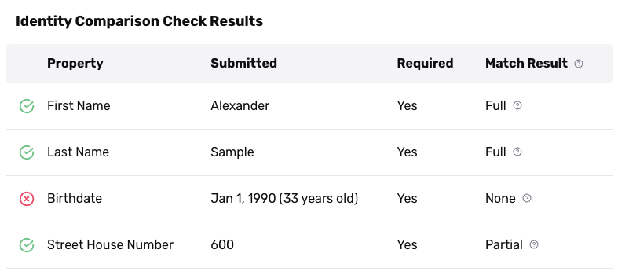
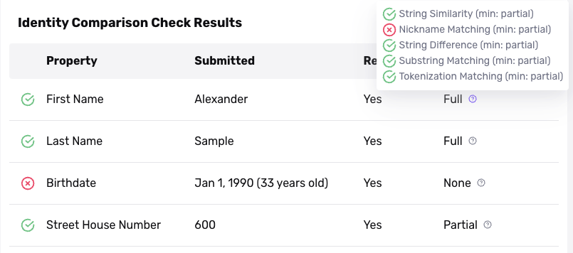

# Database Verification: Setting match requirements (United States)

_This guide describes Database Verifications that cover the United States. Learn about international Database Verifications [here](./7pCo7xatfZfIdljub260dm.md)._

## Overview

When you view a completed [Database Verification](./7dcdaIsMttmPUZ2ZelRbZD.md), you see a _match result_ for each piece of information about a user (such as first name, last name, or birthdate). For example, a match result might say that a user's first name was a "full" match.

Each match result tells you whether a piece of information about a user matches information in a known database. You can specify what it means for information to "match", using rules we call _match requirements_.

Below, we'll cover:

-   **Role of match** **requirements**: How match requirements fit into the bigger picture of a Database Verification.
-   **Match requirement settings**: Each match requirement has a comparison method, and a required match level. Persona provides strong default settings for each field you can collect in a Database Verification, but you can adjust these settings if you wish.
-   **Possible match results**: Match results can be "full", "partial", "missing", or "none." Learn what each of these results mean.
-   **Example match result**: Learn how to interpret an example match result in the Persona Dashboard.

## Role of match requirements

Match requirements are one of the settings you can configure in a Database Verification. Learn about other settings [here](./7x6bbb4azsh7XDTZoNk2xc.md). Match requirements are relevant to two commonly-used Verification checks, the Identity Comparison and Inquiry Comparison Verification checks.

Here are two things to know about how match requirements work:

-   **Match requirements are defined per-field**: You can configure different match requirements for each piece of information about a user. For example, you can require their last name to match more closely to a known database, than their street name.
-   **You can specify multiple match requirements for one field**: For each field, you can specify one or more match requirements. As long as one match requirement is met, the field will be considered a "match."

## Match requirement settings

Under the hood, a single match requirement has a _comparison method_, and a _required match level_.

### Comparison method

What logic do we use to "compare" a user's input with the information in a known database? The comparison method answers this question.

Persona provides standard comparison methods. Some methods work on strings; some methods works on dates or addresses.

Here are some examples:

-   **Tokenization**: Tokenization splits strings with whitespaces or hyphens into tokens and considers a partial match if at least one token matches. For example, "Mary-Anne" would have 1 token match with "Mary". By default a partial match is 1 token.
-   **Nickname matching**: Determines if one string is a nickname of another string. For example, "Jim" is a nickname for "James".
-   **String difference**: Determines if the edit distance between two strings is less than a specified threshold. For example, "Jim" and "Jin" have an edit distance of 1.
-   **String similarity**: Uses matching algorithms to determine whether the similarity score between two strings is above a specified threshold.
-   **Date similarity**: Determines whether two dates are the same. By default, a partial match here means that 2 out of 3 parts of a date—day, month, year—matched.

### Required match level

The required match level specifies how strict the comparison is. There are a few options:

-   **Full**: The information must match exactly.
-   **Partial**: The information must match, with room for slight differences. 
    -   You might hear a partial match referred to as a "fuzzy match".
-   **None**: The information does not need to match. This setting be useful if you want to collect a field only for informational purposes, and don't need it to match against a known database.

### Additional settings

Depending on the comparison method, there may be additional settings. Two common examples are:

-   **Threshold for partial match**: For some comparison methods, you can specify the boundary for what qualifies as a partial match.
    -   For example, for string difference, you can specify how many characters of difference there can be (e.g. up to 2 characters off to be considered a partial match).
-   **Threshold for full match**: Similar to the above, but for a full match.

### Adjusting match requirements

If you want to adjust match requirements, reach out to your Customer Success Manager or [contact the Persona support team](https://app.withpersona.com/dashboard/contact-us).

## Match results

A match result tells you whether a piece of information about a user (such as first name, last name, or birthdate) matched information in a known database, according to the match requirements.

A match result can be one of the following:

-   **Full**: A full match, as defined by the match requirements.
-   **Partial**: A partial match, as defined by the match requirements.
-   **None**: No record matched, as defined by the match requirements.
-   **Missing**: Persona was unable to find information about this field from a known database.

## Match result example

Here's an example of what a match result looks like in the Persona Dashboard.

### Result: Full

The First Name field shows a full match.

#### Match requirements

The tooltip next to the match result shows each of the match requirements for this field. There are five match requirements.

For example, the first match requirement here is:

-   Comparison method: String similarity
-   Required match level: Partial

#### "Passed" match requirements

Four of the five match requirements passed. They have a green check mark next to them.

One match requirement did not pass: Nickname matching.

#### Overall result

As mentioned earlier, if you specify multiple match requirements, as long as one match requirement is met, the field will be considered a "match."

Here, one of the match requirements produced a full match. So, the overall result is a full match.

## Related articles

[Database Verification](./7dcdaIsMttmPUZ2ZelRbZD.md)

[Configuring Database Verification checks](./7x6bbb4azsh7XDTZoNk2xc.md)

[Database Verification: Setting match requirements (Non-US & International)](./7pCo7xatfZfIdljub260dm.md)
