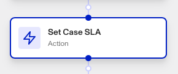

# Workflows: Set Case SLA step

# What is the Set Case SLA step?

**Set Case SLA** is a Workflow Action step that sets the Service Level Agreement (SLA) deadline for a case.

Cases are a Persona product that organizes and presents data and other Persona objects (i.e. Inquiries, Verifications, Accounts, Reports) on an end user to allow for manual investigation and decisioning. They are often used as part of an escalation process. Your organization may need to investigate users or attempts at verification for a variety of reasons:

-   **Onboarding**: Should this user be allowed to onboard to the platform if there are risky signals?
-   **Account takeover investigation**: If a user is claiming that their account has been taken over, is there enough information to validate their claim?
-   **Fraudulent activity**: Are there suspicious signals associated with this user that require further action (e.g. account freezing, sending a follow-up inquiry for verification, etc.)?
-   **Transaction monitoring review**: Are there suspicious transactions associated with this user that require further investigation?

## Why should cases have SLA deadlines?

A Case in Persona can have an SLA deadline to help ensure cases are reviewed and resolved within a specific time frame. This can be important for meeting compliance requirements and maintaining operational efficiency.

The SLA deadline also allows organizations to prioritize cases based on urgency and ensure that they are addressed in a timely manner. By setting deadlines, teams can avoid backlogs and ensure that cases are handled according to the agreed-upon timelines.

You can set deadlines to be listed in minutes, hours, or days.

# How do you add a Set Case SLA step?

1.  Navigate to the Dashboard, and click on **Workflows** > **All Workflows**.
2.  Find and click on the workflow you want to edit, or **Create** a new workflow.
3.  Click on **+** when hovering over a circle to add an **Action**.

4.  Use the **Find Action** select box to click on **Case** > **Set Case SLA**.
5.  Click the **Case** box to choose the case you want to clear the SLA deadline from.
6.  In the **SLA** Target box, add the SLA deadline (measured in your choice of minutes, hours, or days).
7.  (Optional) In ‘Advanced Configuration’, click the **Continue on error** box if you want the workflow to continue running even if this step raises an error.
8.  **Close** the step. You’ll have to **Save** and **Publish** the workflow to begin using it.

# Plans Explained

## Set Case SLA step by plan

|  | Startup Program | Essential Plan | Growth Plan | Enterprise Plan |
| --- | --- | --- | --- | --- |
| Set Case SLA step | Limited | Available | Available | Available |

[Learn more about pricing and plans.](./6oZbzp7jb7AWGClF5vpY3K.md)

# Learn more

Learn more about Cases [here](../../docs/v2022-09-01/docs/cases.md).
