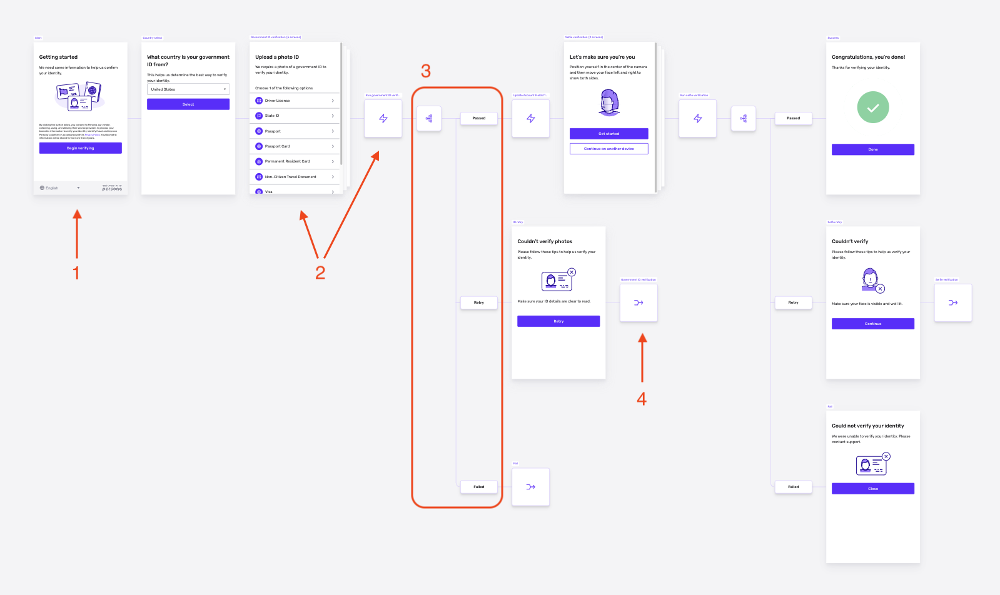

# Inquiry flow

## Overview

An Inquiry flow is what the end user sees when they go through an Inquiry. 

You can view and edit an Inquiry flow in the Flow Editor. The Flow Editor is a visual, no-code editor that lets you make changes to both UI and logic.

There are a few key components to know when you build a flow:

-   **Screens and steps**: the basic building blocks of a flow
-   **Step types**: action steps, conditional steps, and parallel steps
-   **Modules**: useful sets of prepackaged screens and/or steps
-   **Connectors**: a way to jump from one part of a flow to any screen in the flow

## Example

Let's see an example. This flow contains each of the main building blocks:

1.  A screen.
2.  A Government ID Verification module. This module consists of screens and action steps.
3.  A conditional step. In the example, there are three branches in this conditional step.
4.  A connector. In the example, the connector brings the user back to the start of the Government ID Verification module.

## Building blocks of an Inquiry flow

### Screens and steps

In simple terms, a flow is a series of _screens_ connected by _steps_.

A screen is a single page of UI that an end user sees in an Inquiry flow.

Steps define the logic and actions that occur between screens of an Inquiry flow. There are three main types of steps:

-   **Action steps** take an action or series of actions.
-   **Conditional steps** express branching logic.
-   **Parallel steps** enable multiple branches of action steps to run at the same time.

### Modules

Modules are reusable, prepackaged sets of screens and/or steps that you can add to a flow.

Persona offers a number of useful modules. For example, the Verifications types we offer—such as Government ID Verification, Selfie Verification, and Documents Verification—are packaged as modules that you can drop into your flow. Some modules are simpler. For example, the Standard Success Step is a module that consists of one screen.

### Connectors

A connector lets you jump from one part of a flow to any screen in the flow.

## Learn more

Learn more about the building blocks of a flow:

-   [Inquiry flow screens](./2WWzr0d6rEOIlyXjtHSCgC.md)
-   [Inquiry flow steps](./1z8F1l9Q28qNxQFtKoMfY3.md)
-   [Inquiry flow modules](./tdHGWIcHzLEnvUHe05nH1.md)
-   [Inquiry flow connectors](./XQkFH0nTxp9hOy1T5I2Pq.md)

## Related articles

[Screen Steps in Inquiries](./2WWzr0d6rEOIlyXjtHSCgC.md)

[Editing translations for your Inquiry](./1vMFCXQxDsdpZ2YI4eguFd.md)
