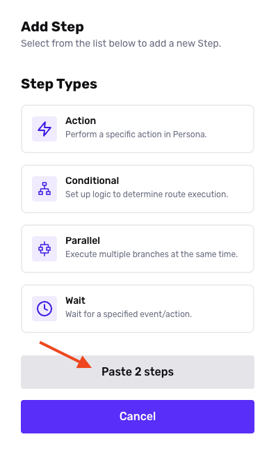

# Copying steps from one Workflow to another

To replicate steps from one workflow to another, follow these steps.

### Step 1: Copy steps from existing Workflow

1.  Open the Workflow you want to duplicate.
2.  Hold down the **Shift** key, and click and drag to select all the steps of the Workflow on the Workflow Editor canvas.

### Step 2: Create a new Workflow and paste steps

1.  Create a new Workflow.
2.  Open the new Workflow in the Workflow Editor.
3.  Click the **+** icon in your Workflow to add a new step.
4.  In the Add Step settings, select **Paste # steps**.

### Step 3: Review and adjust configurations in pasted steps

1.  Review all the steps in that were pasted into the new Workflow. It is common to adjust any dynamic variables used in Conditional steps, Update Object steps, and anywhere where you may be defining a variable based on steps that were pre-defined on your old Workflow.
