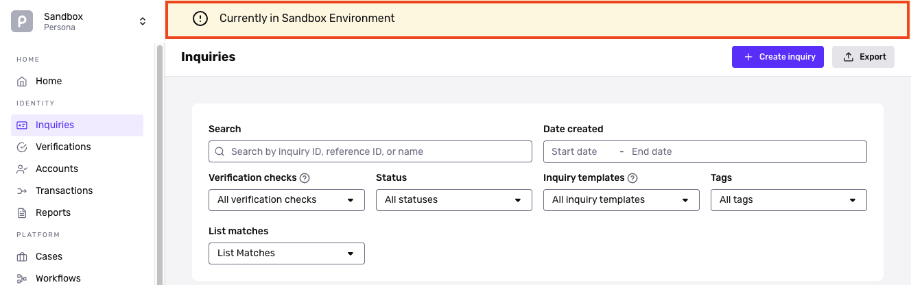

# Sandbox vs. Production Environments

## Sandbox Environment

Sandbox is a limited version of the full Persona platform where you can to test your end-user flow and application integration without incurring charges. In Sandbox, you'll be able to:

-   Customize the theme of an end-user flow to match your brand
-   Test an end-user experience that collects government ID and selfies
-   Explore the library of verification checks available in Persona that can be configured to your use case
-   Test different integration methods
-   ...and much more!

Persona doesn't perform any real verification or extraction of IDs within Sandbox. You'll notice that an inquiry's first name and last name fields are always overwritten to "Alexander J Sample". Once you start sending verifications via Production, you will be able to see the actual first and last names on the inquiry.

### Am I in the Sandbox environment?

The Environment selector at the top of the navigation panel tells you the current environment.

When you're in Sandbox, a yellow banner appears at the top of many pages in the Dashboard.

## Production Environment

Real verifications are run in the Production Environment. Here you can test our information extraction and verification technology. Verifications and inquiries completed will be counted towards your overall usage charge.

To get Production access, please [contact us](../../landing/dashboard/contact-us.md).

## Things to Remember

-   Real verifications are **not** performed within Sandbox.
-   Specific product runs (such as a specific Inquiry, a Workflow Run, a Case, or an Account) do not carry over between Sandbox and Production environments.
-   If you are seeing Sandbox as your only Environment option, you may be in a Sandbox-only trial of Persona. To select a plan and gain Production Environment access, head over to **Organization > [Billing](https://app.withpersona.com/dashboard/billing "Billing")** to review options.

## Related articles

[Where do I find Environment IDs?](./2phMvmqqOPVr6q50vQ9Sfh.md)

[How do I switch environments?](./1IKpaNpGCG2E8ksAjZQYLx.md)
