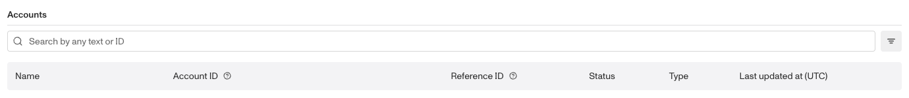
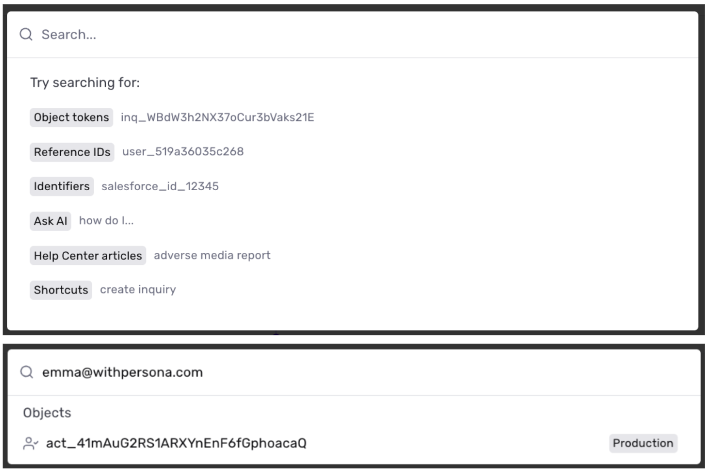
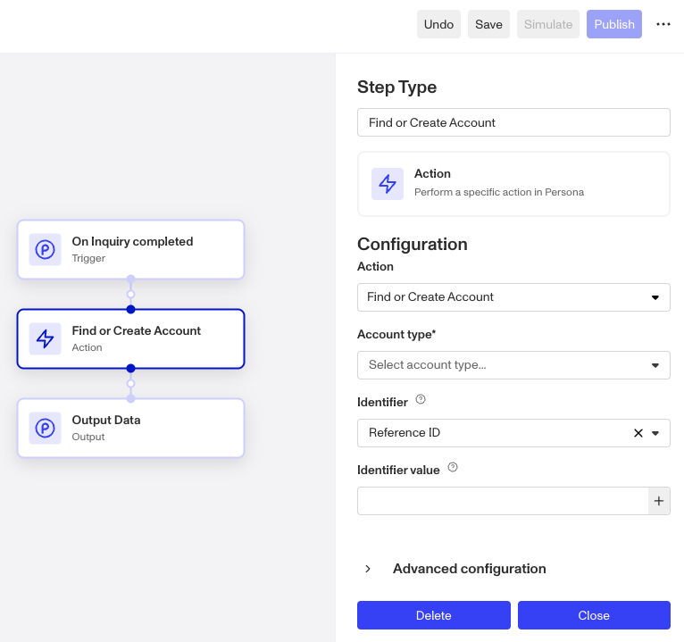

# Using Account Identifiers

# About Account Identifiers

Account Identifiers are unique identifiers defined by a customer organization that can be used to model unique entities. Account Identifiers can be used to look up an exact match quickly within the Persona dashboard search. Some common examples of Identifiers include: Email address, Phone number, Username, User ID, Salesforce ID, Application ID

⚠️ \*Note: Non-unique fields, such as city, application type, full name, birthdate, should not be used as Identifiers. However, these can be stored as fields.\*

Identifiers are not required when an account is first created and can be updated manually after account creation through the Update Account Modal or through a Workflow.

### Reference ID as Account Identifier

The Reference ID is one of an account’s identifiers. It is a system-generated, unique, case-insensitive identifier assigned per account type. While it functions like other identifiers, it has a few distinct characteristics:

-   **Non-editable name:** You cannot set or customize a Reference ID, whereas other identifiers can be named.
-   **Automatic inquiry linking:** When a Reference ID is provided while creating inquiries, those inquiries are automatically attached to the associated account. Other identifiers do not trigger this behavior - you must use the **Attach Object** action step in Workflows instead.
-   **Filtering support:** When listing accounts via API, filtering is currently only supported by [a set of Reference IDs](../../docs/api-reference/accounts/list-all-accounts.md#request.query.filter.filter).

### Configuring Account Identifiers

Learn more about setting up [Account Types](./NrM9W6KETzMbzQXgdU3cV.md) and [Fields](./1wcCKHsRP621g13l4iTc85.md). Identifiers can only be set on fields where the field type is string. Identifiers are not supported in nested string fields like hashes.

### What Identifier configurations are available?

There are 2 additional options for an identifier.

-   Case Sensitive: field setting that treats “ABC” and “abc” as not the same value.
-   Unique: field setting that prevents the same value from being used in multiple records for this field within the same account type.
-   Identifier fields are case-insensitive and non-unique by default.

⚠️ \*If you want an account within Persona to have 1:1 mapping with an account within your system, you should set a field to be an identifier and force uniqueness.\*

### Searching for Accounts

Using an Identifier as a search value will quickly pull up the associated Account, along with associated records. Any records where that identifier is stored as a field value will be surfaced. You can search records by an identifier via omnisearch (top left of the sidebar) or via search bar within the index pages (e.g. search bar on the All Inquiries page, the All Accounts page, etc.). 

### Automatically find or create Accounts

You can automatically find or create Accounts based on the Identifier. Within Workflows, use the “Find or Create Account” workflow step, then select the account type, identifier, and identifier value. 

## How to access identifiers in Workflows

In Workflows, you may want to access and condition off of an identifier’s value for a given account. You can access using `account.identifiers.<key>`.
