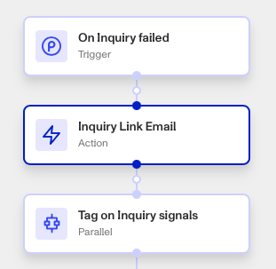
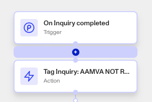

# Workflows: Inquiry Link Email step

# What is the Inquiry Link Email step?

**Inquiry Link Email** step is a Workflow Action step that sends a user a link for an Inquiry in an email.

When an Inquiry is created, a user can be sent a link to the Inquiry to fill out their information and undergo verification. Rather than manually sending links to a user, the Inquiry Link Email step lets you automate and standardize this process within a workflow.

The Inquiry Link Email step requires:

-   The destination email address. Email addresses can be added dynamically and automatically to Inquiry Link Email from another Persona object (such as an Account), or entered manually.
-   The Inquiry to be included in the email. Inquiries can be pulled from elsewhere in the Workflow, or a prior Create Inquiry step can be added earlier in the Workflow to generate the Inquiry.
-   The email Subject. Persona recommends an informative subject line including a call to action (eg. “Complete your verification”) and time limit (”within 1 hour”).
-   The message content, broken down into the Greeting, Body, and Call to action. Each component can be pulled from elsewhere in the Workflow to enable dynamic email composition, or hardcoded.
-   Inquiry Session token checkbox, to allow a user to return to the same link and continue their verification while the time limit has not elapsed. Checking this box reduces security (as anyone with the link can view the same Inquiry session) but may improve the user experience.

Inquiry verification links can also be sent via SMS message using the Send Inquiry Link SMS action step.

# How do you add an Inquiry Link Email step?

1.  Navigate to the Dashboard, and click on **Workflows** > **All Workflows**.
2.  Find and click on the workflow you want to edit, or **Create** a new workflow.
3.  Click on **+** when hovering over a circle to add an **Action** step.

4.  Use the **Find Action** select box to click on **Inquiry** > **Inquiry Link Email**.
5.  Add an email address destination, either manually or from another **Object** by clicking **+**.
6.  Add an Inquiry the action should link to.
7.  Add or edit the Subject, Greeting, Body, and Call to Action to be sent along with the link in the email. These elements can be pulled from elsewhere in the Workflow or hardcoded.
8.  (Optional) Click the **Continue on error** box if you want the Workflow to continue running even if this Action raises an error.
9.  **Close** the Action. You’ll have to **Save** and **Publish** the workflow to begin using it.

# Plans Explained

## Inquiry Link Email step by plan

|  | Startup Program | Essential Plan | Growth Plan | Enterprise Plan |
| --- | --- | --- | --- | --- |
| Inquiry Link Email Step | Not Available | Available | Available | Available |

[Learn more about pricing and plans.](./6oZbzp7jb7AWGClF5vpY3K.md)

# Learn more

[Learn more about Inquiries.](../../docs/docs/inquiries.md)
