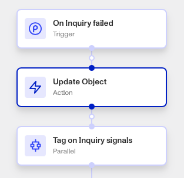
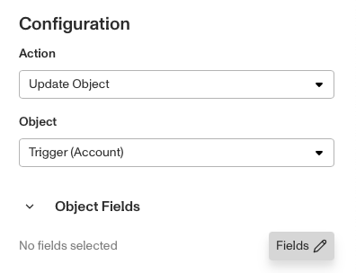
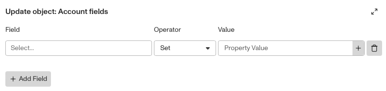

# Workflows: Update Object step

# What is the Update Object step?

**Update Object** is a Workflow Action step that updates information within a Persona object when triggered.

Objects are Persona products including Inquiries, Cases, and Accounts. They may contain information such as customer contact information, address, status, etc. **Update Object** allows you to either modify (set) or remove (unset) information from fields like those, from within your Workflow. This is useful for automating changes to Objects once certain actions are completed. Commonly updated Persona objects included Cases, Accounts, and Transactions.

# How do you add an Update Object step?

1.  Navigate to the Dashboard, and click on **Workflows** > **All Workflows**.
2.  Find and click on the workflow you want to edit, or **Create** a new workflow.
3.  Click on **+** when hovering over a circle to add an **Action**.

4.  Use the **Find Action** select box to click on **Other** > **Update Object**.
5.  Select a target **Object**.

6.  Under ‘Object Fields’, click **Fields (Edit)**. An entry box will appear where you must select:
    1.  The **Field**: Type of information.
    2.  The **Operator**: You can read more about Operators below.
    3.  The **Value**: The new information to populate that field, if the Operator is **Set**.
    4.  You can add more fields by clicking **Add Field**.

7.  **Close** the Step Type. You’ll have to **Save** and **Publish** the workflow to begin using it.

# Update Object Operators

The table below shows the operators available for updating fields within Persona objects. While some operators only apply to arrays, others such as **Set** and **Unset** can be used with any data type, including strings, numbers, dates, and arrays. This allows Workflows to update fields flexibly depending on the data type.

| Operator | Description | Target field (left side) | Value (right side) | Examples |
| --- | --- | --- | --- | --- |
| set | Replaces the entire value of the target field with value. Note that in arrays, all items are replaced. | All field types | Same type as target field | `[a,b,c] set [d,e] = [d,e]` |
| unset | Clears the value of the target field, effectively setting it to null or an empty state. Note that in arrays, all items in the array will be cleared. | All field types | N/A | `[a,b,c] unset = []` |
| append | Adds all items from an array to another array | Array | Array | `[a,b,c] append [d,e] = [a,b,c,d,e]` |
| push | Adds single item to an array | Array | Same type as array item type | `[a,b,c] push d = [a,b,c,d]` |
| remove | Removes all occurrences of a specified value from an array. | Array | Same type as array item type | `[a,b,c,a] remove a = [b,c]` |

# Plans Explained

## Update Object step by plan

|  | Startup Program | Essential Plan | Growth Plan | Enterprise Plan |
| --- | --- | --- | --- | --- |
| Update Object step | Limited | Available | Available | Available |

[Learn more about pricing and plans.](./6oZbzp7jb7AWGClF5vpY3K.md)
