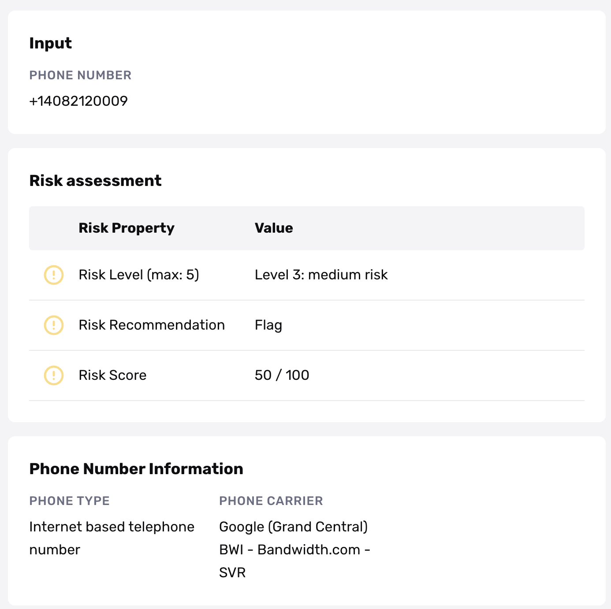

# Phone Risk Report

## Overview

The Phone Risk Report assesses the fraud risk of a phone number and confirms its authenticity. The main use case is to help prevent fraud by leveraging phone intelligence information. The Phone Risk Report is available globally for all phone numbers.

## Report Features

### Search Inputs

-   Full phone number (with international code). E.g. US: +1-000-123-4567

### Report Outputs

💡 The default template provides an overall risk score in additional to phone carrier number and phone type. Persona also offers templates that provide the risk level of sim swap or better EMEA visibility. Please contact the support team if you’re interested in using them.

The vendor we work with looks at a combination of factors in order to make an assessment on whether or not a phone number has a high level of fraud risk.

**Factors included in the risk assessment:**

-   Phone number attributes (e.g. phone type, carrier, etc.). For example, VOIP phone numbers have a higher risk associated with them since they can be created very easily online.
-   Two global databases to detect and identify known fraud faster.
-   Traffic pattern recognition and usage velocity. Anomalous traffic behavior patterns and usage velocity may raise red flags. For example, if passcode requests are received in five different languages from the same number in the same week or a range of numbers are seen repeatedly on one or more web services, it may be a sign that a phone is being shared, and the risk score will increase accordingly.

**`Phone type`**

The type of phone number being used. There are 12 possible results that could be returned for phone type details.

-   **Fixed line**: considered low risk with recommended action to allow through. Fixed-line phones include traditional landline phones and VOIP phones that can be traced back to a particular address and cannot be obtained by a user outside the phone number’s designated country. Because these phone numbers are traceable, they are low-risk.
-   **Mobile**: considered medium-low risk with recommended action to allow through. Mobile telephones are provided by companies such as Verizon, Cingular, or Sprint. Users of these phones must sign contracts, making these telephone numbers traceable. These phone numbers are generally low-risk. However, some prepaid mobile phones will be identified as mobile. Internationally, phones identified as mobile can also include TETRA mobile phones, cordless access systems, proprietary fixed radio access, and fixed cellular systems.
-   **Prepaid (for prepaid mobile)**: considered medium-high risk with recommended action to flag. These telephones can be purchased anonymously at department stores. They work like other mobile phones, but their users are not contracted with a mobile phone company. Prepaid mobile phones generally cost between $30 and $100, making them unattractive for most fraudsters, but we recommend flagging transactions made with this type of telephone due to users’ anonymity. Also, not all prepaid mobile phones will be identified as prepaid; some will be identified as mobile.
-   **Toll\_Free:** considered high risk with recommended action to block. Toll-free numbers are numbers starting with toll-free area codes, such as (800). Although often used by legitimate users calling from companies, fraudsters can easily obtain toll-free numbers that either forward to a telephone located in another country or toll-free numbers that terminate at an internet voicemail box. Toll-free numbers always forward to non-toll-free numbers. For this reason, any legitimate user who provides a toll-free number and is asked to provide a non-toll-free number will be able to do so.
-   **VOIP (non-fixed VOIP):** considered high risk with recommended action to block. Voice Over Internet Protocol (VOIP) phone numbers are internet-based telephone numbers. Non-fixed VOIP telephone numbers can easily be obtained by users who are not located in the country associated with the telephone number. They are untraceable and disposable; some can even be obtained for free. This means that a fraudster in Romania could easily obtain a US-based telephone number using a non-fixed VOIP service and receive a call to this number in his or her home in Romania.
-   **Pager**: considered high risk with recommended action to block. This phone number rings to a pager. Because pagers cannot receive verification calls, it’s best to block calls to these numbers. These calls are most likely requested by fraudsters who are inputting invalid phone numbers.
-   **Payphone:** considered high risk with recommended action to block. Calls to a payphone cannot be traced back to any one person; therefore, we recommend blocking verification calls to these numbers.
-   **Invalid:** considered high risk with recommended action to block. The telephone number entered is not a valid number.
-   **Restricted\_Premium (Restricted Number):** considered high risk with recommended action to block. The telephone number entered is a restricted number. In the US, restricted numbers include numbers that begin with 0 and numbers with the following area codes: 900, 911, 411. Internationally, the following phone types are restricted: Audiotext, Carrier selection, National rate, Premium rate, Shared cost, Satellite, Short Code.
-   **Personal:** considered medium-low risk with recommended action to allow through. A “personal” phone number is a phone number which allows a subscriber to receive calls at almost any telephone number, including a mobile number. The “personal” number forwards to another phone number, which is determined by the subscriber. Because the “personal” number can forward to either a landline or mobile number, it’s impossible to determine what type of phone the subscriber is using. However, because “personal” phone numbers must be obtained from a phone company, there is little risk of fraud associated with this phone type.
-   **Voicemail:** considered medium-high risk with recommended action to block. Voicemail phone numbers will ring directly to a user’s voicemail. Although this phone number was likely purchased through a phone company and may be traceable, it will be impossible to reach the user live at this phone number. In addition, any user providing a voicemail number should also have a valid landline or mobile phone available.
-   **Other:** considered medium-high risk with recommended action to block. Phone numbers labeled “other” are all various types of phones that originate in non-US countries. The following types of phones may be included under the “other” category: Global title address, Inbound routing code, Videotext, VPN. Because clients should not be requesting calls to these phone types, we recommend blocking verification calls to these numbers. Any phone number entered that falls under the “other” category was probably either entered incorrectly or was entered by a fraudster testing various phone numbers.

**`Phone Carrier`**

The telecom carrier of the phone number (e.g. Verizon, AT&T, Sprint)

**`Risk Levels`**

The risk levels range from 1 to 5.

-   Level 5: high risk
-   Level 4: medium to high risk
-   Level 3: medium risk
-   Level 2: low to medium risk
-   Level 1: low risk

**`Risk Recommendations`**

The recommended action based purely on the risk associated with the phone number.

-   Flag
-   Block
-   Allow

**`Risk score`**

A phone number’s risk score is a measure of the risk associated with the phone number. The risk score ranges from 0 to 100. The higher the risk score, the higher the risk level.

| Score | Risk level | Recommendation |
| --- | --- | --- |
| 81-100 | high | block |
| 61-80 | medium-high | block |
| 41-60 | medium | flag |
| 21-40 | medium-low | allow |
| 0-20 | low | allow |

### Notifications

The best way to be notified immediately of a match on the Phone Risk Report is to set up a webhook listening for the event type: `report/phone-number.ready`.

## Configuration Options

There is no configuration option available for this report type.

## Plans Explained

|  | Startup Program | Essential Plan | Growth and Enterprise Plans |
| --- | --- | --- | --- |
| Phone Risk Report | Not Available | Available | Available |

[Learn more about pricing and plans](./6oZbzp7jb7AWGClF5vpY3K.md)

## _Disclaimer_

_Persona is not a consumer reporting agency and the services (and the data provided as part of its services) do not constitute a ‘consumer report’ for the purposes of the Federal Fair Credit Reporting Act (FCRA). The data and reports we provide to you may not be used, in whole or in part, to: make any consumer debt collection decision, establish a consumer’s eligibility for credit, insurance, employment, government benefits, or housing, or for any other purpose authorized under the FCRA. If you use any of any of our services, you agree not to use them, or the data, for any purpose authorized under the FCRA or in relation to taking an adverse action relating to a consumer application._
