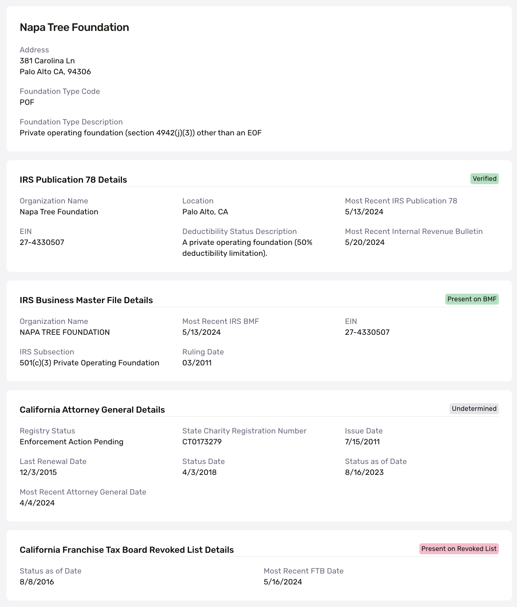

# Business Nonprofit Report

# Overview

The Business Nonprofit Report is used in KYB to surface information from the California Attorney General’s Registry, California Franchise Tax Board, and IRS about U.S.-based nonprofit organizations.

Organizations can use the Business Nonprofit Report to:

#### Automatically verify the tax-exempt status of a nonprofit

The tax-exempt status for an organization in the United States is also known as 501(c)(3) status. Typically, organizations must manually check multiple data sources to verify this status. Because the tax-exempt status of these organizations can change over time, customers must regularly cross-reference these sources to confirm whether an organization has retained its status and remains in good standing.

#### Help meet compliance requirements for California AB 488

Some customers will need to verify the good standing status of a nonprofit to comply with CA AB 488. This law requires charitable fundraising platforms operating in California to only solicit for nonprofits that are in “good standing” with the California Attorney General’s Office, the California Franchise Tax Board, and the Internal Revenue Service (IRS). This means a nonprofit must be current, registered, and not delinquent in its registration status with these three agencies. For more details on that legislation, you can visit this [resource](../../landing/blog/ca-ab-488-compliance.md).

## Configuration Options

The minimum input for this report is the Employment Identification Number (EIN) of the nonprofit.

The Business Nonprofit Lookup Report takes the EIN and searches against four data sources to return granular detail found in each source:

-   IRS Business Master File
-   IRS Publication 78
-   California Attorney General’s Registry of Charities and Fundraisers
-   California Franchise Tax Board

The report can also be configured inside Workflow, with resolvers for each of the high-level statuses in the report. For assistance in configuring this report, please reach out to your Persona account team.

## Interpreting the Business Nonprofit Lookup Report

 The report returns both the general status of the organization across the four data sources and granular details specific to each.

The attributes returned per data source include:

#### IRS Publication 78

-   `church_message`
-   `organization_name`
-   `ein`
-   `verified`
-   `city`
-   `state`
-   `organization_types`
-   `most_recent_pub78`
-   `most_recent_irb`

#### IRS Business Master File

-   `church_message`
-   `organization_name`
-   `ein`
-   `status`
-   `most_recent_bmf`
-   `subsection`
-   `subsection_description`
-   `ruling_month`
-   `ruling_year`

#### California Attorney General

-   `status`
-   `registry_status`
-   `State_charity_reg_num`
-   `issue_date`
-   `last_renewal_date`
-   `status_set_date`
-   `as_of_date`
-   `most_recent_ag`

#### California Franchise Tax Board

-   `revocation_status`
-   `revocation_status_date`
-   `most_recent_ftb`

## Understanding the data sources within the Business Nonprofit Report

Nonprofits must register with different governmental registries—both at the federal level (the Internal Revenue Service) and the state level—to receive tax-exempt status or other benefits. The Business Nonprofit Report checks the following sources:

#### IRS Business Master File

This is the most comprehensive database of entities that have filed for tax-exempt status in the United States. It contains information on roughly 1.9 million entities and is updated on a monthly basis.

#### IRS Publication 78 Data

IRS Publication 78 lists organizations recognized by the IRS as eligible to receive tax-deductible charitable contributions. In contrast, the Business Master File focuses on organizations with IRS-recognized tax-exempt status. Publication 78 is a subset of the larger Business Master File.

#### California Attorney General’s Registry of Charities and Fundraisers

This registry, updated monthly, categorizes organizations based on whether they may operate or solicit for charitable purposes. Classification depends on their registration status and compliance with the Registry’s requirements.

#### California Franchise Tax Board

This list includes California organizations whose tax-exempt status has been revoked by the California Franchise Tax Board.

## Related articles

[Verifying Businesses: How Persona can help verify businesses](./3OGe9IwySJmDvXL2DOfV7N.md)
