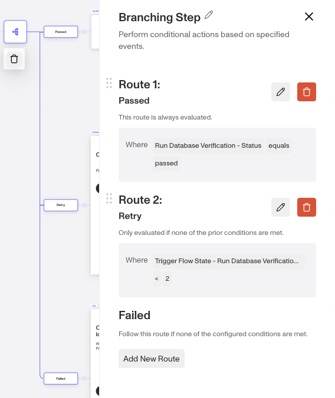
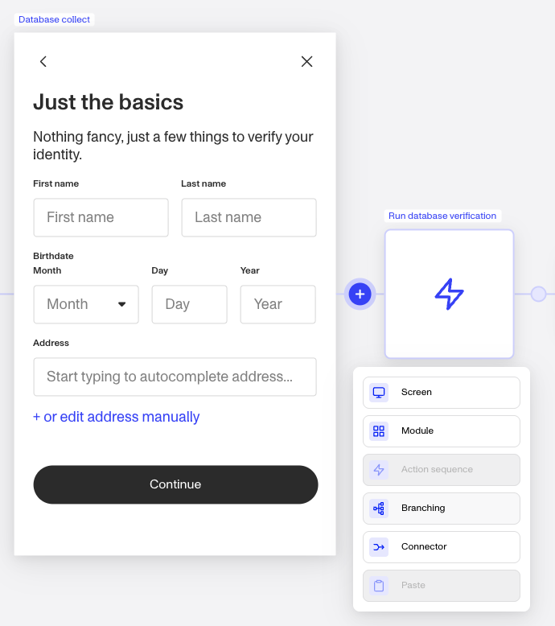
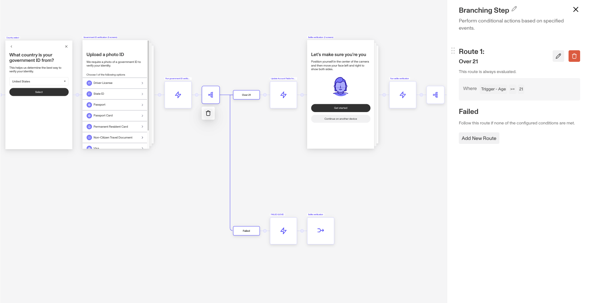
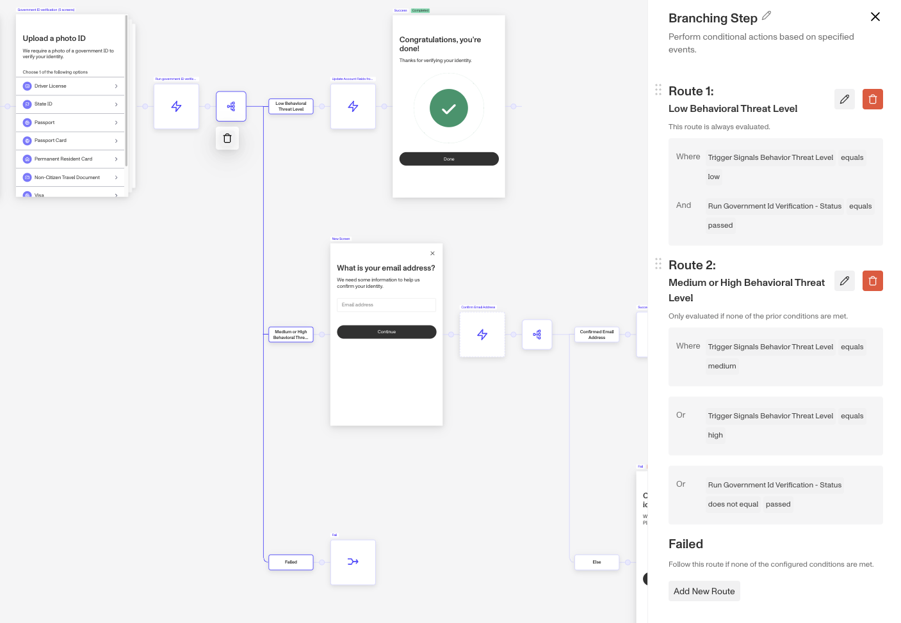

# Branching Steps in Inquiries

# What is a Branching Step?

The Branching Step, within the Flow Editor, lets you build different paths or routes within your flow, based on conditional logic.

 _This particular example of a Branching step is set up to move a user forward if they pass a specific verification, and allow them to retry up to 5 times. After the 5th time, they fail. Many pre-built branching steps are added when a Module such as Government ID or Selfie are added to an Inquiry Flow, allowing you to automatically include retry, pass, and fail logic via a Branching step wihtout having to configure from scratch._

## Where do you add a Branching Step?

1.  To access this feature, navigate to `Inquiries` —> `Templates` from the left nav and select any Inquiry template.
2.  A Branching step can be added by moving your mouse over the circular nodes between steps, turning them into a plus sign, or by selecting an existing Branching node to edit the conditional routes.

 _To add a new Branching Step, click the plus sign wherever you'd like the step to be added._

## What can you do with Branching Step?

### Dynamic user risk segmentation

The Branching Step offers the capability to dynamically adjust the level of friction within the collection flow based on real-time risk assessments. This means that you can direct high-risk users through a more stringent verification process, while sending low-risk users through a lower friction flow, improving the conversion rate for trustworthy users.

### Customized user experiences

The Branching Step allows you to design tailored experience to meet specific business requirements. For example, the flow can be adjusted to differentiate based on age, such as denying access to users under 21, while allowing those over 21 to proceed. Similarly, geographical criteria can be applied, where users from countries that a business does not served are declined, and those from approved regions are successfully verified.

### Pre-built Branching Steps

To help you get started, some branching steps are available as a part of drop-in Modules within Flow Editor. These branching steps include are part of a collection & verification flow for all Verifications (like Government ID or Selfie) that can be added via Modules.

## Examples by Plan

### Branching Step on the Essential plan

Essential plan customers can route or segment users through an Inquiry Flow based on an attribute that is collected or prefilled like age (e.g. under 21 or under 18).

For example in the below implementation, after a user goes through the Government ID Verification, this particular business has decided to allow users over age 21 to proceed to Selfie Verification and to automatically fail those under age 21.

 _In this example, the business is segmenting their Inquiry Flow based on age._

### Branching Step on the Growth plan

Growth plan customers can route or segment users through an Inquiry Flow based on behavioral signals, verification checks passing, or specific verification reasons within the same Inquiry Flow.

 _In this example, the business is choosing to embed their business logic around behavioral risk and whether or not the user passes verifications in order to route them to the appropriate pieces of their Inquiry Template._

# Plans Explained

## Branching Step access by plans

|  | Startup Program | Essential Plan | Growth Plans | Enterprise Plans |
| --- | --- | --- | --- | --- |
| Routes allowed per branching step | Limited to pre-configured solutions | ≤3 routes per branching step | Unlimited | Unlimited |
| Branching steps allowed per Inquiry Template | Limited to pre-configured solutions | ≤20 overall steps (Screen, Action, Branching, or Connector) per Inquiry Template | Unlimited | Unlimited |

[Learn more about pricing and plans](./6oZbzp7jb7AWGClF5vpY3K%20%22Pricing%20Overview%22.md)

## Related articles

[Action Steps in Inquiries](./aBe34oNwaa0YskUd5U5HZ.md)

[Screen Steps in Inquiries](./2WWzr0d6rEOIlyXjtHSCgC.md)

[Connector Steps in Inquiries](./1aLUyDUK4ZGuupSgscqd6P.md)

[Inquiry Template Steps](./1z8F1l9Q28qNxQFtKoMfY3.md)
